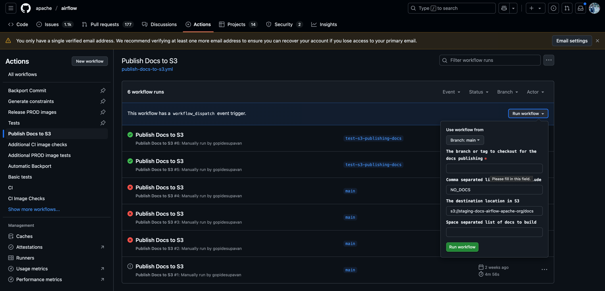
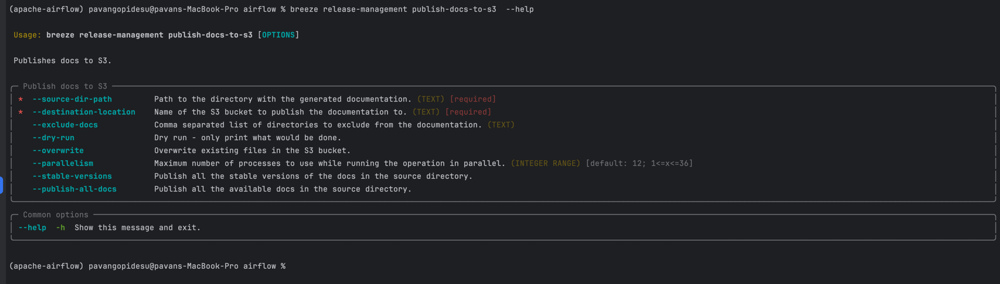
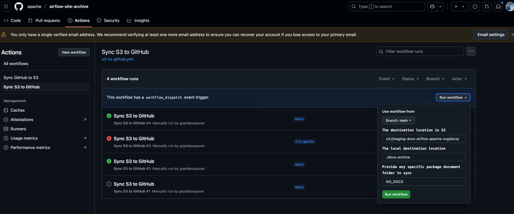
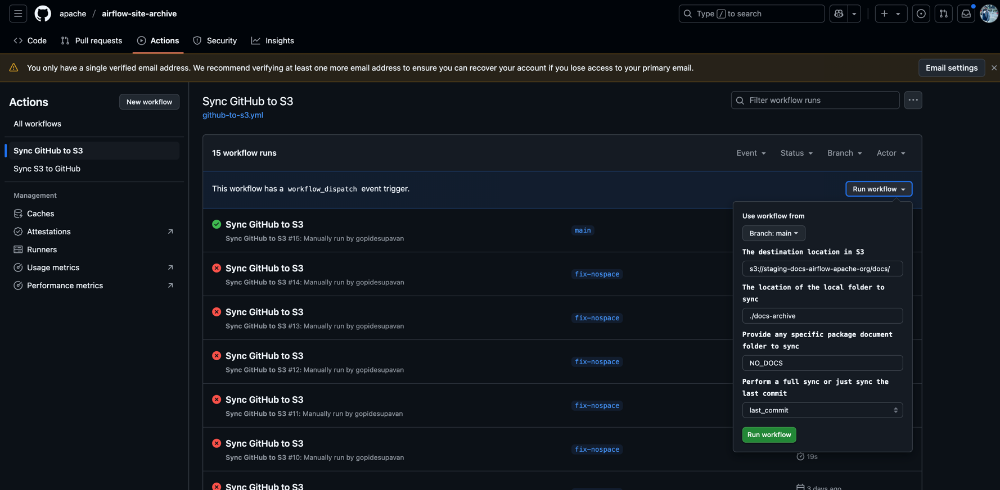

<!--
 Licensed to the Apache Software Foundation (ASF) under one
 or more contributor license agreements.  See the NOTICE file
 distributed with this work for additional information
 regarding copyright ownership.  The ASF licenses this file
 to you under the Apache License, Version 2.0 (the
 "License"); you may not use this file except in compliance
 with the License.  You may obtain a copy of the License at

   http://www.apache.org/licenses/LICENSE-2.0

 Unless required by applicable law or agreed to in writing,
 software distributed under the License is distributed on an
 "AS IS" BASIS, WITHOUT WARRANTIES OR CONDITIONS OF ANY
 KIND, either express or implied.  See the License for the
 specific language governing permissions and limitations
 under the License.
-->

Apache Airflow website documentation publishing
===============================================

This document describes how to publish the [Apache Airflow](https://airflow.apache.org/) website documentation.

## Overview
This setup serves Apache Airflow documentation from **S3 via CloudFront**, while landing pages are hosted separately via github. The process involves:
1. Publishing docs to S3 via `apache/airflow` repository workflow (manual trigger).
2. Refreshing the site via `apache/airflow-site` repo (empty commit/workflow trigger).
3. Syncing the S3 bucket docs with `apache/airflow-site-archive`

---

## Step 1: Publish Docs to S3
1. ### Publishing via Trigger Workflow:
   - Go to `apache/airflow` repo > Actions > [Publish Docs to S3](https://github.com/apache/airflow/actions/workflows/publish-docs-to-s3.yml).
   - Manually run the workflow with the tag that cut from the wave.
   - Workflow accepts the following input parameters:
     - `ref`: The tag of the version to publish (e.g., `providers-amazon/9.6.1`).
     - `exclude-docs`: A comma-separated list of docs to exclude from the build (e.g., `amazon,apache-airflow-providers,google`).
     - `destination-location`: The S3 bucket location to publish the docs (e.g., `s3://staging-docs-airflow-apache-org/docs`). Default is `s3://staging-docs-airflow-apache-org/docs`. do not change it.
     - `docs-list-as-string`: A space separated list of docs to include in the build (e.g., `amazon apache-airflow-providers google`). Default is builds all provider/apache-airflow docs.

   - The workflow contains a series of steps to:
     - Build the docs.
     - Add back references to the newly published version.
     - Upload them to S3.
     - Generate packages-metadata.json for the new version.
     - Generate redirects for the new version.




2. ### Manually publish docs from local:
   - If you want to publish the docs from your local machine, you need to have to setup following:
   - You need to have `awscli` installed and configured with the right permissions to upload to S3, all the release manager should have access to the apache-airflow AWS account.

   - Checkout the `apache/airflow` repo and checkout the tag you want to publish.
   ```bash
   git clone https://github.com/apache/airflow.git && cd airflow && git checkout <tag>
   ```

   - Build the docs using `breeze` command:
   ```bash
     breeze build-docs {docs list as string}
     ```
   - e.g.:
   ```bash
      breeze build-docs amazon apache-airflow-providers google
   ```

   - First publish the docs to local directory to add back references to the newly build docs:
     Create a empty directory to publish the docs:
   ```bash
    mkdir -p /Users/<username>/airflow-site
    export AIRFLOW_SITE_DIRECTORY=/Users/<username>/airflow-site
   ```

   - Run the following command to publish the docs to local directory and add back references:
   ```bash
    breeze release-management publish-docs --override-versioned --run-in-parallel ${DOCS_LIST_AS_STRING}
    breeze release-management add-back-references all-providers
    breeze release-management add-back-references apache-airflow
    breeze release-management add-back-references docker-stack
    breeze release-management add-back-references helm-chart
   ```
   - Finally, run the following command to publish the docs to S3:

   ```bash
    breeze release-management publish-docs-to-s3 --source-dir-path /Users/<username>/airflow-site/docs-archive \
          --destination-location s3://staging-docs-airflow-apache-org/docs --stable-versions
    ```

  - To exclude the docs from the build, you can use the `--exclude-docs` parameter and pass the comma-separated list of docs to exclude from the publish.
  - To override the versioned docs, you can use the `--overwrite` parameter to override the versioned docs in the  `breeze release-management publish-docs-to-s3`.





3. ### Verify Upload (Optional):
    - To verify the docs are published to S3, you can verify the packages-metadata.json file in the S3 bucket updated with new stable version for the new version. Download the packages-metadata.json file from S3 and verify the new version is added to the file.

   ```bash
    aws s3 cp s3://staging-docs-airflow-apache-org/manifest/packages-metadata.json .
    ```

   Look for the stable-versions key in the file and verify the new version is added to the list.

**Note** When publishing the docs workflow validates the new version of docs are already published to S3. If the version already exists, the workflow skip publishing the docs for that provider/apache-airflow docs.


---
## Step 2: Refresh Airflow Site
After S3 upload completes:
1. **Trigger Update** (choose one):
   - **Option 1**: Push an empty PR to `apache/airflow-site`:
   - **Option 2**: Manually trigger the site’s workflow via GitHub UI (TBD).

  This step ensures the site reflects the latest changes from S3 and refreshes any landing pages that may have been updated.

---

---

## Step 3: Sync S3 Bucket with Airflow Site Archive (Optional)

1. ### Sync S3 Bucket:
   - Sync S3 bucket process is done via a GitHub Action in the [apache/airflow-site-archive](https://github.com/apache/airflow-site-archive) repo. This way we can keep the S3 bucket in sync with the latest version of the docs from S3 bucket.




---

---

## How to publish adhoc docs change

There are certain instances we make changes manually to the docs and we can push the changes to airflow-site-archive repo and sync the changes to S3 bucket. We call this process `Github To S3 sync`.


The Github to S3 Process have two options:

1. **Option 1**: Push only the last commit changes to S3 bucket with sync_type ``last_commit`` flag
2. **Option 2**: ``full_sync`` flag (The full sync will sync all the files from airflow-site-archive/docs-archive to S3 bucket).

To Trigger the Github to S3 sync, Run the workflow in apache/airflow-site-archive repo [Sync GitHub to S3](https://github.com/apache/airflow-site-archive/actions/workflows/github-to-s3.yml)

**Note**: When using ``full_sync`` It is recommended to verify and have latest changes from S3 bucket synced to the airflow-site-archive repo before running the workflow. This is to avoid any documentation loss during the sync process, because the full sync will delete all the files in the S3 bucket and upload the files from airflow-site-archive repo.




---

---

## airflow-site with CloudFront

We are using the .htaccess file `landing-pages/site/static/.htaccess` to proxy the requests to the S3 bucket. The cloudfront distribution is configured to proxy anything requests under `/docs/` to the S3 bucket.


---

## Notes
- **Order matters**: Always complete S3 uploads before refreshing the site.


