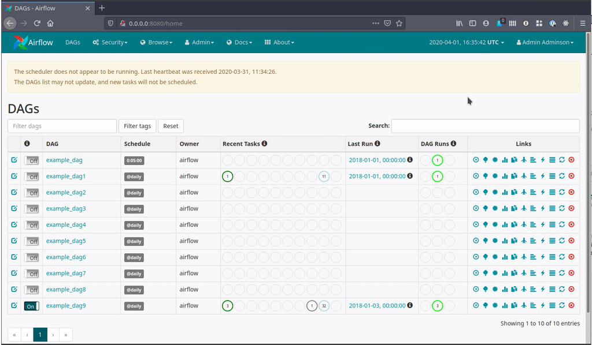
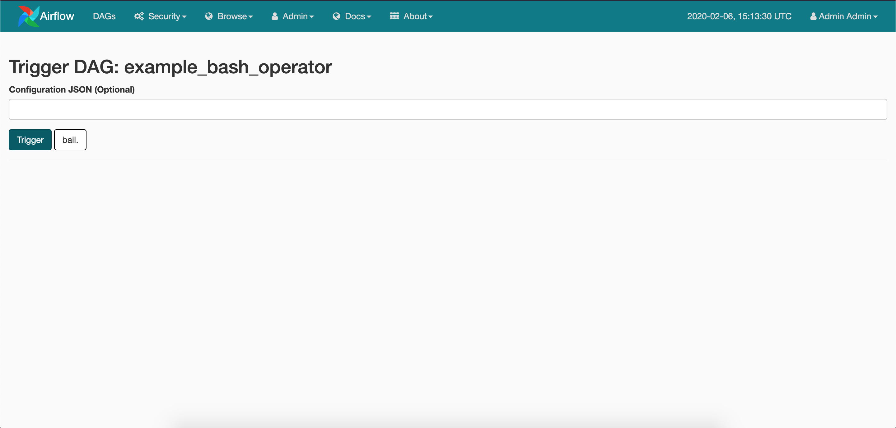

Airflow 1.10.10 contains 199 commits since 1.10.9 and includes 11 new features, 43 improvements, 44 bug fixes, and several doc changes.

**Details**:

* **PyPI**: [https://pypi.org/project/apache-airflow/1.10.10/](https://pypi.org/project/apache-airflow/1.10.10/)
* **Docs**: [https://airflow.apache.org/docs/1.10.10/](https://airflow.apache.org/docs/1.10.10/)
* **Changelog**: [http://airflow.apache.org/docs/1.10.10/changelog.html](http://airflow.apache.org/docs/1.10.10/changelog.html)

Some of the noteworthy new features (user-facing) are:

- [Allow user to chose timezone to use in the RBAC UI](https://github.com/apache/airflow/pull/8046)
- [Add Production Docker image support](https://github.com/apache/airflow/pull/7832)
- [Allow Retrieving Airflow Connections & Variables from various Secrets backend](http://airflow.apache.org/docs/1.10.10/howto/use-alternative-secrets-backend.html)
- [Stateless Webserver using DAG Serialization](http://airflow.apache.org/docs/1.10.10/dag-serialization.html)
- [Tasks with Dummy Operators are no longer sent to executor](https://github.com/apache/airflow/pull/7880)
- [Allow passing DagRun conf when triggering dags via UI](https://github.com/apache/airflow/pull/7312)

### Allow user to chose timezone to use in the RBAC UI

By default the Web UI will show times in UTC. It is possible to change the timezone shown by using the menu in the top
 right (click on the clock to activate it):

**Screenshot**:


Details: https://airflow.apache.org/docs/1.10.10/timezone.html#web-ui

**Note**: This feature is only available for the RBAC UI (enabled using `rbac=True` in `[webserver]` section in your `airflow.cfg`).

### Add Production Docker image support

There are brand new production images (alpha quality) available for Airflow 1.10.10. You can pull them from the
[Apache Airflow Dockerhub](https://hub.docker.com/r/apache/airflow) repository and start using it.

More information about using production images can be found in https://github.com/apache/airflow/blob/master/IMAGES.rst#using-the-images. Soon it will be updated with
information how to use images using official helm chart.

To pull the images you can run one of the following commands:

- `docker pull apache/airflow:1.10.10-python2.7`
- `docker pull apache/airflow:1.10.10-python3.5`
- `docker pull apache/airflow:1.10.10-python3.6`
- `docker pull apache/airflow:1.10.10-python3.7`
- `docker pull apache/airflow:1.10.10` (uses Python 3.6)

### Allow Retrieving Airflow Connections & Variables from various Secrets backend

From Airflow 1.10.10, users would be able to get Airflow Variables from Environment Variables.

Details: https://airflow.apache.org/docs/1.10.10/concepts.html#storing-variables-in-environment-variables

A new concept of Secrets Backend has been introduced to retrieve Airflow Connections and Variables.

From Airflow 1.10.10, users can retrieve Connections & Variables using the same syntax (no DAG code change is required),
from a secret backend defined in `airflow.cfg`. If no backend is defined, Airflow falls-back to Environment Variables
and then Metadata DB.

Check https://airflow.apache.org/docs/1.10.10/howto/use-alternative-secrets-backend.html#configuration for details on how-to
configure Secrets backend.

As of 1.10.10, Airflow supports the following Secret Backends:

- Hashicorp Vault
- GCP Secrets Manager
- AWS Parameters Store

Details: https://airflow.apache.org/docs/1.10.10/howto/use-alternative-secrets-backend.html

Example configuration to use Hashicorp Vault as the backend:

```ini
[secrets]
backend = airflow.contrib.secrets.hashicorp_vault.VaultBackend
backend_kwargs = {"url": "http://127.0.0.1:8200", "connections_path": "connections", "variables_path": "variables", "mount_point": "airflow"}
```

### Stateless Webserver using DAG Serialization

The Webserver can now run without access to DAG Files when DAG Serialization is turned on.
The 2 limitations we had in 1.10.7-1.10.9 (
https://airflow.apache.org/docs/1.10.7/dag-serialization.html#limitations)
have been resolved.

The main advantage of this would be reduction in Webserver startup time for large number of DAGs.
Without DAG Serialization all the DAGs are loaded in the DagBag during the
Webserver startup.

With DAG Serialization, an empty DagBag is created and
Dags are loaded from DB only when needed (i.e. when a particular DAG is
clicked on in the home page)

Details: http://airflow.apache.org/docs/1.10.10/dag-serialization.html

### Tasks using Dummy Operators are no longer sent to executor

The Dummy operators does not actually do any work and are mostly used for organizing/grouping tasks along
with BranchPythonOperator.

Previously, when using Kubernetes Executor, the executor would spin up a whole worker pod to execute a dummy task.
With Airflow 1.10.10 tasks using Dummy Operators would be scheduled & evaluated by the Scheduler but not sent to the
Executor. This should significantly improve execution time and resource usage.

### Allow passing DagRun conf when triggering dags via UI

When triggering a DAG from the CLI or the REST API, it s possible to pass configuration for the DAG run as a JSON blob.

From Airflow 1.10.10, when a user clicks on Trigger Dag button, a new screen confirming the trigger request, and allowing the user to pass a JSON configuration
blob would be show.

**Screenshot**:


Details: https://github.com/apache/airflow/pull/7312

## Updating Guide

If you are updating Apache Airflow from a previous version to `1.10.10`, please take a note of the following:

-   Run `airflow upgradedb` after `pip install -U apache-airflow==1.10.10` as `1.10.10` contains 3 database migrations.

-   If you have used `none_failed` trigger rule in your DAG, change it to use the new `none_failed_or_skipped` trigger rule.
    As previously implemented, the actual behavior of `none_failed` trigger rule would skip the current task if all parents of the task
    had also skipped. This was not in-line with what was documented about that trigger rule. We have changed the implementation to match
    the documentation, hence if you need the old behavior use `none_failed_or_skipped`.

    More details in https://github.com/apache/airflow/pull/7464.

-   Setting empty string to a Airflow Variable will now return an empty string, it previously returned `None`.

    Example:

        >> Variable.set('test_key', '')
        >> Variable.get('test_key')

    The above code returned `None` previously, now it will return ''.

-   When a task is marked as `success` by a user in Airflow UI, function defined in `on_success_callback` will be called.


## Special Note / Deprecations

### Python 2
Python 2 has reached end of its life on Jan 2020. Airflow Master no longer supports Python 2.
Airflow 1.10.* would be the last series to support Python 2.

We strongly recommend users to use Python >= 3.6

### Use Airflow RBAC UI
Airflow 1.10.10 ships with 2 UIs, the default is non-RBAC Flask-admin based UI and Flask-appbuilder based UI.

The Flask-AppBuilder (FAB) based UI allows Role-based Access Control and has more advanced features compared to
the legacy Flask-admin based UI. This UI can be enabled by setting `rbac=True` in `[webserver]` section in your `airflow.cfg`.

Flask-admin based UI is deprecated and new features won't be ported to it. This UI will still be the default
for 1.10.* series but would no longer be available from Airflow 2.0

### Running Airflow on MacOS

Run `export OBJC_DISABLE_INITIALIZE_FORK_SAFETY=YES` in your scheduler environmentIf you are running Airflow on MacOS
and get the following error in the Scheduler logs:

    objc[1873]: +[__NSPlaceholderDate initialize] may have been in progress in another thread when fork() was called.
    objc[1873]: +[__NSPlaceholderDate initialize] may have been in progress in another thread when fork() was called. We cannot safely call it or ignore it in the fork() child process. Crashing instead. Set a breakpoint on objc_initializeAfterForkError to debug.

This error occurs because of added security to restrict multiprocessing & multithreading in Mac OS High Sierra and above.

### We have moved to Github Issues

The Airflow Project has moved from [JIRA](https://issues.apache.org/jira/projects/AIRFLOW/issues) to
[Github](https://github.com/apache/airflow/issues) for tracking issues.

So if you find any bugs in Airflow 1.10.10 please create a Github Issue for it.

## List of Contributors

According to git shortlog, the following people contributed to the 1.10.10 release. Thank you to all contributors!

ANiteckiP, Alex Guziel, Alex Lue, Anita Fronczak, Ash Berlin-Taylor, Benji Visser, Bhavika Tekwani, Brad Dettmer, Chris McLennon, Cooper Gillan, Daniel Imberman, Daniel Standish, Felix Uellendall, Jarek Potiuk, Jiajie Zhong, Jithin Sukumar, Kamil Breguła, Kaxil Naik, Kengo Seki, Kris, Kumpan Anton, Lokesh Lal, Louis Guitton, Louis Simoneau, Luyao Yang, Noël Bardelot, Omair Khan, Philipp Großelfinger, Ping Zhang, RasPavel, Ray, Robin Edwards, Ry Walker, Saurabh, Sebastian Brandt, Tomek Kzukowski, Tomek Urbaszek, Van-Duyet Le, Xiaodong Deng, Xinbin Huang, Yu Qian, Zacharya, atrbgithub, cong-zhu, retornam
