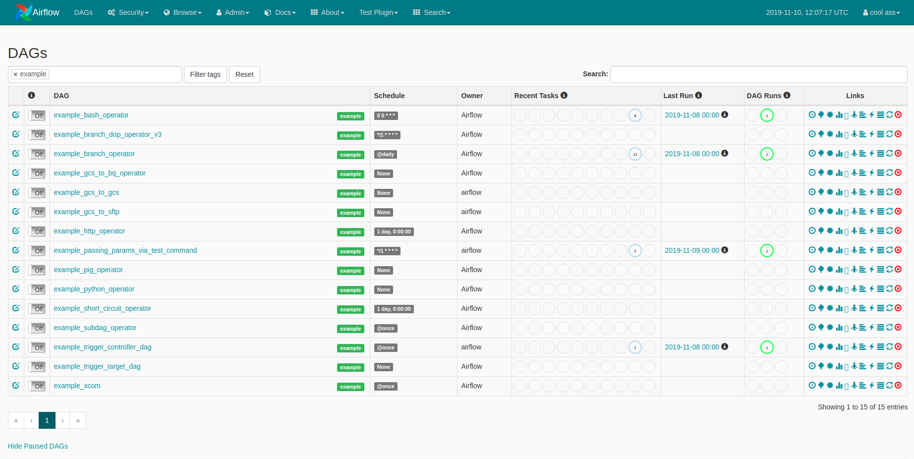

Airflow 1.10.8 contains 160 commits since 1.10.7 and includes 4 new features, 42 improvements, 36 bug fixes, and several doc changes.

We released 1.10.9 on the same day as one of the Flask dependencies (Werkzeug) released 1.0 which broke Airflow 1.10.8.

**Details**:

* **PyPI**: [https://pypi.org/project/apache-airflow/1.10.9/](https://pypi.org/project/apache-airflow/1.10.9/)
* **Docs**: [https://airflow.apache.org/docs/1.10.9/](https://airflow.apache.org/docs/1.10.9/)
* **Changelog (1.10.8)**: [http://airflow.apache.org/docs/1.10.8/changelog.html#airflow-1-10-8-2020-01-07](http://airflow.apache.org/docs/1.10.8/changelog.html#airflow-1-10-8-2020-01-07)
* **Changelog (1.10.9)**: [http://airflow.apache.org/docs/1.10.9/changelog.html#airflow-1-10-9-2020-02-10](http://airflow.apache.org/docs/1.10.9/changelog.html#airflow-1-10-9-2020-02-10)

Some of the noteworthy new features (user-facing) are:

- [Add tags to DAGs and use it for filtering in the UI (RBAC only)](https://github.com/apache/airflow/pull/6489)
- [New Executor: DebugExecutor for Local debugging from your IDE](http://airflow.apache.org/docs/1.10.9/executor/debug.html)
- [Allow passing conf in "Add DAG Run" (Triggered Dags) view](https://github.com/apache/airflow/pull/7281)
- [Allow dags to run for future execution dates for manually triggered DAGs (only if `schedule_interval=None`)](https://github.com/apache/airflow/pull/7038)
- [Dedicated page in documentation for all configs in airflow.cfg](https://airflow.apache.org/docs/1.10.9/configurations-ref.html)

### Add tags to DAGs and use it for filtering in the UI

In order to filter DAGs (e.g by team), you can add tags in each dag. The filter is saved in a cookie and can be reset by the reset button.

For example:

In your Dag file, pass a list of tags you want to add to DAG object:

```python
dag = DAG(
    dag_id='example_dag_tag',
    schedule_interval='0 0 * * *',
    tags=['example']
)
```

**Screenshot**:


**Note**: This feature is only available for the RBAC UI (enabled using `rbac=True` in `[webserver]` section in your `airflow.cfg`).


## Special Note / Deprecations

### Python 2
Python 2 has reached end of its life on Jan 2020. Airflow Master no longer supports Python 2.
Airflow 1.10.* would be the last series to support Python 2.

We strongly recommend users to use Python >= 3.6

### Use Airflow RBAC UI
Airflow 1.10.9 ships with 2 UIs, the default is non-RBAC Flask-admin based UI and Flask-appbuilder based UI.

The Flask-AppBuilder (FAB) based UI is allows Role-based Access Control and has more advanced features compared to
the legacy Flask-admin based UI. This UI can be enabled by setting `rbac=True` in `[webserver]` section in your `airflow.cfg`.

Flask-admin based UI is deprecated and new features won't be ported to it. This UI will still be the default
for 1.10.* series but would no longer be available from Airflow 2.0


## List of Contributors

According to git shortlog, the following people contributed to the 1.10.8 and 1.10.9 release. Thank you to all contributors!

Anita Fronczak, Ash Berlin-Taylor, BasPH, Bharat Kashyap, Bharath Palaksha, Bhavika Tekwani, Bjorn Olsen, Brian Phillips, Cooper Gillan, Daniel Cohen, Daniel Imberman, Daniel Standish, Gabriel Eckers, Hossein Torabi, Igor Khrol, Jacob, Jarek Potiuk, Jay, Jiajie Zhong, Jithin Sukumar, Kamil Breguła, Kaxil Naik, Kousuke Saruta, Mustafa Gök, Noël Bardelot, Oluwafemi Sule, Pete DeJoy, QP Hou, Qian Yu, Robin Edwards, Ry Walker, Steven van Rossum, Tomek Urbaszek, Xinbin Huang, Yuen-Kuei Hsueh, Yu Qian, Zacharya, ZxMYS, rconroy293, tooptoop4
