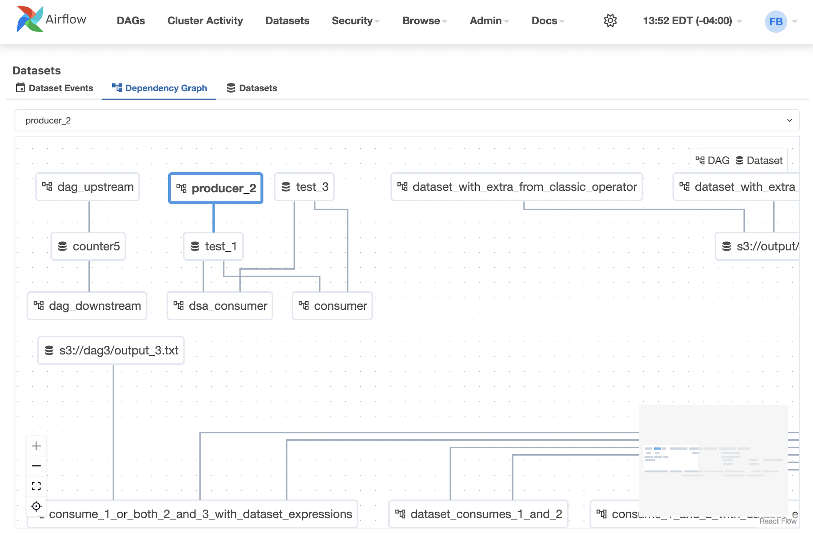
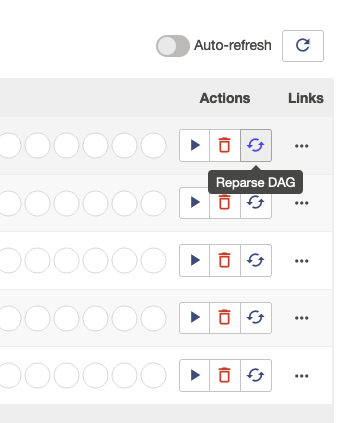
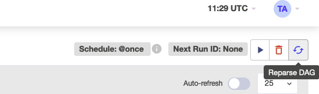

I'm happy to announce that Apache Airflow 2.10.0 is now available, bringing an array of noteworthy enhancements and new features that will greatly serve our community.

**Details**:

📦 PyPI: <https://pypi.org/project/apache-airflow/2.10.0/> \
📚 Docs: <https://airflow.apache.org/docs/apache-airflow/2.10.0/> \
🛠 Release Notes: <https://airflow.apache.org/docs/apache-airflow/2.10.0/release_notes.html> \
🐳 Docker Image: "docker pull apache/airflow:2.10.0" \
🚏 Constraints: <https://github.com/apache/airflow/tree/constraints-2.10.0>

## Airflow now collects Telemetry data by default

With the release of Airflow 2.10.0, we’ve introduced the collection of basic telemetry data, as outlined [here](https://airflow.apache.org/docs/apache-airflow/2.10.0/faq.html#does-airflow-collect-any-telemetry-data). This data will play a crucial role in helping Airflow maintainers gain a deeper understanding of how Airflow is utilized across various deployments. The insights derived from this information are invaluable in guiding the prioritization of patches, minor releases, and security fixes. Moreover, this data will inform key decisions regarding the development roadmap, ensuring that Airflow continues to evolve in line with community needs.

For those who prefer not to participate in data collection, deployments can easily opt-out by setting the `[usage_data_collection] enabled` option to `False` or by using the `SCARF_ANALYTICS=false` environment variable.


## Multiple Executor Configuration (formerly "Hybrid Execution")

Each executor comes with its unique set of strengths and weaknesses, typically balancing latency, isolation, and compute efficiency. Traditionally, an Airflow environment is limited to a single executor, requiring users to make trade-offs, as no single executor is perfectly suited for all types of tasks.

We are introducing a new feature that allows for the concurrent use of multiple executors within a single Airflow environment. This flexibility enables users to take advantage of the specific strengths of different executors for various tasks, improving overall efficiency and mitigating weaknesses. Users can set a default executor for the entire environment and, if necessary, assign particular executors to individual DAGs or tasks.

To configure multiple executors we can pass comma separated list in airflow configuration. The first executor in the list will be the default executor for the environment.

```
[core]
executor = 'LocalExecutor,CeleryExecutor'
```

To make it easier for dag authors, we can also specify aliases for executors that can be specified in the executor configuration

```commandline
[core]
executor = 'LocalExecutor,KubernetesExecutor,my.custom.module.ExecutorClass:ShortName'
```

DAG authors can specify executors to use at the task

```python
BashOperator(
    task_id="hello_world",
    executor="ShortName",
    bash_command="echo 'hello world!'",
)

@task(executor="KubernetesExecutor")
def hello_world():
    print("hello world!")
```

We can also specify executors on the DAG level

```python
def hello_world():
    print("hello world!")

def hello_world_again():
    print("hello world again!")

with DAG(
    dag_id="hello_worlds",
    default_args={"executor": "ShortName"},  # Applies to all tasks in the DAG
) as dag:
    # All tasks will use the executor from default args automatically
    hw = hello_world()
    hw_again = hello_world_again()
```

## Dynamic Dataset scheduling through DatasetAlias

Airflow 2.10 comes with `DatasetAlias` class which can be passed as a value in the `outlets`, `inlets` on a task, and `schedule` on a DAG. An instance of `DatasetAlias` is resolved dynamically to a real dataset. Downstream can depend on either the resolved dataset or on an alias itself.

`DatasetAlias` has one argument `name` that uniquely identifies the dataset. The task must first declare the alias as an outlet, and use `outlet_events` or `yield Metadata` to add events to it.

### Emit a dataset event during task execution through outlet_events

```python
from airflow.datasets import DatasetAlias

@task(outlets=[DatasetAlias("my-task-outputs")])
def my_task_with_outlet_events(*, outlet_events):
    outlet_events["my-task-outputs"].add(Dataset("s3://bucket/my-task"))
```

### Emit a dataset event during task execution by yielding Metadata

```python
from airflow.datasets.metadata import Metadata

@task(outlets=[DatasetAlias("my-task-outputs")])
def my_task_with_metadata():
    s3_dataset = Dataset("s3://bucket/my-task}")
    yield Metadata(s3_dataset, alias="my-task-outputs")
```

There are two options for scheduling based on dataset aliases. Schedule based on `DatasetAlias` or real datasets.

```python
with DAG(dag_id="dataset-alias-producer"):
    @task(outlets=[DatasetAlias("example-alias")])
    def produce_dataset_events(*, outlet_events):
        outlet_events["example-alias"].add(Dataset("s3://bucket/my-task"))

with DAG(dag_id="dataset-consumer", schedule=Dataset("s3://bucket/my-task")):
    ...

with DAG(dag_id="dataset-alias-consumer", schedule=DatasetAlias("example-alias")):
    ...
```

### Dataset Aliases UI Enhancements

Now users can see Dataset Aliases in legend of each cross-dag dependency graph with a corresponded icon/color.


## Dark Mode for Airflow UI

Airflow 2.10 comes with new Dark Mode feature which is designed to enhance user experience by offering an alternative visual theme that is easier on the eyes, especially in low-light conditions. You can toggle the crescent icon on the right side of the navigation bar to switch between light and dark mode.


## Task Instance History

In Apache Airflow 2.10.0, when a task instance is retried or cleared, its execution history is maintained. You can view this history by clicking on the task instance in the Grid view, allowing you to access information about each attempt, such as logs, execution durations, and any failures. This feature improves transparency into the task's execution process, making it easier to troubleshoot and analyze your DAGs.


The history displays the final values of the task instance attributes for each specific run. On the log page, you can also access the logs for each attempt of the task instance. This information is valuable for debugging purposes.


## Dataset UI Enhancements

The dataset page has been revamped to include a focused dataset events section with additional details such as extras, consuming DAGs, and producing tasks.


We now have separate dependency graph and dataset list pages in new tabs, enhancing the user experience.



Dataset events are now displayed in both the Details tab of each DAG run and within the DAG graph.


### Toggle datasets in Graph

We can now toggle the datasets in the DAG graph


### Dataset Conditions in DAG Graph view

We now display the graph view with logical gates. Datasets with actual events are highlighted with a different border, making it easier to see what triggered the selected run.


### Dataset event info in DAG Graph

For a DAG run, users can now view the dataset events connected to it directly in the graph view.


## On-demand DAG Re-parsing

In 2.10 users can now reparse the DAGs on demand using below button on DAG list and DAG detail pages




## Additional new features

Here are just a few interesting new features since there are too many to list in full:

* Deferrable operators can now execute directly from the triggerer without needing to go through the worker. This is especially efficient for certain operators, like sensors, and can help teams save both time and money.
* Crucial executor logs are now integrated into the task logs. If the executor fails to start a task, the relevant error messages will be available in the task logs, simplifying the debugging process.

## Contributors

Thanks to everyone who contributed to this release, including Andrey Anshin, Brent Bovenzi, Daniel Standish, Ephraim Anierobi, Hussein Awala, Jarek Potiuk, Jed Cunningham, Jens Scheffler, Tzu-ping Chung, Vincent, and over 63 others!

I hope you enjoy using Apache Airflow 2.10.0!
