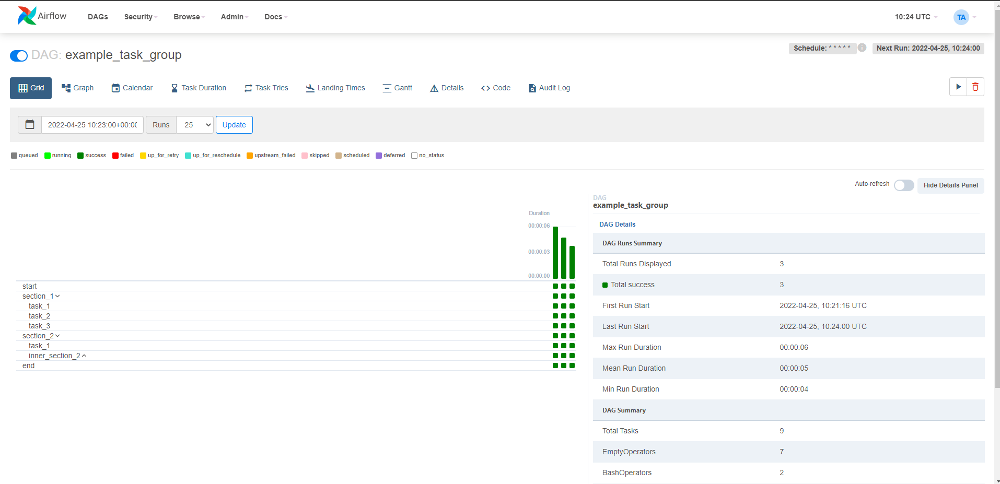

Apache Airflow 2.3.0 contains over 700 commits since 2.2.0 and includes 50 new features, 99 improvements, 85 bug fixes, and several doc changes.

**Details**:

📦 PyPI: https://pypi.org/project/apache-airflow/2.3.0/ \
📚 Docs: https://airflow.apache.org/docs/apache-airflow/2.3.0/ \
🛠️ Release Notes: https://airflow.apache.org/docs/apache-airflow/2.3.0/release_notes.html \
🐳 Docker Image: docker pull apache/airflow:2.3.0 \
🚏 Constraints: https://github.com/apache/airflow/tree/constraints-2.3.0

As the changelog is quite large, the following are some notable new features that shipped in this release.

## Dynamic Task Mapping(AIP-42)

There's now first-class support for dynamic tasks in Airflow. What this means is that you can generate tasks dynamically at runtime. Much like using a `for` loop
to create a list of tasks, here you can create the same tasks without having to know the exact number of tasks ahead of time.

You can have a `task` generate the list to iterate over, which is not possible with a `for` loop.

Here is an example:

```python
@task
def make_list():
    # This can also be from an API call, checking a database, -- almost anything you like, as long as the
    # resulting list/dictionary can be stored in the current XCom backend.
    return [1, 2, {"a": "b"}, "str"]


@task
def consumer(arg):
    print(list(arg))


with DAG(dag_id="dynamic-map", start_date=datetime(2022, 4, 2)) as dag:
    consumer.expand(arg=make_list())
```

More information can be found here: [Dynamic Task Mapping](https://airflow.apache.org/docs/apache-airflow/2.3.0/concepts/dynamic-task-mapping.html)

## Grid View replaces Tree View

Grid view replaces tree view in Airflow 2.3.0.

**Screenshots**:


## Purge history from metadata database

Airflow 2.3.0 introduces a new `airflow db clean` command that can be used to purge old data from the metadata database.

You would want to use this command if you want to reduce the size of the metadata database.

More information can be found here: [Purge history from metadata database](https://airflow.apache.org/docs/apache-airflow/2.3.0/usage-cli.html#purge-history-from-metadata-database)

## LocalKubernetesExecutor

There is a new executor named LocalKubernetesExecutor. This executor helps you run some tasks using LocalExecutor and run another set of tasks using the KubernetesExecutor in the same deployment based on the task's queue.

More information can be found here: [LocalKubernetesExecutor](https://airflow.apache.org/docs/apache-airflow/2.3.0/executor/local_kubernetes.html)


## DagProcessorManager as standalone process (AIP-43)

As of 2.3.0, you can run the DagProcessorManager as a standalone process. Because DagProcessorManager runs user code, separating it from the scheduler process and running it as an independent process in a different host is a good idea.

The `airflow dag-processor` cli command will start a new process that will run the DagProcessorManager in a separate process. Before you can run the DagProcessorManager as a standalone process, you need to set the [[scheduler] standalone_dag_processor](https://airflow.apache.org/docs/apache-airflow/stable/configurations-ref.html#standalone_dag_processor) to `True`.

More information can be found here: [dag-processor CLI command](https://airflow.apache.org/docs/apache-airflow/2.3.0/cli-and-env-variables-ref.html#dag-processor)

## JSON serialization for connections
You can now create connections using the `json` serialization format.

```bash
airflow connections add 'my_prod_db' \
    --conn-json '{
        "conn_type": "my-conn-type",
        "login": "my-login",
        "password": "my-password",
        "host": "my-host",
        "port": 1234,
        "schema": "my-schema",
        "extra": {
            "param1": "val1",
            "param2": "val2"
        }
    }'
```
You can also use `json` serialization format when setting the connection in environment variables.

More information can be found here: [JSON serialization for connections](https://airflow.apache.org/docs/apache-airflow/2.3.0/howto/connection.html)

## Airflow `db downgrade` and Offline generation of SQL scripts

Airflow 2.3.0 introduced a new command `airflow db downgrade` that will downgrade the database to your chosen version.

You can also generate the downgrade/upgrade SQL scripts for your database and manually run it against your database or just view the SQL queries that would be run by the downgrade/upgrade command.

More information can be found here: [Airflow `db downgrade` and Offline generation of SQL scripts](https://airflow.apache.org/docs/apache-airflow/2.3.0/usage-cli.html#downgrading-airflow)

## Reuse of decorated tasks

You can now reuse decorated tasks across your dag files. A decorated task has an `override` method that allows you to override it's arguments.

Here's an example:

```python
@task
def add_task(x, y):
    print(f"Task args: x={x}, y={y}")
    return x + y


@dag(start_date=datetime(2022, 1, 1))
def mydag():
    start = add_task.override(task_id="start")(1, 2)
    for i in range(3):
        start >> add_task.override(task_id=f"add_start_{i}")(start, i)
```

More information can be found here: [Reuse of decorated DAGs](https://airflow.apache.org/docs/apache-airflow/2.3.0/tutorial_taskflow_api.html#reusing-a-decorated-task)

## Other small features

This isn’t a comprehensive list, but some noteworthy or interesting small features include:

- Support different timeout value for dag file parsing
- `airflow dags reserialize` command to reserialize dags
- Events Timetable
- SmoothOperator - Operator that does literally nothing except logging a YouTube link to
    Sade's "Smooth Operator". Enjoy!

## Contributors
Thanks to everyone who contributed to this release: Ash Berlin-Taylor, Brent Bovenzi, Daniel Standish, Elad, Ephraim Anierobi, Jarek Potiuk, Jed Cunningham, Josh Fell, Kamil Breguła, Kanthi, Kaxil Naik, Khalid Mammadov, Malthe Borch, Ping Zhang, Tzu-ping Chung and many others who keep making Airflow better for everyone.
