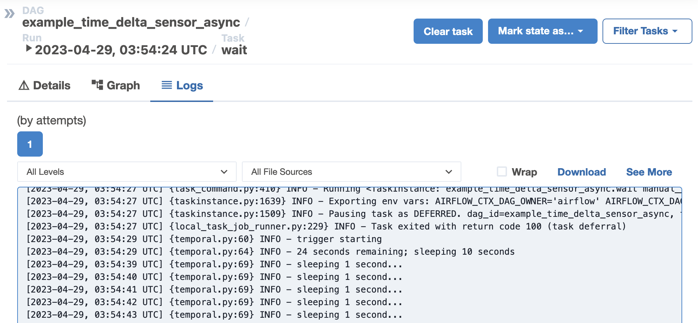
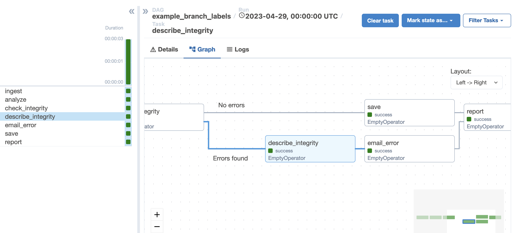
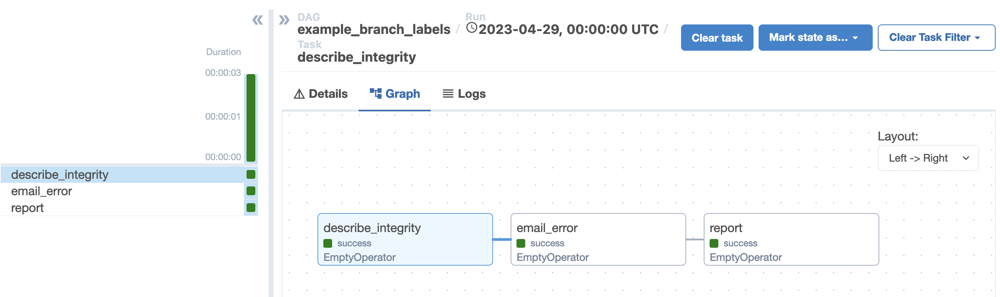
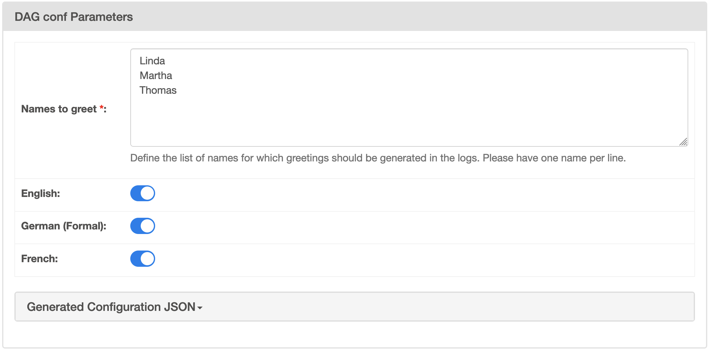

I am excited to announce that Apache Airflow 2.6.0 has been released, bringing many minor features and improvements to the community.

Apache Airflow 2.6.0 contains over 500 commits, which include 42 new features, 58 improvements, 38 bug fixes, and 17 documentation changes.

**Details**:

📦 PyPI: https://pypi.org/project/apache-airflow/2.6.0/ \
📚 Docs: https://airflow.apache.org/docs/apache-airflow/2.6.0/ \
🛠 Release Notes: https://airflow.apache.org/docs/apache-airflow/2.6.0/release_notes.html \
🐳 Docker Image: "docker pull apache/airflow:2.6.0" \
🚏 Constraints: https://github.com/apache/airflow/tree/constraints-2.6.0

As the changelog is quite large, the following are some notable new features that shipped in this release.

## Trigger logs can now be viewed in webserver

Trigger logs have now been added to task logs. They appear right alongside the rest of the logs from your task.



Adding this feature required changes across the entire Airflow logging stack, so be sure to update your providers if you are using remote logging.

## Grid view improvements

The grid view has received a number of minor improvements in this release.

Most notably, there is now a graph tab in the grid view. This offers a more integrated graph representation of the DAG, where choosing a task in either the grid or graph will highlight the same task in both views.



You can also filter upstream and downstream from a single task. For example, in the screenshot above, `describe_integrity` is the selected task. If you choose to filter downstream, this is the result:



## Trigger UI based on DAG level params

A user-friendly form is now shown to users triggering runs for DAGs with DAG level params.



See the [Params docs](https://airflow.apache.org/docs/apache-airflow/2.6.0/core-concepts/params.html#use-params-to-provide-a-trigger-ui-form) for more details.

## Consolidation of handling stuck queued tasks

Airflow now has a single configuration, `[scheduler] task_queued_timeout`, to handle tasks that get stuck in queued for too long. With a simpler implementation than the outgoing code handling these tasks, tasks stuck in queued will no longer slip through the cracks and stay stuck.

For more details, see the [Unsticking Airflow: Stuck Queued Tasks are No More in 2.6.0](https://medium.com/apache-airflow/unsticking-airflow-stuck-queued-tasks-are-no-more-in-2-6-0-6f40a1a22835) Medium post.

## Cluster Policy hooks can come from plugins

Cluster policy hooks (e.g. `dag_policy`), can now come from Airflow plugins in addition to Airflow local settings. By allowing multiple hooks to be defined, it makes it easier for more than one team to run hooks in a single Airflow instance.

See the [cluster policy docs](https://airflow.apache.org/docs/apache-airflow/2.6.0/administration-and-deployment/cluster-policies.html) for more details.

## Notification support added

The notifications framework allows you to send messages to external systems when a task instance/DAG run changes state. For example, you can easily post a message to Slack

```python
with DAG(
    “slack_notifier_example”,
    start_date=datetime(2023, 1, 1),
    on_success_callback=[
        send_slack_notification(
            text="The DAG {{ dag.dag_id }} succeeded",
            channel="#general",
            username="Airflow",
        )
    ],
):
```

As of today, Slack is the only system supported out of the box. However, watch this space as more integrations will be added soon.

You can also create notifiers for your own use, refer to the [notifier how-to docs](https://airflow.apache.org/docs/apache-airflow/2.6.0/howto/notifications.html) for more details.

## Thanks to the contributors

Thanks to everyone who contributed to this release, including Andrey Anshin, Ash Berlin-Taylor, Brent Bovenzi, Daniel Standish, Ephraim Anierobi, Hussein Awala, Jarek Potiuk, Jed Cunningham, Josh Fell, Michael Petro, Niko Oliveira, Pierre Jeambrun, Tzu-ping Chung, Victor Chiapaikeo, and over 120 others!

I'd especially like to thank our release manager, Ephraim, for getting this release out the door.

I hope you enjoy using Apache Airflow 2.6.0!
