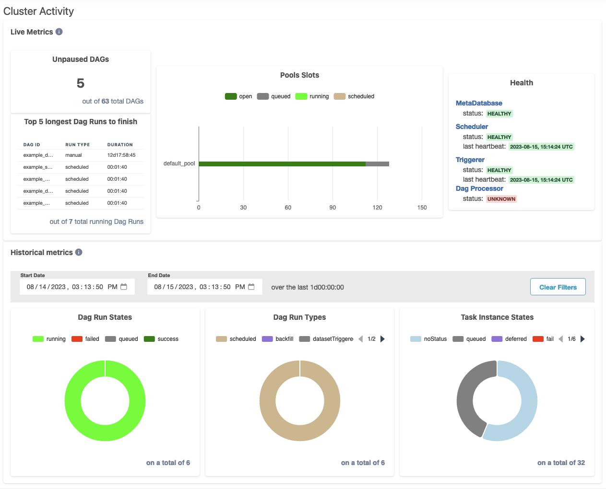
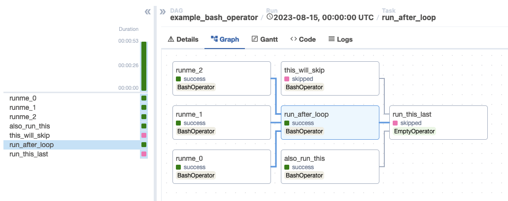

I’m happy to announce that Apache Airflow 2.7.0 has been released! Some notable features have been added that we are excited for the community to use.

Apache Airflow 2.7.0 contains over 500 commits, which include 40 new features, 49 improvements, 53 bug fixes, and 15 documentation changes.

**Details**:

📦 PyPI: https://pypi.org/project/apache-airflow/2.7.0/ \
📚 Docs: https://airflow.apache.org/docs/apache-airflow/2.7.0/ \
🛠 Release Notes: https://airflow.apache.org/docs/apache-airflow/2.7.0/release_notes.html \
🐳 Docker Image: "docker pull apache/airflow:2.7.0" \
🚏 Constraints: https://github.com/apache/airflow/tree/constraints-2.7.0

Airflow 2.7.0 is a release that focuses on security. The Airflow security team, working together with security researchers, identified a number of areas that required strengthening of security. This resulted in, among others things, an improved description of the [Airflow security model](https://airflow.apache.org/docs/apache-airflow/stable/security/security_model/), a better explanation of our [security policy](https://github.com/apache/airflow/security/policy) and the disabling of certain, potentially dangerous, features by default - like, for example, connection testing (#32052).

Airflow 2.7.0 is also the first release that drops support for end-of-life Python 3.7. This allows Airflow users and maintainers to make use of features and improvements in Python 3.8, and unlocks newer versions of our dependencies.

## Setup and Teardown (AIP-52)

Airflow now has first class support for the concept of setup and teardown tasks. These tasks have special behavior in that:

* Teardown tasks will still run, no matter what state the upstream tasks end up in
* Teardown tasks failing won’t, by default, cause the DAG run to fail
* Automatically clear setup/teardown tasks when clearing a dependent task

You can read more about setup and teardown in the [Introducing Setup and Teardown tasks blog post](), or in the [setup and teardown docs](https://airflow.apache.org/docs/apache-airflow/2.7.0/howto/setup-and-teardown.html).

## Cluster Activity UI

There is a new top level page in Airflow, the Cluster Activity page. This gives an overview of the cluster, including component health, dag and task state counts, and more!

## Graph and gantt views moved into the Grid view UI

The graph and gantt views have been rewritten and moved into the now familiar grid view. This makes it easier to jump between task details, logs, graph, and gantt views without losing your place in a complicated DAG.

## Enable deferrable mode for all deferable tasks with 1 config setting

Airflow 2.7.0 comes with a new config option, `default_deferrable`, which allows admins to enable deferrable mode for all deferrable tasks without requiring any DAG modifications. Simply set it in your config and enjoy async tasks!

## OpenLineage built-in integration

[OpenLineage](https://openlineage.io/) provides a spec standardizing operational lineage collection and distribution across the data ecosystem that projects – open source or proprietary – implement.

With 2.7.0, OpenLineage changes from a plugin implementation maintained in the OpenLineage project to a built-in feature of Airflow. As a plugin, OpenLineage depended on Airflow and operators’ internals, making it brittle. Built-in OpenLineage support in Airflow makes publishing operational lineage through the OpenLineage ecosystem easier and more reliable. It has been implemented by moving the [openlineage-airflow](https://github.com/OpenLineage/OpenLineage/tree/main/integration/airflow) package from the OpenLineage project to an `apache-airflow-providers-openlineage` provider in the base Airflow Docker image, where it can be easily enabled by configuration. Also, lineage extraction logic that was included in [Extractors](https://github.com/OpenLineage/OpenLineage/tree/main/integration/airflow/openlineage/airflow/extractors) in that package has been moved into each corresponding provider package along with unit tests, eliminating the need for Extractors in most cases. For this purpose, a new optional API for Operators (`get_openlineage_facets_on_{start(), complete(ti), failure(ti)}`, documented [here](https://openlineage.io/docs/integrations/airflow/default-extractors)) can be used. Having the extraction logic in each provider ensures the stability of the lineage contract in each operator and makes adding lineage coverage to custom operators easier.

## Some executors moved into providers

Some of the executors that were shipped in core Airflow have moved into their respective providers for Airflow 2.7.0. The great benefit of this is to allow faster bug-fix releases as providers are released independently from core.
The following providers have been moved and require certain minimum providers versions:

* In order to use Celery executors, install the [celery provider version 3.3.0+](https://pypi.org/project/apache-airflow-providers-celery/)
* In order to use the Kubernetes executor, install the [kubernetes provider version 7.4.0+](https://pypi.org/project/apache-airflow-providers-cncf-kubernetes/)
* In order to use the Dask executor, install any version of the [daskexecutor provider](https://pypi.org/project/apache-airflow-providers-daskexecutor/)

If you use the official docker images, all of these providers come preinstalled.

## Additional new features

Here are just a few interesting new features, since there are too many to list in full:

* Pools can now consider tasks in the deferred state as running (#32709)
* chain_linear, like chain but allowing sequential tasks (#31927)
* Grid view now supports keyboard shortcuts! (#30950)
* Mark task groups as success or failed (#30478)
* Fail_stop, allowing all remaining and running tasks to be failed on the first failure in a DAG (#29406)

## Contributors

Thanks to everyone who contributed to this release, including Akash Sharma, Amogh Desai, Brent Bovenzi, D. Ferruzzi, Daniel Standish, Ephraim Anierobi, Hussein Awala, Jarek Potiuk, Jed Cunningham, Karthikeyan Singaravelan, Maciej Obuchowski, Niko Oliveira, Pankaj Koti, Pankaj Singh, Pierre Jeambrun, Tzu-ping Chung, Utkarsh Sharma, Vincent Beck, and over 74 others!

I’d especially like to thank our release manager, Ephraim, for getting this release out the door.

I hope you enjoy using Apache Airflow 2.7.0!
