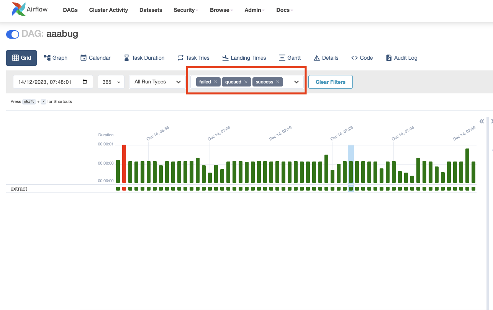
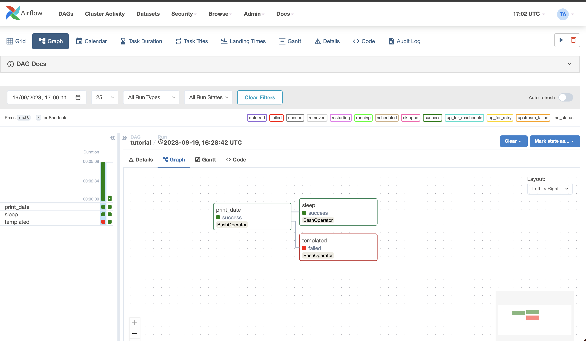

I am thrilled to announce the release of Apache Airflow 2.8.0, featuring a host of significant enhancements and new features that will greatly benefit our community.

**Details**:

📦 PyPI: https://pypi.org/project/apache-airflow/2.8.0/ \
📚 Docs: https://airflow.apache.org/docs/apache-airflow/2.8.0/ \
🛠 Release Notes: https://airflow.apache.org/docs/apache-airflow/2.8.0/release_notes.html \
🐳 Docker Image: "docker pull apache/airflow:2.8.0" \
🚏 Constraints: https://github.com/apache/airflow/tree/constraints-2.8.0

## Airflow Object Storage (AIP-58)

*This feature is experimental and subject to change.*

Airflow now offers a generic abstraction layer over various object stores like S3, GCS, and Azure Blob Storage, enabling the use of different storage systems in DAGs without code modification.

In addition, it allows you to use most of the standard Python modules, like shutil, that can work with file-like objects.

Here is an example of how to use the new feature to open a file:

```python
from airflow.io.path import ObjectStoragePath

base = ObjectStoragePath("s3://my-bucket/", conn_id="aws_default")  # conn_id is optional

@task
def read_file(path: ObjectStoragePath) -> str:
    with path.open() as f:
        return f.read()
```

The above example is just the tip of the iceberg. The new feature allows you to configure an alternative backend for a scheme or protocol.

Here is an example of how to configure a custom backend for the `dbfs` scheme:

```python
from airflow.io.path import ObjectStoragePath
from airflow.io.store import attach

from fsspec.implementations.dbfs import DBFSFileSystem

attach(protocol="dbfs", fs=DBFSFileSystem(instance="myinstance", token="mytoken"))
base = ObjectStoragePath("dbfs://my-location/")
```

For more information: [Airflow Object Storage](https://airflow.apache.org/docs/apache-airflow/stable/core-concepts/objectstorage.html)

The support for a specific object storage system depends on the installed providers,
with out-of-the-box support for the file scheme.

## Ship logs from other components to Task logs

This feature seamlessly integrates task-related messages from various Airflow components, including the Scheduler and
Executors, into the task logs. This integration allows users to easily track error messages and other relevant
information within a single log view.

Presently, suppose a task is terminated by the scheduler before initiation, times out due to prolonged queuing, or transitions into a zombie state. In that case, it is not recorded in the task log. With this enhancement, in such situations,
it becomes feasible to dispatch an error message to the task log for convenient visibility on the UI.

This feature can be toggled, for more information [see “enable_task_context_logger” in the logging configuration documentation](https://airflow.apache.org/docs/apache-airflow/stable/configurations-ref.html#enable-task-context-logger).

## Listener hooks for Datasets

*Please note that listeners are still experimental and subject to change.*

This feature enables users to subscribe to Dataset creation and update events using listener hooks.
It’s particularly useful to trigger external processes based on a Dataset being created or updated.

## Using Extra Index URLs with PythonVirtualEnvOperator and Caching
This feature allows you to specify extra index URLs to PythonVirtualEnvOperator (+corresponding decorator) to be able to install virtualenvs with (private) additional Python package repositories.

You can also reuse the virtualenvs by caching them in a specified directory and reusing them in subsequent runs. This
can be achieved by setting the ``venv_cache_path`` to a file system folder on your worker

For more information: [PythonVirtualenvOperator](https://airflow.apache.org/docs/apache-airflow/stable/howto/operator/python.html#pythonvirtualenvoperator)

# Web UI improvements

There are a number of improvements to the Web UI in this release, including:

## Add multiselect to run state in grid view:
The grid view now supports multiselect for run states. This allows you to select multiple states to filter the dag runs shown in the grid view.



## Improved visibility of task status in the Graph view
You can now see the status of a task in the graph view through the border color of the task. This makes it easier to see the status of a task at a glance.



## Raw HTML code in DAG docs and DAG params descriptions is disabled by default
As part of our continuous quest to make airflow more secure by default, we have disabled raw HTML code in DAG docs and DAG params descriptions by default.
We care for your security, and "secure by default" is one of the things we follow strongly.

Other notable UI improvements include:
  - Simplify DAG trigger UI
  - Hide logical date and run id in trigger UI form
  - Move external logs links to top of react logs page

Additional new features and improvements can be found in the [Airflow 2.8.0 release notes](https://airflow.apache.org/docs/apache-airflow/2.8.0/release_notes.html#airflow-2-8-0-2023-12-14).

# Contributors
Thanks to everyone who contributed to this release, including Amogh Desai, Andrey Anshin, Bolke de Bruin, Daniel Dyląg, Daniel Standish, Ephraim Anierobi, Hussein Awala, Jarek Potiuk, Jed Cunningham, Jens Scheffler, mhenc, Miroslav Šedivý, Pankaj Koti, Tzu-ping Chung, Vincent, and everyone else who committed, all 110 of you! You are what makes Airflow the successful project that it is!

I hope you enjoy using Apache Airflow 2.8.0!
