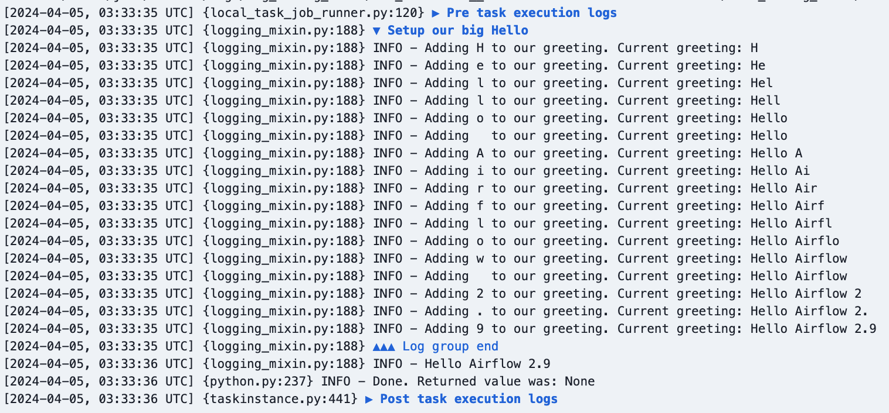

I’m happy to announce that Apache Airflow 2.9.0 has been released! This time around we have new features for data-aware scheduling and a bunch of UI-related improvements.

Apache Airflow 2.9.0 contains over 550 commits, which include 38 new features, 70 improvements, 31 bug fixes, and 18 documentation changes.

**Details**:

📦 PyPI: https://pypi.org/project/apache-airflow/2.9.0/ \
📚 Docs: https://airflow.apache.org/docs/apache-airflow/2.9.0/ \
🛠 Release Notes: https://airflow.apache.org/docs/apache-airflow/2.9.0/release_notes.html \
🐳 Docker Image: "docker pull apache/airflow:2.9.0" \
🚏 Constraints: https://github.com/apache/airflow/tree/constraints-2.9.0

Airflow 2.9.0 is also the first release that supports Python 3.12. However, Pendulum 2 does not support Python 3.12, so you’ll need to use [Pendulum 3](https://pendulum.eustace.io/blog/announcing-pendulum-3-0-0.html) if you upgrade to Python 3.12.

## New data-aware scheduling options

### Logical operators and conditional expressions for DAG scheduling

When Datasets were added in Airflow 2.4, DAGs only had scheduling support for logical AND combinations of Datasets. Simply, you could schedule against more than one Dataset, but a DAG run would only be created once all the Datasets were updated after the last run. Now in Airflow 2.9, we support logical OR and even arbitrary combinations of AND and OR.

As an example, you can schedule a DAG whenever `dataset_1` or `dataset_2` are updated :

```python
with DAG(schedule=(dataset_1 | dataset_2), ...):
    ...
```

You can have arbitrary combinations:

```python
with DAG(schedule=((dataset_1 | dataset_2) & dataset_3), ...):
    ...
```

You can read more about this new functionality in the [data-aware scheduling docs](https://airflow.apache.org/docs/apache-airflow/2.9.0/authoring-and-scheduling/datasets.html#advanced-dataset-scheduling-with-conditional-expressions).

### Combining Dataset and Time-Based Schedules

Airflow 2.9 comes with a new timetable, `DatasetOrTimeSchedule`, that allows you to schedule DAGs based on both dataset events and a timetable. Now you have the best of both worlds.

For example, to run whenever `dataset_1` updates and at midnight UTC:

```python
with DAG(
    schedule=DatasetOrTimeSchedule(
        timetable=CronTriggerTimetable("0 0 * * *", timezone="UTC"),
        datasets=[dag1_dataset],
    ),
    ...
):
    ...

```

### Dataset Event REST API endpoints

New REST API endpoints have been introduced for creating, listing, and deleting dataset events. This makes it possible for external systems to notify Airflow about dataset updates and unlocks management of event queues for more sophisticated use cases.

See the [Dataset API docs](https://airflow.apache.org/docs/apache-airflow/2.9.0/stable-rest-api-ref.html#tag/Dataset) for more details.


### Dataset UI Enhancements

The DAG's graph view has been enhanced to display both the datasets it is scheduled on and those in the task outlets, providing a comprehensive overview of the datasets consumed and produced by the DAG.


The main datasets view now allows you to filter for both DAGs and datasets:


When viewing a Dataset, you can now create a manual dataset event through the UI by clicking the play button shown in the top right here:


## Custom names for Dynamic Task Mapping

Gone are the days of clicking into index numbers and hunting for the dynamically mapped task you wanted to see! This has been a requested feature ever since task mapping was added in Airflow 2.3, and we are happy it’s finally here.

You can provide a `map_index_template` to mapped operators:

```python
BashOperator.partial(
    task_id="hello",
    bash_command="echo Hello $NAME",
    map_index_template="{{ task.env['NAME'] }}",
).expand(
    env=[{"NAME": "John"}, {"NAME": "Bob"}, {"NAME": "Fred"}],
)
```

That template will be rendered after each task finishes running and will populate the name in the UI:


More details on this, including a taskflow example, is available in the [dynamic task mapping docs](https://airflow.apache.org/docs/apache-airflow/2.9.0/authoring-and-scheduling/dynamic-task-mapping.html#named-mapping).

## Object Storage as XCom Backend

You can now configure Object Storage to be used as an XCom backend, making it much easier to get XCom results into an object store. Deployment managers can configure the object store of their choice, a size threshold to route some results to the Airflow metadata database and some to the object store, and even a compression method to apply before the data is stored.

The following configuration will store anything above 1MB in S3 and will compress it using gzip:

```
[core]
xcom_backend = airflow.providers.common.io.xcom.backend.XComObjectStoreBackend

[common.io]
xcom_objectstorage_path = s3://conn_id@mybucket/key
xcom_objectstorage_threshold = 1048576
xcom_objectstorage_compression = gzip
```

See the [docs on the object storage xcom backend](https://airflow.apache.org/docs/apache-airflow/2.9.0/core-concepts/xcoms.html#object-storage-xcom-backend) for more details.

## Display names for DAGs and Tasks

Get your emojis ready! You can now set a display name for dags and tasks, separate from the `dag_id` and `task_id`. This allows you to have localized display names in the UI, or just use a bunch of emojis.

Using `dag_display_name` and `task_display_name`, you can break away from the ascii handcuffs:

```python
with DAG("not_a_fun_dag_id", dag_display_name="📣 Best DAG ever 🎉", ...):
    BashOperator(task_id="some_task", task_display_name="🥳 Fun task!", ...)
```


## Task log grouping

Airflow now has support for arbitrary grouping of task logs.

By default, pre-execute and post-execute logs are grouped and collapsed, making it easier to see your task logs:


You can also use this feature in your task code to make your logs easier to follow:

```python
@task
def big_hello():
    print("::group::Setup our big Hello")
    greeting = ""
    for c in "Hello Airflow 2.9":
        greeting += c
        print(f"Adding {c} to our greeting. Current greeting: {greeting}")
    print("::endgroup::")
    print(greeting)
```

That custom group is collapsed by default:


And it can be expanded if you want to dig into the details:



## UI Modernization

In addition to all the UI improvements mentioned above, we have a bunch more improvements in Airflow 2.9!

The rest of the DAG level views have been moved into React and the grid view interface, allowing for a more cohesive experience. This includes the calendar, task duration, run duration (which replaces landing times), and the audit log. These weren’t just “moved”, they each were improved upon as well.

Here is the new run duration view, which replaces landing times. Users can toggle between landing times and simple run duration:


And the new task duration view. Users can toggle queued time on/off and see the median value across the displayed runs:


## Additional new features

Here are just a few interesting new features since there are too many to list in full:

* All create/update/delete actions in the REST API are now recorded in the audit log
* [New `on_skipped_callback`](https://airflow.apache.org/docs/apache-airflow/2.9.0/administration-and-deployment/logging-monitoring/callbacks.html#callback-types)
* [Auto pause DAGs after n consecutive failures](https://airflow.apache.org/docs/apache-airflow/2.9.0/core-concepts/dags.html#dag-auto-pausing-experimental)
* Support for [Matomo](https://matomo.org/) as an [analytics tool](https://airflow.apache.org/docs/apache-airflow/2.9.0/administration-and-deployment/logging-monitoring/tracking-user-activity.html)
* [New `@task.bash` TaskFlow decorator](https://airflow.apache.org/docs/apache-airflow/2.9.0/howto/operator/bash.html)
* Support regex in dag_id for the DAG pause and resume CLI commands
* `airflow tasks test` now works with deferrable operators

## Contributors

Thanks to everyone who contributed to this release, including Amogh Desai, Andrey Anshin, Brent Bovenzi, Daniel Standish, Ephraim Anierobi, Hussein Awala, Jarek Potiuk, Jed Cunningham, Jens Scheffler, Tzu-ping Chung, Vincent Beck, Wei Lee, and over 120 others!

I’d especially like to thank our release manager, Ephraim, for getting this release out the door.

I hope you enjoy using Apache Airflow 2.9.0!
