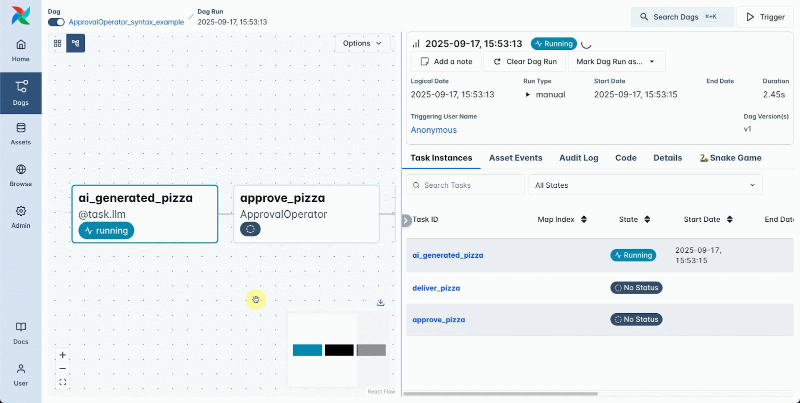
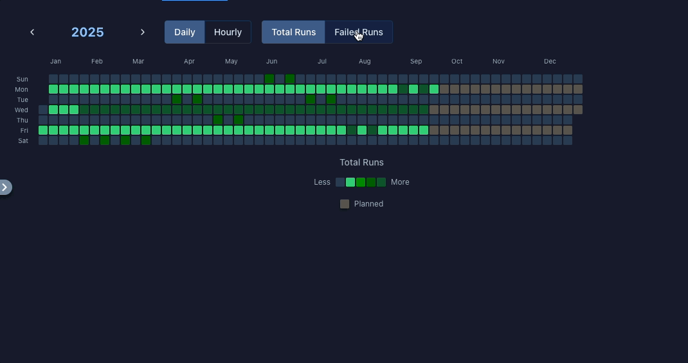
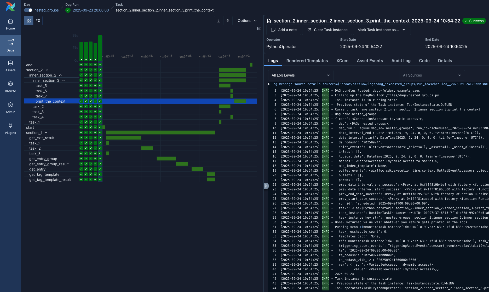
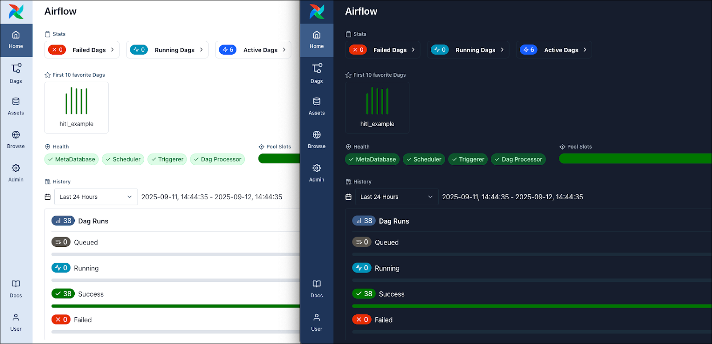
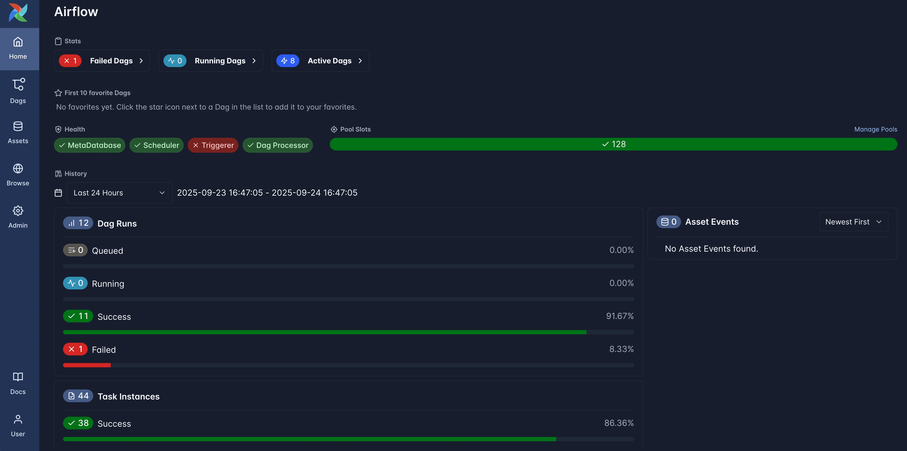

We are thrilled to announce the release of **Apache Airflow 3.1.0**, an update that puts humans at the center of data
workflows. This release introduces powerful new capabilities for human decision-making in automated
processes, comprehensive internationalization support, and significant developer experience improvements.

**Details**:

📦 PyPI: https://pypi.org/project/apache-airflow/3.1.0/ \
📚 Core Airflow Docs: https://airflow.apache.org/docs/apache-airflow/3.1.0/ \
📚 Task SDK Docs: https://airflow.apache.org/docs/task-sdk/1.1.0/ \
🛠️ Release Notes: https://airflow.apache.org/docs/apache-airflow/3.1.0/release_notes.html \
🪶 Sources: https://airflow.apache.org/docs/apache-airflow/3.1.0/installation/installing-from-sources.html \
🚏 Constraints: https://github.com/apache/airflow/tree/constraints-3.1.0

## 🤝 Human-in-the-Loop (HITL): When Automation Meets Human Judgment

This powerful capability bridges the gap between automated processes and human expertise, making Airflow invaluable for:



* **AI/ML Model Validation**: Pause inference pipelines for human review of model outputs
* **Content Moderation**: Route content through human reviewers before publication
* **Approval Workflows**: Require manager approval for sensitive operations
* **Data Quality Gates**: Allow data stewards to validate critical datasets

**HITL** tasks pause in a deferred state while presenting intuitive web forms in the Airflow UI. Users with appropriate roles can review context data, DAG parameters, and XCom values before making informed decisions.

## Example Code:

```py
from airflow.sdk import DAG
from airflow.providers.standard.operators.hitl import HITLOperator

with DAG("content_moderation", schedule="@daily") as dag:
    moderate_content = HITLOperator(
        task_id="review_content",
        message="Please review this content for publication",
        data_key="content_to_review"
    )
```

# 📊 UI Enhancements & Performance

## Calendar and Gantt Views Make Their Comeback

Remember those beloved Calendar and Gantt chart views from Airflow 2.x? They're back, completely rebuilt for the
modern React UI after being omitted from the 3.0 release.

The new Calendar view is genuinely interactive with filtering capabilities that make it easy to drill down
into specific time periods and dag states.



The Gantt chart is now integrated directly into the grid view and renders much faster than the old
version, giving you that timeline perspective without the performance headaches.



## Theme Updates That Actually Matter

We've refreshed the color palette using modern design principles, making the UI more consistent, professional
and most of all taken a careful look at contrast ratios so the UI should be more accessible.

## Other Improvements

We've added a lot more filtering options across the pages!

Plus, you can now pin your **favorite DAGs** to keep them at the top of your list or to filter for them easily. It's
one of those small features that makes a huge difference when dealing with 100s of workflows.


Credited to Volker Janz.

> 📊 **UI Development Milestone**: Airflow 3.1.0 features **5x more UI pull requests** than the 2.10 release and **50% more** than Airflow 3.0, demonstrating the community's commitment to user experience excellence.

# ⏰ **Deadline Alerts**: Proactive Workflow Monitoring

Say goodbye to reactive monitoring. **Deadline Alerts** provide proactive notifications when DAG runs
exceed time thresholds, helping ensure SLA compliance and timely completion of critical workflows.

Configure monitoring by specifying:

* **Reference point**: DAG queued time, logical date, or fixed datetime
* **Interval**: Time threshold (positive or negative)
* **Callback**: Notifications via Airflow Notifiers or custom functions

## Example Code:

```py
from datetime import timedelta
from airflow.sdk.definitions.deadline import DeadlineAlert, DeadlineReference, AsyncCallback
from airflow.providers.slack.notifications.slack_webhook import SlackWebhookNotifier

with DAG(
    "critical_etl",
    deadline=DeadlineAlert(
        reference=DeadlineReference.DAGRUN_QUEUED_AT,
        interval=timedelta(hours=2),
        callback=AsyncCallback(
            SlackWebhookNotifier,
            kwargs={"text": "🚨 Critical ETL missed deadline!"}
        )
    )
) as dag:
    # Your tasks here
```

Perfect for monitoring daily ETLs, alerting before critical deadlines, or escalating resource-constrained workflows.

# 🌍 Going Global with 17 Languages

Airflow now speaks your team's language. Literally. We have added comprehensive internationalization support
for **17 languages**, including Arabic, Chinese, French, German, Spanish and more. The interface detects your
browser preferences automatically, but you can switch languages on the fly without refreshing the page.



For our Arabic and Hebrew users, we've built in **proper right-to-left (RTL) support**

The best part? We have made it straightforward for the community to contribute additional languages with clear
contribution guidelines, so this is just the beginning of Airflow's global reach.


# 🎨 Build *your Airflow*, *your way*

The new **React Plugin System** (**AIP-68**) transforms how you extend Airflow's interface. We have replaced
the old Flask-based approach with a modern toolkit that lets you customize Airflow exactly how your team works.

Want to embed your company's dashboard right in the Airflow UI? Build React applications or iframes that will
render inside Airflow's (nav bar, dashboard, details page, etc). Want to link to your existing tools
seamlessly? Create custom external links to your resources. Want to extend Airflow's API server? Register
FastAPI sub applications and middlewares that fit your specific processes.

The system includes:

* **External Views** for linking to existing tools (external links or embedded iframes)
* **React Applications**  support for rendering external react apps
* **FastAPI Sub Applications** to extend the API server
* **Root Middlewares** for intercepting API requests (even core ones)

We've already seen teams integrate everything from Wikipedia searches to data lineage
visualizations to yes, someone building a snake game to play while waiting on dag runs!


Credited to Tamara Fingerlin.

# 🔧 Enhanced Developer and Authoring Experience

## Task SDK Evolution

Airflow 3.1 advances the decoupling of the **Task SDK** from Airflow Core through improved DAG serialization. While
complete separation arrives in 3.2.0, the foundation enables:

* **Independent Upgrades**: Reduced coordination need between Dag authors and Airflow Ops teams
* **Forward Compatibility**: Dag authors should now write Dags by importing from the **airflow.sdk** namespace for future-proofing. (Naturally, the old imports still work but issue a warning.)
* **Deployment Flexibility**: Better support for separated component deployment

## Python 3.13 Support

Airflow 3.1.0 adds **Python 3.13** support while removing Python 3.9 (end-of-life). The platform now supports Python 3.10, 3.11, 3.12, and 3.13.

## Inference Execution

A new streaming API endpoint (**`/dags/{dag_id}/dagRuns/{dag_run_id}/wait`**) allows applications to watch DAG runs
until completion, enabling responsive integration patterns for real-time workflows.

The below example use [`httpx`](https://www.python-httpx.org/async/) to trigger a dag run, and emits the final dag run
state after it finishes:

```py
import asyncio
import json

import httpx

dag_id = "my-dag"

async def create_and_wait(client):
    # Create a dag run...
    r = await client.post(f"https://my-airflow.example.com/api/v2/dags/{dag_id}/dagRuns")
    run_id = r.json()["dag_run_id"]
    async with client.stream(
        "GET",
        f"https://my-airflow.example.com/api/v2/dags/{dag_id}/dagRuns/{run_id}/wait",
    ) as r:
        async for line in r.aiter_lines():
            pass  # You can do progress report here instead.
    print("Dag run state:", json.loads(line.strip())["state"])

async def main():
    async with httpx.AsyncClient() as client:
        await create_and_wait(client)

asyncio.run(main())
```

# 🙏 Amazing Community

Apache Airflow 3.1.0 represents an extraordinary community effort, showcasing the vibrant ecosystem that drives this project forward with **163 contributors** making this release possible across **1,400+ commits**.

## Leading Contributors
Special thanks to our top 20 contributors who drove this release forward: **Amogh Desai**, **Ash Berlin-Taylor**, **Brent Bovenzi**, **Bugra Ozturk**, **Daniel Standish**, **Elad Kalif**, **Ephraim Anierobi**, **GPK**, **Guan Ming (Wesley) Chiu**, **Jarek Potiuk**, **Jens Scheffler**, **Karthikeyan Singaravelan**, **Kaxil Naik**, **LI,JHE-CHEN**, **Pierre Jeambrun**, **Shahar Epstein**, **Tzu-ping Chung**, **Vincent**, **Wei Lee**, and **Yeonguk Choo**.

<details>
<summary>View all 143 additional contributors</summary>

1in3x, Aaron Chen, Aayush Bisen, Abhishek, Achim Gädke, Aldo, Alex Neal Albinda, Alyssa Mhie M. Matila, Anand Raman, Andrei Serdiukov, Ankit Chaurasia, Antony Southworth, Aritra Basu, Aryan Khurana, Atul Singh, Azis, BBQing, Bjorn Olsen, Bowrna, Brunda10, Carl Leake, Chang-Yen (Brian) Li, Christos Bisias, Collin McNulty, Constance Martineau, D. Ferruzzi, DHARMENDRA AHIRWAR, Damian Shaw, Daniel Wolf, David Blain, Denis Krivenko, Dev-iL, Dheeraj Turaga, Diogo Rodrigues, Domadelfin, Dov Benyomin Sohacheski, Duc Nguyen, Evgenii Prusov, Farhan, Fortytwo, Gabriel TOUZALIN, Gajo Petrovic, Gary Hsu, Glenn Schuurman, Guangyang Li, Gwak Beomgyu, Hoyeop Lee, Hussein Awala, Isaiah Iruoha, Ivan, Jake Roach, James Hyphen, Jason, Jason Brownstein, Jed Cunningham, Jeongseok Kang, John Bampton, Josef Šimánek, Josué Velázquez Gen, João Ramiro, Kacper Muda, Kalyan R, Karan Anand, Karen Braganza, Karthik S, Kavya Katal, Ken Lewerentz, Kevin Liu, Kevin Yang, Kiran R, Kiruban Kamaraj, Kosteev Eugene, Kumbha Lakshmi Narayana, Kyungjun Lee, LIU ZHE YOU, Lipu Fei, Maciej Obuchowski, Maksim, Mike Lay, Mikhail Dengin, Minkyu Kim, N R Navaneet, NOEUN KIM, Naseem Shah, Nataneljpwd, Niko Oliveira, Nithin U, Nitochkin, Olivier, Owen Leung, Paolo Facchinetti, Pedro Leal, Pratiksha, Przemysław Mirowski, Qiang-Liu, Rahul Vats, Ramit Kataria, Sam Wheating, Sean Ghaeli, Sean Rose, Sebastián Ortega, Seongho Kim, SeungMin, Shlomit-B, Shubham Raj, Sneha Prabhu, Stanley Law, Stephan, Steve Ahn, Valentyn, Vic Wen, Vincent Kling, VladaZakharova, Wei-Yu Chen, Wonseok Yang, Xch1, Xiaodong DENG, Y. SOMDA, Yann Lambret, Yannick Suter, Yeonguk, Yiming Peng, Yusin, Zach, Zach Liu, Zhen-Lun (Kevin) Hong, anasatzemoso, ayush3singh, codecae, davidfgcorreia, dominikhei, ecodina, fuatcakici, humit, magic_frog, majorosdonat, mandeepzemo, oboki, olegkachur-e, pawelgrochowicz, roach231428, shreyaskj-0710, sujitha-saranam, suman-himanshu, vikrantkumar-max, yangyulely, 코딩하는펭귄.

</details>

## UI Excellence & Community Growth
The exceptional growth in UI contributions - **5x more pull requests** than Airflow 2.10 and **50% more** than Airflow 3.0 - reflects the dedicated efforts of our UI maintainers and an expanding community of **70 frontend contributors** who have made user experience a cornerstone of this release.

## Global Collaboration
The internationalization effort represents contributors from around the world, making Airflow truly accessible across **17 languages** and diverse technical communities, demonstrating the truly global nature of the Airflow project.

---

*Apache Airflow is a community-driven project. Special thanks to all contributors who made this release possible through code, documentation, testing, and feedback. The future of workflow orchestration is built together.*

# 📝 Migration & Upgrade Notes

* **Python Support**: Ensure you're running Python 3.10+ before upgrading. We recommend at least Python 3.12 for performance improvements from the Python core team – 3.13 if you can manage it is even better\!
* **Provider Updates**: Update to the latest provider packages to take advantage of new features.
* **Breaking Changes**: Review the [migration guide](https://airflow.apache.org/docs/apache-airflow/3.1.0/installation/upgrading.html) for configuration changes and removed features if you are upgrading directly from Airflow 2.x.

# 🔗 Get Involved

* **Try the Release**: Upgrade your development environment and explore the new features
* **Join the Conversation**: Connect with us on ([Airflow Slack](https://s.apache.org/airflow-slack)) and the ([dev mailing list](https://airflow.apache.org/community/))
* **Contribute**: Check out our [contribution guide](https://github.com/apache/airflow/blob/main/contributing-docs/README.rst).
* **Provide Feedback**: Share your experiences and suggestions on GitHub ([https://github.com/apache/airflow](https://github.com/apache/airflow))

Apache Airflow 3.1.0 marks a new chapter in making data orchestration more inclusive, intelligent, and
human-centered. We can't wait to see what you build with it!
