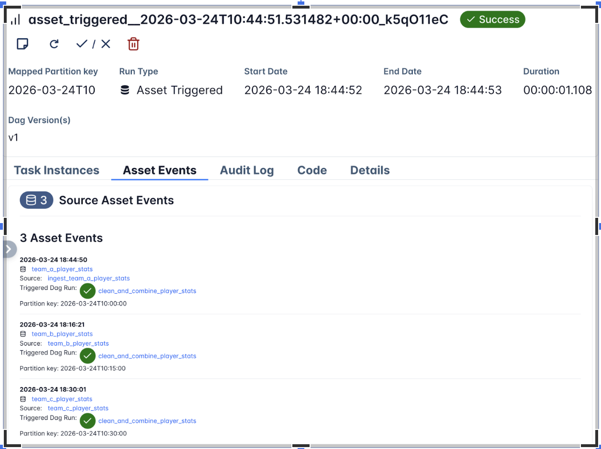

We're proud to announce the release of **Apache Airflow 3.2.0**! Airflow 3.1 puts humans at the center of automated workflows. 3.2 brings that same precision to data: Asset partitioning for granular pipeline orchestration, multi-team deployments for enterprise scale, synchronous deadline alert callbacks, and continued progress toward full Task SDK separation.

**Details**:

📦 PyPI: https://pypi.org/project/apache-airflow/3.2.0/ \
📚 Docs: https://airflow.apache.org/docs/apache-airflow/3.2.0/ \
🛠️ Release Notes: https://airflow.apache.org/docs/apache-airflow/3.2.0/release_notes.html \
🐳 Docker Image: `docker pull apache/airflow:3.2.0` \
🚏 Constraints: https://github.com/apache/airflow/tree/constraints-3.2.0

# 🗂️ Asset Partitioning (AIP-76): Only the Right Work Gets Triggered

Asset partitioning has been one of the most requested additions to data-aware scheduling. If you work with date-partitioned S3 paths, Hive table partitions, BigQuery partitions, or really any partitioned data store, you've dealt with this: An upstream task updates one partition, and every downstream Dag fires regardless of which slice actually changed. It's wasteful, and for large deployments it creates real operational noise.

Asset partitioning in 3.2 makes this granular. Downstream Dags trigger only when the specific partition they care about gets updated. It's the biggest change to data-aware scheduling since Assets were introduced, and it turns partition-driven orchestration into something Airflow handles natively rather than something you work around.



## Key Capabilities

* **Partition-driven scheduling**: Dags trigger on specific partition updates, not every asset change
* **CronPartitionTimetable**: Schedule Dags against partitions using cron expressions. Also available in the Task SDK
* **Backfill for partitioned Dags**: Backfill historical partitions without re-triggering everything downstream (#61464)
* **Multi-asset partitions**: A single Dag can listen for partitions across multiple assets, which matters when your downstream work depends on several sources aligning (#60577)

For more advanced use cases, there are temporal and range partition mappers (#61522, #55247) for mapping time ranges and value ranges to partition keys, a partition key field on Dag run references (#61725) so you can inspect exactly which partition triggered a run, and PartitionedAssetTimetable for full control over how partition events from multiple assets get resolved into a unified trigger.

**Example**: Three upstream ingestion Dags each write to a separate asset on an hourly cadence. The downstream Dag only triggers when all three have updated the same hourly partition. Since the three assets don't share a partition key natively, a mapper resolves them into a common key.

```py
from __future__ import annotations

from airflow.sdk import (
    DAG,
    Asset,
    CronPartitionTimetable,
    PartitionedAssetTimetable,
    StartOfHourMapper,
    asset,
    task,
)

team_a_player_stats = Asset(uri="file://incoming/player-stats/team_a.csv", name="team_a_player_stats")
combined_player_stats = Asset(uri="file://curated/player-stats/combined.csv", name="combined_player_stats")


with DAG(
    dag_id="ingest_team_a_player_stats",
    schedule=CronPartitionTimetable("0 * * * *", timezone="UTC"),
    tags=["player-stats", "ingestion"],
):

    @task(outlets=[team_a_player_stats])
    def ingest_team_a_stats():
        """Materialize Team A player statistics for the current hourly partition."""
        pass

    ingest_team_a_stats()


@asset(schedule=CronPartitionTimetable("15 * * * *", timezone="UTC"))
def team_b_player_stats():
    pass


with DAG(
    dag_id="clean_and_combine_player_stats",
    schedule=PartitionedAssetTimetable(
        assets=team_a_player_stats & team_b_player_stats,
        default_partition_mapper=StartOfHourMapper(),
    ),
    catchup=False,
):

    @task(outlets=[combined_player_stats])
    def combine_player_stats(dag_run=None):
        """Merge the aligned hourly partitions into a combined dataset."""
        print(dag_run.partition_key)

    combine_player_stats()
```

See [`example_asset_partition.py`](https://github.com/apache/airflow/blob/main/airflow-core/src/airflow/example_dags/example_asset_partition.py) and the Task SDK API docs for `PartitionedAssetTimetable` and partition mappers.

# 🏢 Multi-Team Deployments (AIP-67): Airflow for the Enterprise

> ⚠️ **Experimental**: Multi-Team support is experimental in Airflow 3.2 and may change in future releases based on user feedback.

Airflow 3.2 introduces multi-team support, allowing organizations to run multiple isolated teams within a single Airflow deployment. Each team can have its own Dags, connections, variables, pools, and executors— enabling true resource and permission isolation without requiring separate Airflow instances per team.

This is particularly valuable for platform teams that serve multiple data engineering or data science teams from shared infrastructure, while maintaining strong boundaries between teams' resources and access.

## Key Capabilities

* **Per-team resource isolation**: Each team has its own Dags, connections, variables, and pools
* **Per-team executors**: Different teams can use different executors (e.g. Celery, Kubernetes, Local, AWS ECS, etc.) and configure them separately — #57837, #57910
* **Team-scoped authorization**: Keycloak and Simple auth managers support team-scoped access control (#61351, #61861)
* **Team-scoped secrets**: Use `AIRFLOW_VAR__{TEAM}___{KEY}` environment variable or `AIRFLOW_CONN__<TEAM>___<CONN_ID>` pattern for team-specific secrets (#62588)
* **CLI management**: New CLI commands for managing teams (#55283)
* **UI team selector**: Team selector in connection, variable, and pool create/edit forms (#60237, #60474, #61082)
* **Full API support**: `team_name` field added to Connection, Variable, and Pool APIs (#59336, #57102, #60952)

## Enabling Multi-Team

```
# In airflow.cfg:
[core]
multi_team = True

# Or via environment variable:
export AIRFLOW__CORE__MULTI_TEAM=True
```

# ⏰ Deadline Alerts: Now With Synchronous Callbacks (AIP-86)

> ⚠️ **Experimental**: Deadline Alerts are experimental in Airflow 3.2 and may change in future releases based on user feedback.

Building on the Deadline Alerts system introduced in Airflow 3.1, this release adds synchronous callback support. In 3.1, callbacks ran through the triggerer (async only), which limited integration options. Synchronous callbacks execute directly via the executor, with optional targeting of a specific executor via the executor parameter.

## What's New in 3.2

* **SyncCallback support**: Unlike `AsyncCallback` which runs on the triggerer, `SyncCallback` executes directly on the worker via the executor, with optional targeting of a specific executor
* **Multiple Deadline Alerts per Dag**: Pass a list to the deadline parameter to configure multiple thresholds on a single Dag
* **Missed-deadline metadata in Grid API**: Dag run API now includes missed-deadline information for programmatic monitoring
* **Improved UX for custom DeadlineReferences**: Cleaner developer experience when defining custom deadline reference points (#57222)

```py
with DAG(
    dag_id="sync_deadline",
    deadline=DeadlineAlert(
        reference=DeadlineReference.FIXED_DATETIME(datetime(1980, 8, 10, 2)),
        interval=timedelta(0),
        callback=SyncCallback(
            SlackWebhookNotifier,
            {"text": "Sync Callback; Alert should trigger immediately!"},
        )
    )
):
    EmptyOperator(task_id='empty_task')
```

# 🖥️ UI Enhancements

* **HITL Approval History**: The Human-in-the-Loop approval interface now shows the complete audit trail of approvals and rejections for any task. (#56760, #55952)
* **XCom Management**: You can now add, edit, and delete XCom values directly from the UI. (#58921)
* **Segmented state bar**: Collapsed task groups and mapped tasks now show a segmented state bar for at-a-glance status (#61854)
* **Unified tooltips**: Grid and Graph view tooltips now show dates, duration, and child states (#62119)
* **Filename in Dag Code tab**: File identification now shown in the Code tab (#60759)
* **Copy button for logs**: One-click log copying (#61185)
* **Date range filter**: Filter Dag executions by date range (#60772)
* **Task upstream/downstream filter**: Filter by upstream or downstream tasks in Graph and Grid views (#57237)
* **Data redaction**: Sensitive fields are now redacted in the UI and Public API (#59873)
* **Custom theme support**: `globalCss` and theme config for white-label/custom deployments (#61161, #58411)
* **Inherit core UI theme in React plugins**: Plugin UIs now automatically match the core Airflow theme (#60256)
* **Task display names in Gantt**: `task_display_name` shown for better readability (#61438)

# 🚀 Performance Improvements

**Rendered Task Instance Fields Cleanup: ~42x Faster.** The cleanup job for rendered task instance fields has been rewritten and is roughly 42 times faster for Dags with many mapped tasks. Retention is now based on the N most recent Dag runs rather than N most recent task executions, which is both more intuitive and dramatically more performant. Config renamed: `max_num_rendered_ti_fields_per_task` → `num_dag_runs_to_retain_rendered_fields` (old name still works with deprecation warning). (#60951)

**Scheduler Improvements.** For large-scale deployments, 3.2 addresses several known bottlenecks:

* The scheduler no longer loads all TaskInstances into memory, preventing memory spikes on large deployments (#60956)
* Faster task dequeuing loop (#61376)
* Queue query now enforces `max_active_tasks` directly, preventing over-queueing (#54103)

**API Server Improvements:**

* Eliminated SerializedDag loads on task start, reducing memory usage (#60803)
* `serialized_dag` data column now uses JSONB on PostgreSQL (#55979)

# 🔧 Task SDK Evolution & Developer Experience

## Task SDK Decoupling Continues

Airflow 3.2 continues moving components from `airflow-core` into the Task SDK, progressing toward full client-server separation. This enables Dag authors to independently upgrade the Task SDK without requiring Airflow Core upgrades, reducing coordination overhead between Dag authors and Ops teams.

Modules moved to Task SDK in this release (old import paths still work with deprecation warnings):

* **Exceptions**: `AirflowSkipException`, `TaskDeferred`, etc. → `airflow.sdk.exceptions` (#59780)
* **Serde**: `airflow.serialization.serde` → `airflow.sdk.serde`; serializers → `airflow.sdk.serde.serializers.*` (#58900)
* **SkipMixin / BranchMixIn**: Moved to Task SDK; existing imports work via `common-compat` (#62749, #62776)
* **Lineage module**: Moved to Task SDK for client-server separation (#60968, #61157)
* **Listeners module**: Moved to shared library (#59883)
* **XCom API**: Decoupled from `XComEncoder` (#58900)

## PythonOperator Async Support

`PythonOperator` now supports async callables. You can pass an async function as the `python_callable` and the operator will correctly await it, enabling async I/O patterns without needing a custom operator. (#60268)

```py
@task(show_return_value_in_logs=False)
async def load_xml_files(files):
    import asyncio
    from io import BytesIO
    from more_itertools import chunked
    from os import cpu_count
    from tenacity import retry, stop_after_attempt, wait_fixed

    from airflow.providers.sftp.hooks.sftp import SFTPClientPool

    print("number of files:", len(files))

    async with SFTPClientPool(sftp_conn_id=sftp_conn, pool_size=cpu_count()) as pool:
        @retry(stop=stop_after_attempt(3), wait=wait_fixed(5))
        async def download_file(file):
            async with pool.get_sftp_client() as sftp:
                print("downloading:", file)
                buffer = BytesIO()
                async with sftp.open(file, encoding=xml_encoding) as remote_file:
                    data = await remote_file.read()
                    buffer.write(data.encode(xml_encoding))
                    buffer.seek(0)
                return buffer

        for batch in chunked(files, cpu_count() * 2):
            tasks = [asyncio.create_task(download_file(f)) for f in batch]

            # Wait for this batch to finish before starting the next
            for task in asyncio.as_completed(tasks):
                result = await task
                # Do something with result or accumulate it and return it as an XCom
```

# Updated securiy model

We are working on improving isolation and improving security of Airflow deployments and in order to make our users better informed of what expectations they should have for Airflow security, we updated the security model to reflect changes implemented in Airflow 3.2.0 and explain future improvements that we work on in this area. See more:  [Airflow Security Model](https://airflow.apache.org/docs/apache-airflow/stable/security/security_model.html).

# 🙏 Community Appreciation

This release represents the collaborative effort of hundreds of contributors from around the world. Special thanks to our release manager and all the developers, documentarians, testers, and community members who made Airflow 3.2.0 possible.

Thanks to contributors like you, the Airflow project continues to thrive. Whether you're filing issues, submitting PRs, improving documentation, or helping others in the community, every contribution matters.

# 🔗 Get Involved

* **Try the Release**: Upgrade your development environment and explore the new features
* **Join the Conversation**: Connect with us on [Slack](https://s.apache.org/airflow-slack) and the [dev mailing list](https://airflow.apache.org/community/)
* **Contribute**: Check out our [contribution guide](https://github.com/apache/airflow/blob/main/contributing-docs/README.rst)
* **Provide Feedback**: Share your experiences and suggestions on [GitHub](https://github.com/apache/airflow)

Apache Airflow 3.2.0 marks a new chapter in data-aware, partition-driven workflow orchestration. We can't wait to see what you build with it!
