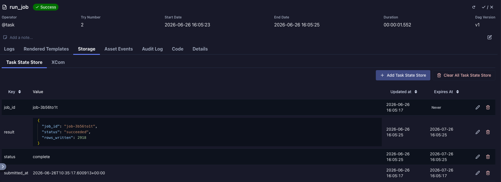
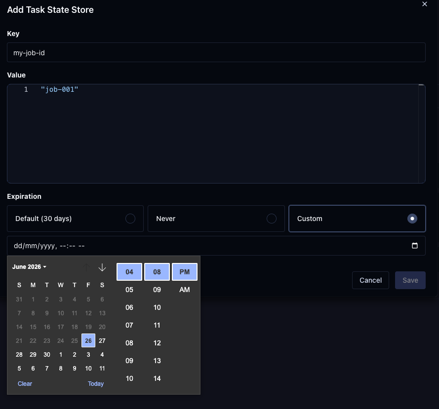
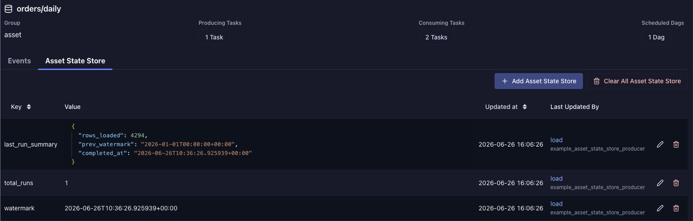
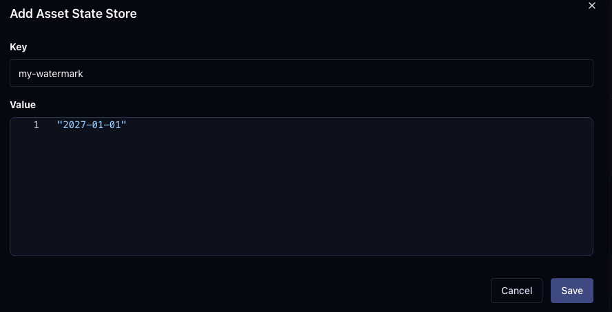
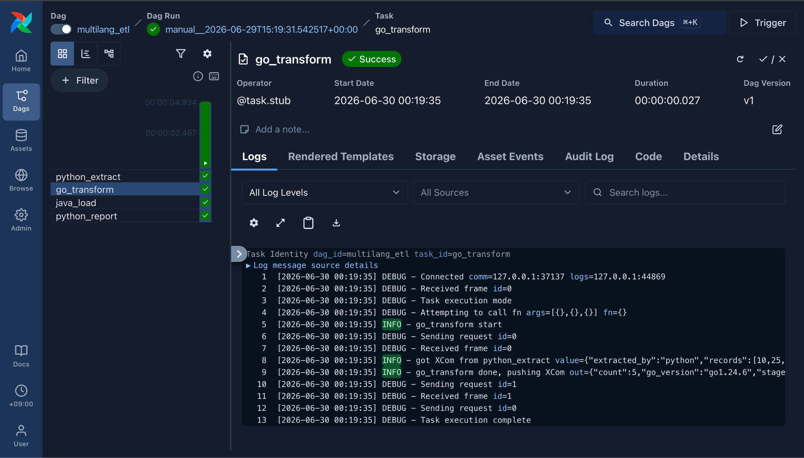
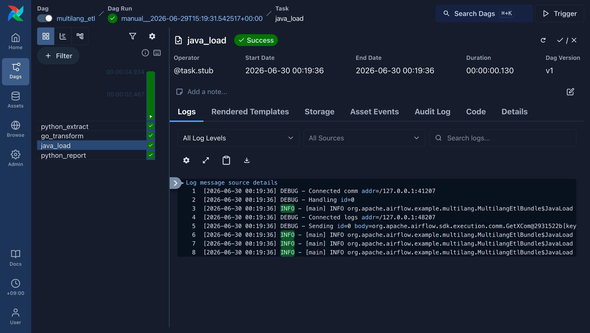

We're proud to announce the release of **Apache Airflow 3.3.0**! Where 3.2 brought precision to *data* with asset partitioning, 3.3 gives your *tasks* memory and multi-language support: a first-class state store for tasks and assets, a Language Task SDK for writing task logic in Java and Go, a major expansion of asset partitioning, and pluggable retry policies.

**🎯 Release Highlights**

📦 PyPI: https://pypi.org/project/apache-airflow/3.3.0/ \
📚 Docs: https://airflow.apache.org/docs/apache-airflow/3.3.0/ \
🛠️ Release Notes: https://airflow.apache.org/docs/apache-airflow/3.3.0/release_notes.html \
🐳 Docker Image: `docker pull apache/airflow:3.3.0` \
🚏 Constraints: https://github.com/apache/airflow/tree/constraints-3.3.0

# 🗃️ Task & Asset State Store (AIP-103): Tasks That Remember

Until now, if a task needed to remember something across retries or runs — a cursor, a checkpoint, a high-water mark — you reached for XComs, an external store, or a clever Variable hack. Airflow 3.3 makes durable task state a first-class concept.

Tasks can persist arbitrary key-value state that survives across retries and runs via a new `task_state_store` accessor, and assets can carry their own state via `asset_state_store` — both available directly from the Task SDK. State lives in the metadata database by default, or in a custom worker-side backend (`[workers] state_store_backend`), supports per-key retention with periodic garbage collection and an optional `clear_on_success`, and is fully manageable through the Core API and Execution API.

## Task State Store

Task state is scoped to a specific task instance and persists across retries. Use it to track coordination state like remote job IDs, cursors, or progress checkpoints:

```python
@task
def extract_data(**context):
    task_state = context["task_state_store"]
    # Resume from where we left off on retry
    cursor = task_state.get("last_cursor", default=0)
    records = fetch_records(since=cursor)
    new_cursor = records[-1]["id"]
    task_state.set("last_cursor", new_cursor)
    return records
```

Persisted state is visible per task instance in the UI, and you can add or edit entries (with an optional custom expiry) directly:





## Asset State Store

Asset state is scoped to an asset, so any task that produces or consumes it can read and write the same state. Ideal for shared watermarks:

```python
from datetime import datetime, timezone
from airflow.sdk import Asset, task

warehouse = Asset("s3://warehouse/orders")

@task(outlets=[warehouse])
def load_to_warehouse(**context):
    asset_state = context["asset_state_store"]
    last_loaded_at = asset_state.get("last_loaded_at", default=None)
    rows = [r for r in fetch_all_rows()
            if last_loaded_at is None or r["created_at"] > last_loaded_at]
    if not rows:
        return
    load(rows)
    asset_state.set("last_loaded_at", datetime.now(tz=timezone.utc).isoformat())
```

Asset state is browsable from the asset view, including which task last wrote each entry:





## Durable / Crash-Safe Execution

The clearest demonstration of what AIP-103 enables is `ResumableJobMixin`, which `SparkSubmitOperator` now uses. If the Airflow worker dies mid-run, the retry reconnects to the existing Spark job instead of submitting a new one — this is on by default (`durable=True`):

```python
SparkSubmitOperator(
    task_id="submit_spark_job",
    application="my_app.py",
    durable=True,  # survives worker failures, reconnects to the existing job on retry
)
```

## Configuration

By default, state persists in the Airflow metadata database:

```ini
[state_store]
backend = airflow.state.metastore.MetastoreBackend
default_retention_days = 30       # Set to 0 to disable time-based cleanup
clear_on_success = False          # Set True for automatic post-success cleanup
max_value_storage_bytes = 65535   # 64 KB cap on REST API writes; 0 = no limit
```

For large payloads or credentialed storage, route writes through a worker-side backend. The Execution API still records a reference string in the database:

```ini
[workers]
state_store_backend = mypackage.state.CustomStateBackend
```

## Key Capabilities

* **Durable task state** that survives retries and reruns via the `task_state_store` accessor
* **Asset state** carried alongside assets via `asset_state_store`
* **Pluggable backend**: metadata DB by default, or a custom worker-side backend (`[workers] state_store_backend`)
* **Retention & GC**: per-key retention with periodic garbage collection for the task state store; asset state persists indefinitely until explicitly deleted. Optional `clear_on_success` for task state.
* **Fully managed via API**: Core API + Execution API support, and new UI views for the asset and task stores (#67292)

(#65759, #66073, #66160, #66463, #66586, #66859, #67041, #67319)

# 🌐 Language Task SDK (AIP-108): Write Tasks in Java and Go

Airflow has always been Python-first for both orchestration *and* task logic. 3.3 keeps the orchestration in Python but lets individual **task implementations** be written in Java or Go and run on the **standard Airflow workers** you already operate. A new **Coordinator** layer routes a task to its language runtime — `JavaCoordinator` for the JVM, `ExecutableCoordinator` for self-contained native binaries such as Go — runs your code there, and proxies Variables, Connections, and XComs back through the Execution API. Your team's existing Java or Go code becomes a first-class Airflow task without a Python rewrite.

> ⚠️ **Experimental in 3.3.** The SDK APIs and wire protocol may change between releases. The Java and Go SDKs ship as **separate artifacts** (a Maven/Gradle dependency and a Go module + coordinator), **not** in the `apache-airflow` pip package.

## Author two things: a Python stub Dag + the language task

In this release the Dag *shape* is still declared in Python with `@task.stub`, while the *implementation* lives in your Go binary or Java jar. The `dag_id` and task ids must match across both so the coordinator can locate the right artifact. The `queue=` on each stub routes it to a coordinator.

```python
# Python stub Dag - declares the shape, routes Go/Java tasks by queue
from airflow.sdk import dag, task

@task()
def python_extract():
    return {"records": [10, 25, 7, 42, 16]}  # XCom: Python -> Go

@task.stub(queue="golang")  # -> ExecutableCoordinator (Go binary)
def go_transform(): ...

@task.stub(queue="java")    # -> JavaCoordinator (JVM jar)
def java_load(): ...

@task()
def python_report(loaded):  # XCom: Java -> Python
    print(loaded)

@dag(dag_id="multilang_etl")
def multilang_etl():
    extracted, transformed, loaded = python_extract(), go_transform(), java_load()
    extracted >> transformed >> loaded
    python_report(loaded)

multilang_etl()
```

```go
// Go task - same dag_id; reads the Python task's XCom, returns its own
type bundle struct{}

func (b *bundle) RegisterDags(dagbag v1.Registry) error {
    dag := dagbag.AddDag("multilang_etl") // matches the Python stub
    dag.AddTaskWithName("go_transform", goTransform)
    return nil
}

func goTransform(ctx sdk.TIRunContext, client sdk.Client, log *slog.Logger) (any, error) {
    ti := ctx.TaskInstance()
    in, err := client.GetXCom(ctx, ti.DagID, ti.RunID, "python_extract", nil, api.XComReturnValueKey, nil)
    if err != nil {
        return nil, err
    }
    log.InfoContext(ctx, "got XCom from python_extract", "value", in)
    return map[string]any{"stage": "go_transform"}, nil // XCom: Go -> Java
}

func main() {
    if err := bundlev1server.Serve(&bundle{}); err != nil {
        log.Fatal(err)
    }
} // + GetBundleVersion() completes the BundleProvider
```

```java
// Java task - same dag_id; XCom crosses languages
public class MultilangEtlBundle implements BundleBuilder {
    public Iterable<Dag> getDags() {
        return List.of(new Dag("multilang_etl").addTask("java_load", JavaLoad.class));
    }

    public static void main(String[] args) {
        Server.create(args).serve(new MultilangEtlBundle().build());
    }

    public static class JavaLoad implements Task {
        public void execute(Context context, Client client) {
            var fromGo = client.getXCom("go_transform"); // read the Go task's XCom from Java
            var conn = client.getConnection("test_http");
            client.setXCom(Map.of("status", "loaded"));   // XCom: Java -> Python
        }
    }
}
```

One run of the combined Dag chains Python, Go, and Java tasks in a single graph — all three task types succeed and their native logs stream straight into the Airflow UI:





## Authoring & build tooling

* **Go** — write tasks in a bundle package, then pack a deployable binary (executable + embedded source + manifest) with the `airflow-go-pack` tool: `go tool airflow-go-pack ./example/bundle`
* **Java** — apply the `org.apache.airflow.sdk` Gradle plugin and run the `bundle` task to produce a deploy-ready fat jar in `build/bundle/`: `./gradlew bundle`

## Configuration

Declare one coordinator per language runtime under `[sdk]` and bind each to the queues your stub tasks use:

```ini
[sdk]
# One coordinator per language runtime
coordinators = {
    "go": {"classpath": "airflow.sdk.coordinators.executable.ExecutableCoordinator",
           "kwargs": {"executables_root": ["~/airflow/executable-bundles"]}},
    "jdk-17": {"classpath": "airflow.sdk.coordinators.java.JavaCoordinator",
               "kwargs": {"jars_root": ["~/airflow/jars"]}}
}

# Map @task.stub(queue=...) to a coordinator
queue_to_coordinator = {"golang": "go", "java": "jdk-17"}
```

## Key Capabilities

* **Native Airflow model access**: read and write XComs, Variables, and Connections from Go and Java through the same Execution API the Python SDK uses
* **Airflow logging + remote logging**: task logs stream over the coordinator into Airflow's normal logging stack, so they show up in the UI and honor your remote logging (S3/GCS/…) setup. The SDKs bridge native loggers (Java ships `System.Logger` / SLF4J adapters; Go bridges `log/slog`)
* **Truly cross-language Dag**: one Dag can chain Python, Go, and Java tasks, and XCom round-trips between any of them — Python → Go/Java and back
* **Task-level retries**: set `retries` on the Python stub task (e.g. `@task.stub(queue=…, retries=2)`); the Go and Java SDKs honor it — a failed task with retries left moves to `up_for_retry` and runs again, instead of failing terminally
* **Works across executors**: runs on `LocalExecutor`, `CeleryExecutor`, and `KubernetesExecutor` (`KubernetesExecutor` needs some extra configuration)

(#65958, #67161, #67635, #67699)

# 🧩 Asset Partitioning: More Mappers, Windows, and Wait Policies

Building on the asset partitioning introduced in 3.2.0, Airflow 3.3 substantially expands how a single upstream asset event fans out to partitioned downstream Dag runs.

New partition mappers — `FanOutMapper` (one-to-many) and `FixedKeyMapper` + `SegmentWindow` (categorical rollup) — join `RollupMapper`, and compose with time windows (day / week / month / quarter / year) and a `wait_policy` (`WaitForAll` or `MinimumCount(n)`) to control exactly when partitioned runs fire.

## Key Capabilities

* **New mappers**: `FanOutMapper` for one-to-many fan-out, `FixedKeyMapper` + `SegmentWindow` for categorical rollup (#67716, #66030)
* **Time windows** that fan out forward *or* backward in time (day/week/month/quarter/year)
* **Wait policies**: fire on `WaitForAll` or `MinimumCount(n)` of the upstream window (#66848)
* **Per-mapper fan-out cap** plus the global `[scheduler] partition_mapper_max_downstream_keys` bound (#67184)
* **Forward or backward fan-out** via `direction=Window.Direction.FORWARD` / `Window.Direction.BACKWARD` (default `FORWARD`) (#67475)

For detailed usage, see the [asset authoring & scheduling guide](https://airflow.apache.org/docs/apache-airflow/3.3.0/authoring-and-scheduling/assets.html).

# 🔁 Pluggable Retry Policies (AIP-105)

Task retry behaviour is now pluggable. In addition to a fixed `retries` count, you can attach a custom retry policy that decides **whether and when** a task is retried — enabling strategies such as retrying only on specific exceptions, or backing off based on your own logic. (#65474)

# 🎯 Dag Results: Call a Dag and Get a Value Back

You can now designate a task as a Dag's **result** with the `@result` decorator, then call `GET /api/v2/dags/{dag_id}/dagRuns/{dag_run_id}/wait` to block until the run finishes and get the value back. The endpoint streams newline-delimited JSON (NDJSON) — the run state as it progresses, and on completion the result task's return value keyed by task id — which makes it easy to embed an Airflow Dag behind an API endpoint.

> ⚠️ **Experimental** in 3.3.0 and may change in future releases. (#64563)

# 📦 Dag Bundle Version Control on Clear, Rerun, and Backfill

Airflow 2.x always reran with the latest code; 3.x introduced bundle versioning that defaults to the *original* version. 3.3 adds per-run control over whether a cleared, rerun, or backfilled Dag run uses the latest bundle version or the original, resolved by precedence: an explicit request parameter `run_on_latest_version` (exposed as a CLI flag for **backfill** only) → the Dag-level `rerun_with_latest_version` → `[core] rerun_with_latest_version` → finally `False` for clear/rerun and `True` for backfills (preserving historical behaviour). (#63884)

# 🖥️ UI Enhancements

* **Asset & task store views**: Inspect persisted task and asset state directly in the UI (#67292), including a column linking to the task instance that wrote each entry (#68395) and a custom expiration picker for the task store (#68394)
* **`awaiting_input` HITL state**: Human-in-the-Loop tasks awaiting input now run off the triggerer with a dedicated state (#68028)
* **Bulk actions**: Bulk-mark Dag runs as success/failed (#68278, #67948) and bulk-clear task instance selections (#68029)
* **Details tab for mapped task instances** (#68340) and additional task-instance attributes in the details section (#68378)
* **Team name in the asset graph view** for multi-team deployments (#68457)
* **Full-screen toggle** in the code viewer (#68044)

# 🔭 Observability & Operations

* **OpenTelemetry Histograms**: Timer and timing metrics are now recorded as Histograms instead of Gauges, preserving count, sum, and bucket distribution across recordings. **⚠️ Breaking for existing dashboards/alerts** — queries built on the old Gauge series need updating. (#64207)
* **Tagged Dag-processing metric**: `dag_processing.last_run.seconds_ago` is now emitted with `file_path`, `bundle_name`, and `file_name` tags instead of baking the file name into the metric path. **⚠️ Breaking** — dashboards/alerts parsing the old `…seconds_ago.{dag_file}` path must switch to the tagged form. (#62487)
* **New Deadlines page**: A **Deadlines** page under the Browse menu, available to any role with `can_read` + `menu_access` on **Dag Runs** (#67586)
* **Remote logging resolution refactor**: Remote task-log handler resolution now lives in the shared `airflow_shared.logging.factory` with a single, well-defined precedence, lazy resolution on first use, and a `from_config()` contract for provider `RemoteLogIO` classes (#67056)

# ⬆️ Upgrading to 3.3.0

Before upgrading, review the [Significant Changes](https://airflow.apache.org/docs/apache-airflow/3.3.0/release_notes.html) in the release notes. In particular, the OpenTelemetry metrics changes above are **breaking for existing dashboards and alerts**, so plan to update any queries built on the previous Gauge series or the old `dag_processing.last_run.seconds_ago.{dag_file}` metric path.

# 🙏 Community Appreciation

This release represents the collaborative effort of hundreds of contributors from around the world. Special thanks to our release manager and all the developers, documentarians, testers, and community members who made Airflow 3.3.0 possible.

Thanks to contributors like you, the Airflow project continues to thrive. Whether you're filing issues, submitting PRs, improving documentation, or helping others in the community, every contribution matters.

# 🔗 Get Involved

* **Try the Release**: Upgrade your development environment and explore the new features
* **Join the Conversation**: Connect with us on [Slack](https://s.apache.org/airflow-slack) and the [dev mailing list](https://airflow.apache.org/community/)
* **Contribute**: Check out our [contribution guide](https://github.com/apache/airflow/blob/main/contributing-docs/README.rst)
* **Provide Feedback**: Share your experiences and suggestions on [GitHub](https://github.com/apache/airflow)

Apache Airflow 3.3.0 gives your tasks memory and multi-language support. We can't wait to see what you build with it!
