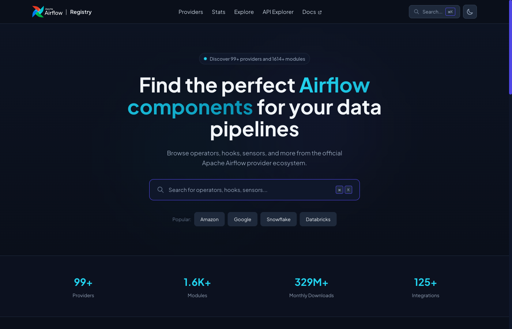
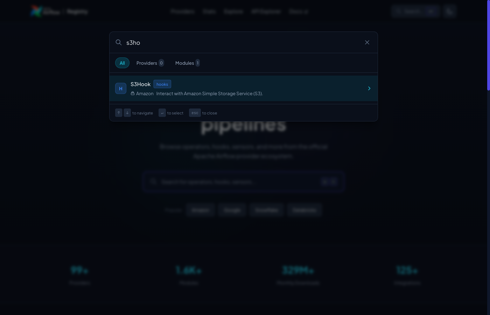
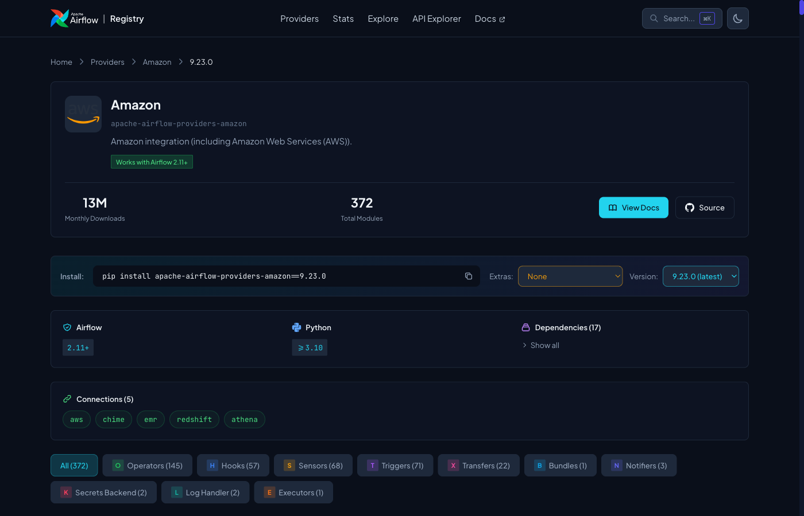
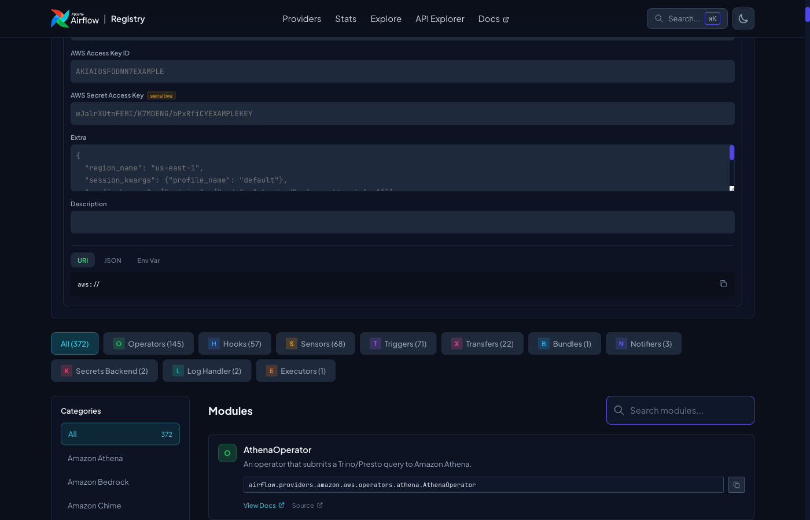
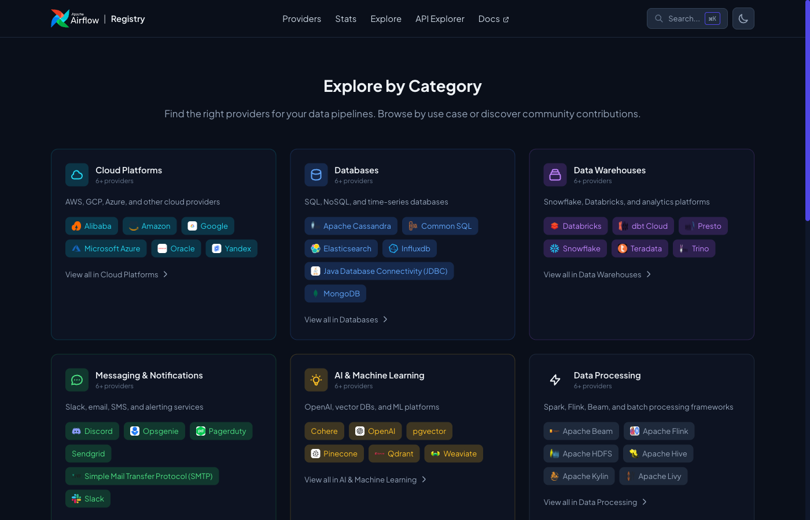
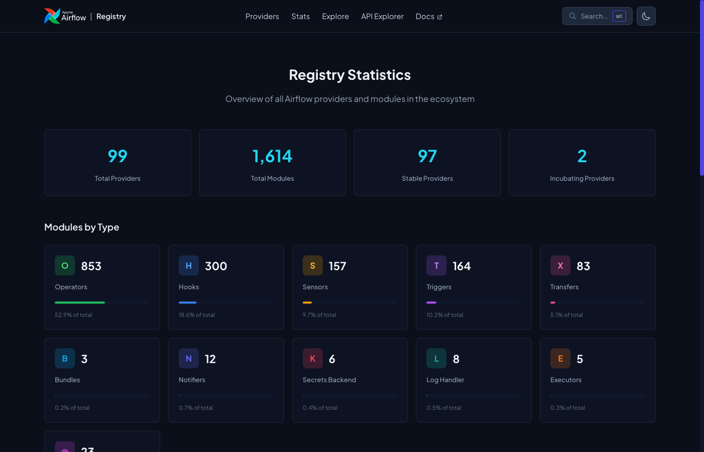
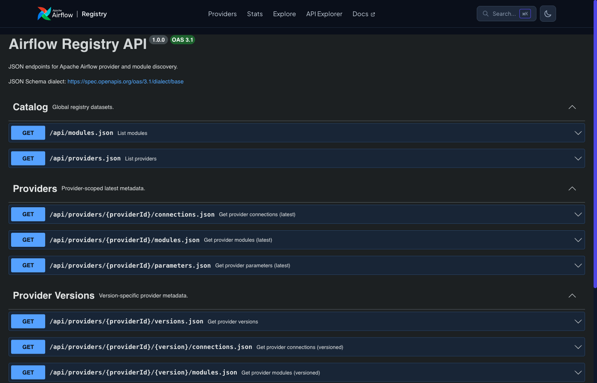
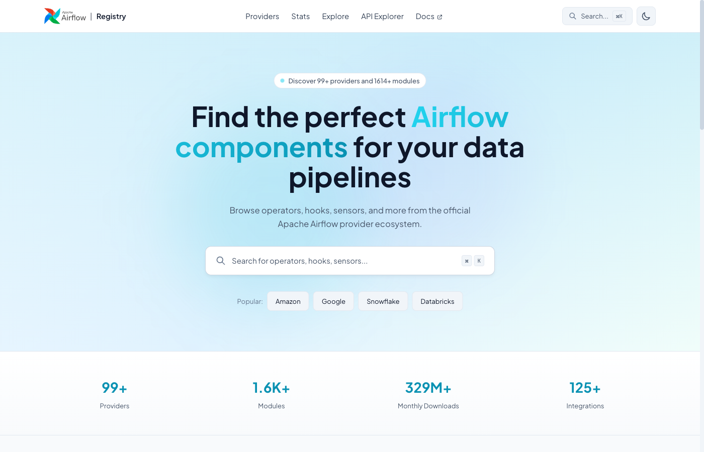

Today we're launching the **[Apache Airflow Registry](https://airflow.apache.org/registry/)** — a searchable catalog of every official Airflow provider and its modules, live at [airflow.apache.org/registry/](https://airflow.apache.org/registry/).

Need an S3 operator? A Snowflake hook? An OpenAI sensor? The Registry helps you find, compare, and configure the right components for your data pipelines — without digging through docs or PyPI pages.

## By the Numbers

| | |
|---|---|
| **98** | Official providers |
| **1,602** | Modules (operators, hooks, sensors, triggers, transfers, and more) |
| **329M+** | Monthly PyPI downloads across all providers |
| **125+** | Integrations with cloud platforms, databases, ML tools, and messaging services |

## Search Everything

Hit **Cmd+K** from any page and start typing. Results show up instantly, grouped by Providers and Modules, with type badges so you can tell a hook from an operator at a glance.

## Provider Pages

Each provider gets a dedicated page with everything in one place: install command with copy-to-clipboard, version selector, extras dropdown, compatibility info, connection types, and the full module listing organized by type.

The Amazon provider, for example, has **372 modules** across operators, hooks, sensors, triggers, transfers, and more. Module type tabs let you filter to exactly what you're looking for, and a category sidebar groups modules by AWS service (S3, Lambda, Glue, Step Functions, etc.).

## Connection Builder

Click any connection type badge on a provider page, fill in the fields, and the builder generates the connection in three formats — **URI**, **JSON**, and **Env Var** — ready to copy into your configuration.

No more guessing URI encoding or JSON structure.

## Explore by Category

Not sure which provider you need? The **[Explore page](https://airflow.apache.org/registry/explore/)** organizes providers into categories: Cloud Platforms, Databases, Data Warehouses, Messaging & Notifications, AI & Machine Learning, Data Processing, and more.

## Statistics

The **[Stats page](https://airflow.apache.org/registry/stats/)** breaks down the ecosystem: **848 operators**, **298 hooks**, **164 triggers**, **157 sensors**, **83 transfers**, and more — plus top providers by downloads and module count.

## JSON API

Every piece of data in the Registry is available as structured JSON — providers, modules, parameters, connections, versions. An **[API Explorer](https://airflow.apache.org/registry/api-explorer/)** lets you browse all endpoints interactively.

This makes the Registry accessible to IDE extensions, AI coding assistants, and automation tools.

## Light & Dark Mode

Full theme support with dark mode as the default. One click to switch.

## Standing on Shoulders

The Apache Airflow PMC would like to thank [Astronomer](https://www.astronomer.io) for building and maintaining the Astronomer Registry for years — it was the go-to place to discover Airflow providers and proved the value of a searchable provider catalog. That work directly shaped this community-owned registry.

The Apache Airflow Registry lives at `airflow.apache.org`, is built from the same repo as the providers, and updates automatically when new versions are published.

## What's Next

This is the first release of the Registry. Here's what's coming:

- **Third-party provider support** — we're exploring options to list community-built providers alongside the official ones
- **Richer module pages** — dedicated pages per module with full parameter docs and usage examples

## Get Involved

- **[Explore the Registry](https://airflow.apache.org/registry/)** and let us know what you think
- **Join the conversation** on [Airflow Slack](https://s.apache.org/airflow-slack) and the [dev mailing list](https://airflow.apache.org/community/)
- **Contribute** — the code lives in [`registry/`](https://github.com/apache/airflow/tree/main/registry) in the main Airflow repo
- **Report issues or request features** on [GitHub](https://github.com/apache/airflow/issues)
