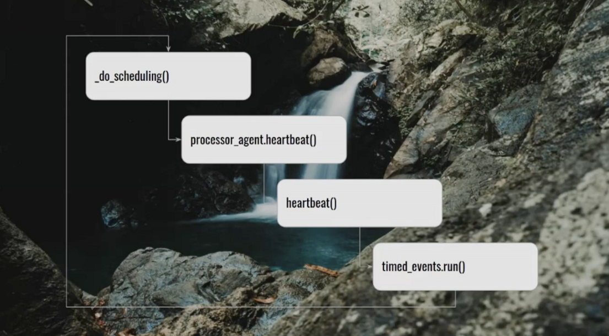

Hosts warming up the crowd during Airflow Summit ([credits](https://unsplash.com/photos/0RDBOAdnbWM))

I want to write about the Airflow Summit 2021 and all the takeaways I got from there.

So the Summit was the time for the Airflow community to meet online and share every wonderful ideas and use-cases everyone has. The summit took place from the 8th to 16th of July. In the following post I'm gonna share with you content I got from all the talks I watched from the Summit and link to the replays if you want to go further. As a warning I say that **this post will reflect my views** and how I perceived presentations.

To write this article I've watched almost all of the 53 sessions from the Summit, I hope it'll help you narrow your watch.

I'll sort all takeaways in 3 categories:

* Airflow vision and understanding 🔭
* Airflow multi tenancy 🕸️
* Airflow with superpowers ️🦸‍♀️

Before going further **I want to share my favorite session** from the Summit. Pinterest team shared how they migrated their 40K daily job from their internal system to Airflow. In order to smooth the transition they develop a super creative way with a `PinterestDagBag` to translate configs from old system to the new one. I can't sum-up the whole session and I advise you to [see it there](https://www.crowdcast.io/e/airflowsummit2021/13).

# Airflow vision and understanding 🔭

Ash sharing the directions for Airflow ([credits](https://unsplash.com/photos/xu2WYJek5AI))

[Ash Berlin-Taylor](https://www.linkedin.com/in/ashberlin/) gave an awesome introduction regarding his views on where Airflow should go in the next months/years. From this he tried to give a probable roadmap. By listening users he drew 3 main pillars:

1. Making DAGs a joy to write
2. Airflow should be THE data workflow orchestrator
3. Operate Airflow should be done with confidence

From these pillars we got some ideas for the community to work on like:

* custom schedules
* execution_date evolution to a data interval concept
* deferrable (async) operators — in the following of Smart Sensors — will introduce a new Trigger concept to Airflow
* new UI with a Single Page App (React) ✨
* airflowctl, to operate your airflow cluster from remote (probably like the [astro CLI](https://www.astronomer.io/docs/cloud/stable/develop/cli-quickstart))
* untrusted workers to segregate connections depending on DAG or tags
* create a dynamic dags API — more and more people are writing dag factories and it's time to help them
* DAG versioning — it could solve many issues
* Replace XCom with a "data object" to improve data lifeline and lineage
* and more by bringing streaming and better ML support to Airflow

If you want to see more [go see Ash video](https://www.crowdcast.io/e/airflowsummit2021/11).

After this refreshing vision regarding Airflow and what could coming after some talks presented how you could today write your Airflow DAGs in a more maintainable manner. For instance by using [dataclasses as pipeline definitions](https://www.crowdcast.io/e/airflowsummit2021/15) or by using [Viewflow](https://www.crowdcast.io/e/airflowsummit2021/15) to define all your transformations. I like a lot the dataclasses approach because you can create a full inheritance layer regarding your configurations.

To conclude this part I'd repeat that it's important to have [DRY process](https://www.crowdcast.io/e/airflowsummit2021/30) when you start to write your Airflow DAGs. In the session Sarah Krasnik proposed a folder architecture where 1 folder = 1 DAG to help newcomers on-boarding. This in addition to code consolidation and abstraction will prevent you doing useless copy pasting. Go see the presentation it's worth checking.

Last but not least if you want to what the Airflow scheduler is doing internally and why Airflow webserver is faster in Airflow 2.x go see Ash talk about [scheduler internals](https://www.crowdcast.io/e/airflowsummit2021/28).

Scheduler infinite loop (image extracted from Ash Berlin-Taylor [presentation](https://www.crowdcast.io/e/airflowsummit2021/28))

**Operating contexts in Airflow**

[Maxime Beauchemin](https://www.linkedin.com/in/maximebeauchemin/) presented how in the future we could introduce [operating contexts](https://www.crowdcast.io/e/airflowsummit2021/50) in Airflow. Below the definition he wrote.

> a declared mode of operation for a DAG that alters its shape or behaviour in a deterministic way

Apart the fact that he shared the Preset will come with a freemium version in a soon release he also shared 4 patterns to explain OC: swap connections pointers, schema suffixes, crossovers env (e.g. load prod in dev) and a fast mode limiting data reads (SQL DML LIMIT in dev for instance).

# Airflow Multi Tenancy 🕸️

With the scale of data teams deploying Airflow with multi tenancy is becoming more and more a standard. As Yuanmeng Zeng and Nitish Victor from EA presented the multi-tenancy is needed because when you scale teams you need: isolation, support from diverse use-cases, lower the charge on scheduler, to have multiple hardware requirements (e.g. GPU), self-serve.

From that we got wonderful talks from [Apple](https://www.crowdcast.io/e/airflowsummit2021/6), [EA](https://www.crowdcast.io/e/airflowsummit2021/32) and [Wise](https://www.crowdcast.io/e/airflowsummit2021/24) talking about it. What I get for these is that teams from all over the world are being innovative regarding the way Airflow can make them more productive.

Apple team shown for instance how they mocked the operators to send to Airflow scheduler only mocked code to avoid any risk running code in the main scheduler loop. At EA they develop a custom self-service UI to create Airflow cluster leveraging the Airflow k8s operator.

> The main advantage of the multi-tenancy is to isolate workloads.

By default Airflow is not designed to do that. But when you give power to end-user you want to be sure that dag from a team will only access the right connections and not the another team ones. To do this kind of isolation you could create your own [SecretBackend like Xiao Deng presented](https://www.crowdcast.io/e/airflowsummit2021/21) or [create dynamic security roles](https://www.crowdcast.io/e/airflowsummit2021/38).

# Airflow with superpowers 🦸‍♀️

This category is so inspiring. From sessions we can get ideas on how to improve our own Airflow setup.

**Backfilling** — Every airflow user know that backfilling DAGs could be a big pain once you have multiple DAG to backfill with dependencies. This year we got two detailed solutions regarding the matter. [Adyen explaining how they developed a Undo DAG](https://www.crowdcast.io/e/airflowsummit2021/33) and airflow extension to mitigate the impact when we have multiple frequencies and dag ownerships to re-run. On the other side Pinterest team shown the form they develop to help backfill run.

**Debug and inspection** — Regarding superpowers [Pinterest team shown](https://www.crowdcast.io/e/airflowsummit2021/46), imho, huge improvements to the UI, the Clear failed button, the audit log and dag run tab at dag level, the graph view improvements with stats. Go check the replay to see the amazing work they done.

Pinterest team tools to operate Airflow ([credits](https://unsplash.com/photos/t5YUoHW6zRo))

**Open lineage** — Every month we get a new tool in the lineage ecosystem, but in order to simplify all implementation we need open formats. This is [Open Lineage](https://github.com/OpenLineage). In the [session](https://www.crowdcast.io/e/airflowsummit2021/44) we see how open lineage can be integrated in your airflow setup and what's the entities and protocols under-the-hood.

**dbt, Airbyte, Great Expectations, reverse-ETL** — we almost forgot that Airflow is used to schedule data pipelines. If we integrate Airflow with best in class tools we can get the best in class platform. We got talks presenting:

* how you can integrate dbt within Airflow by writing a [DbtDagParser](https://github.com/astronomer/airflow-dbt-demo/blob/master/include/dbt_dag_parser.py) and how GE in addition with dbt tests will ensure your data is perfect ([link](https://www.crowdcast.io/e/airflowsummit2021/31))
* how you can trigger Airbyte refresh from a DAG ([link](https://www.crowdcast.io/e/airflowsummit2021/34))
* how you can write reverse ETL to keep your third parties tools in sync ([link](https://www.crowdcast.io/e/airflowsummit2021/42)).

That's all for the Airflow Summit sessions, I can't wait for next year sessions, with I hope physical ones!

I hope you liked it and you shared love to all Airflow speakers ❤️.

PS: As a side note once every session will be available on YouTube I'll change all the link in the article.

This article has been originally published on [blef.fr](http://blef.fr/data-news-airflow-summit-edition/) & [medium](https://medium.com/@_blef/airflow-summit-takeaways-c3e703a104c1), if you want to support me subscribe to the weekly newsletter!
