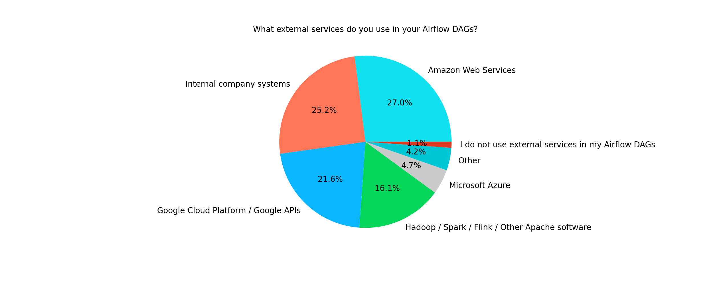
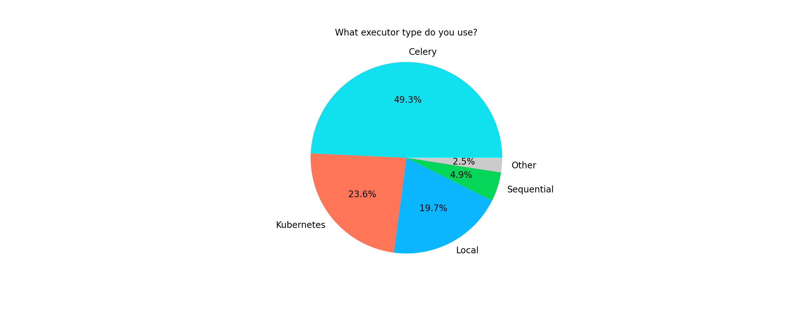

# Apache Airflow Survey 2020

World of data processing tools is growing steadily. Apache Airflow seems to be already considered as
crucial component of this complex ecosystem. We observe steady growth in number of users as well as in
an amount of active contributors. So listening and understanding our community is of high importance.

It's worth to note that the 2020 survey was still mostly about 1.10.X version of Apache Airflow and
possibly many drawbacks were addressed in the 2.0 version that was released in December 2020. But if this
is true, we will learn next year!

## Overview of the user

**What best describes your current occupation? (single choice)**

|                     | No. | %     |
| ------------------- | --- | ----- |
| Data Engineer       | 115 | 56.65 |
| Developer           | 28  | 13.79 |
| DevOps              | 17  | 8.37  |
| Solutions Architect | 14  | 6.9   |
| Data Scientist      | 12  | 5.91  |
| Other               | 10  | 4.93  |
| Data Analyst        | 4   | 1.97  |
| Support Engineer    | 3   | 1.48  |

Those results are not a surprise as Airflow is a tool dedicated to data-related tasks. The majority of
our users are data engineers, scientists or analysts. The 2020 results are similar to [those from 2019](https://airflow.apache.org/blog/airflow-survey/) with
visible slight increase in ML use cases.

Additionally, 79% of users uses Airflow on daily basis and 16% interacts with it at least once a week.

**How many people work in your company? (single choice)**

|        | No. | %     |
| ------ | --- | ----- |
| 200+   | 107 | 52.71 |
| 51-200 | 44  | 21.67 |
| 11-50  | 37  | 18.23 |
| 1-10   | 15  | 7.39  |

**How many people in your company use Airflow? (single choice)**

|       | No. | %     |
| ----- | --- | ----- |
| 1-5   | 84  | 41.38 |
| 6-20  | 75  | 36.95 |
| 21-50 | 23  | 11.33 |
| 50+   | 21  | 10.34 |

Airflow is a software that is used and trusted by big companies. We can also see that Airflow can work
fine for teams of different sizes. However, in some cases users may use multiple Airflow instances.

**Are you considering moving to other workflow engines? (single choice)**

|                               | No. | %     |
| ----------------------------- | --- | ----- |
| No, we are happy with Airflow | 174 | 85.71 |
| Yes                           | 29  | 14.29 |

Nearly 1 out of 7 users is considering migrating to other workflow engines. Their decision is usually
justified by need of **easier workflow writing experience** (12.32%), **better UI/UX** and **faster scheduler**
(8.37% both).

While the first point may be addressed by [TaskFlow API](http://airflow.apache.org/docs/apache-airflow/stable/concepts.html#taskflow-api) in Airflow 2.0 the other two are definitely addressed
in the new major version. And the early feedback from 2.0 users seems to be confirming it.

The alternative engines considered by users are mainly Prefect and Argo. Some participants also mentioned
Luigi, Kubeflow or custom solutions.

**Are you or your team actively participating in Airflow development - contributing? (single choice)**

|                 | No. | %     |
| --------------- | --- | ----- |
| I wish we could | 99  | 48.77 |
| No              | 59  | 29.06 |
| Yes             | 45  | 22.17 |

This is really heart-warming result. It means that 1 out of 5 users contributes actively to our project!
But it would be good to learn if there's something else than time that is stopping people who wish to contribute
from doing it. If there are some other obstacles we definitely would like to learn about them so we can improve.
That said - if you know something we can improve please reach out via Slack, dev list or Github
discussions.

**How likely are you to recommend Apache Airflow? (single choice)**

|               | No. | 2020 % | 2019 % |
| ------------- | --- | ------ | ------ |
| Very Likely   | 125 | 61.58  | 45.45% |
| Likely        | 62  | 30.54  | 40.26% |
| Neutral       | 11  | 5.42   | 10.71% |
| Unlikely      | 3   | 1.48   | 2.60%  |
| Very unlikely | 2   | 0.99   | 0.97%  |

Here is good news! It seems that people are more willing to recommend Apache Airflow than year before.

**What is your source of information about Airflow? (multiple choice)**

|                                   | No. | %     |
| --------------------------------- | --- | ----- |
| Documentation                     | 154 | 75.86 |
| Airflow website                   | 139 | 68.47 |
| Slack                             | 128 | 63.05 |
| Github                            | 127 | 62.56 |
| Stack Overflow                    | 72  | 35.47 |
| Airflow Summit Videos             | 44  | 21.67 |
| The dev mailing list              | 33  | 16.26 |
| Awesome Apache Airflow repository | 21  | 10.34 |
| Other                             | 15  | 7.39  |

Here we see that Airflow documentation is the crucial source of information. What's interesting is that more
than 60% of users are getting information from Github and Slack channels.

## Airflow uses cases

**Do you have any customisation of Airflow? (single choice)**

|                                      | No. | %     |
| ------------------------------------ | --- | ----- |
| No, we use vanilla Airflow           | 154 | 75.86 |
| Yes, we have small patches (no fork) | 34  | 16.75 |
| Yes, we have separate fork           | 15  | 7.39  |

**When onboarding new members to airflow, what is the biggest problem? (multiple choice)**

|                                                                 | No. | %     |
| --------------------------------------------------------------- | --- | ----- |
| No guide on best practises on developing DAGs                   | 102 | 50.25 |
| There is no easy option to launch Airflow                       | 64  | 31.53 |
| Small number of tutorials on different aspects of using Airflow | 57  | 28.08 |
| Documentation is not clear enough                               | 53  | 26.11 |
| There is no easy option to deploy DAGs to an Airflow instance   | 52  | 25.62 |
| No problems                                                     | 34  | 16.75 |
| Small number of blogs regarding Airflow                         | 30  | 14.78 |

**Which interface(s) of Airflow do you use as part of your current role? (multiple choice)**

|                                                       | No. | %     |
| ----------------------------------------------------- | --- | ----- |
| Original Airflow Graphical User Interface             | 199 | 98.03 |
| CLI                                                   | 88  | 43.35 |
| API                                                   | 48  | 23.65 |
| Custom (own created) Airflow Graphical User Interface | 12  | 5.91  |
| Other                                                 | 3   | 1.48  |

**Do you combine multiple DAGs? (multiple choice)**

|                                   | No. | %     |
| --------------------------------- | --- | ----- |
| Yes, by triggering another DAG    | 87  | 42.86 |
| No, I don't combine multiple DAGs | 79  | 38.92 |
| Yes, through SubDAG               | 40  | 19.7  |
| Other                             | 18  | 8.87  |

**How do you integrate with external services? (multiple choice)**

|                                            | No. | %     |
| ------------------------------------------ | --- | ----- |
| Using existing dedicated operators / hooks | 147 | 72.41 |
| Using Bash / Python operator               | 140 | 68.97 |
| Using own custom operators / hooks         | 138 | 67.98 |
| Other                                      | 12  | 5.91  |

**What external services do you use in your Airflow DAGs? (multiple choice)**

|                                                   | No. | %     |
| ------------------------------------------------- | --- | ----- |
| Amazon Web Services                               | 121 | 59.61 |
| Internal company systems                          | 113 | 55.67 |
| Google Cloud Platform / Google APIs               | 97  | 47.78 |
| Hadoop / Spark / Flink / Other Apache software    | 72  | 35.47 |
| Microsoft Azure                                   | 21  | 10.34 |
| Other                                             | 19  | 9.36  |
| I do not use external services in my Airflow DAGs | 5   | 2.46  |

**Do you use Airflow Plugins? If yes, what do you use them for? (multiple choice)**

|                                        | No. | %     |
| -------------------------------------- | --- | ----- |
| Adding new operators/sensors and hooks | 119 | 58.62 |
| I don't use Airflow plugins            | 69  | 33.99 |
| Adding AppBuilder views & menu items   | 27  | 13.3  |
| Adding new executors                   | 17  | 8.37  |
| Adding OperatorExtraLinks              | 13  | 6.4   |

| Other

**Do you use Airflow's data lineage feature? (single choice)**

|                                                           | No. | %     |
| --------------------------------------------------------- | --- | ----- |
| No, I will use such feature if fully supported in Airflow | 105 | 51.72 |
| No, data lineage isn’t a concern for my usage.            | 68  | 33.5  |
| Yes, I use another data lineage product                   | 24  | 11.82 |
| Yes, I use custom implementation                          | 5   | 2.46  |
| Yes, I use Airflow's experimental data lineage feature    | 1   | 0.49  |

When asked what lineage product users use, the answers were varying from custom tools
to known product like Amundsen, Atlas or dbt.

## Deployment

**How many active DAGs do you have in your largest Airflow instance? (open question)**

| Number of DAGs | No. | %   |
| -------------- | --- | --- |
| < 20           | 64  | 32  |
| 21-40          | 33  | 16  |
| 41-60          | 13  | 6   |
| 61-100         | 32  | 16  |
| 101-200        | 31  | 15  |
| 201-300        | 8   | 4   |
| 301-999        | 12  | 6   |
| 1000+          | 10  | 5   |

**What is the maximum number of tasks that you have used in one DAG? (open question)**

| Number of DAGs | No. | %   |
| -------------- | --- | --- |
| < 10           | 42  | 21  |
| 11-20          | 31  | 15  |
| 21-30          | 15  | 7   |
| 31-40          | 11  | 5   |
| 41-50          | 22  | 11  |
| 51-100         | 39  | 19  |
| 101-200        | 16  | 8   |
| 201-500        | 16  | 8   |
| 501+           | 11  | 5   |

**Which version of Airflow do you use currently? (single choice)**

|                 | No. | %     |
| --------------- | --- | ----- |
| 1.10.14         | 55  | 27.09 |
| 2.0.0+          | 45  | 22.17 |
| 1.10.12         | 27  | 13.3  |
| 1.10.10         | 26  | 12.81 |
| 1.10.11         | 14  | 6.9   |
| 1.10.5 or older | 10  | 4.93  |
| 1.10.9          | 8   | 3.94  |
| 1.10.13         | 7   | 3.45  |
| 1.10.6          | 4   | 1.97  |
| 1.10.7          | 4   | 1.97  |
| 1.10.8          | 3   | 1.48  |

This was probably one of the most important questions in the survey. While it's good to see
that more than 60% of users use one of three latest Airflow versions, it's worrying that the rest
are using versions that are old or have known security vulnerabilities.

Additionally, more than 20% of users are already using 2.0.0+ versions which is reasonably good information.

**What meta-database do you use? (single choice)**

|              | No. | %     |
| ------------ | --- | ----- |
| Postgres 12  | 36  | 17.73 |
| Postgres 9.6 | 33  | 16.26 |
| Postgres 11  | 31  | 15.27 |
| MySQL 5.7    | 27  | 13.3  |
| MySQL 8.0    | 20  | 9.85  |
| Postgres 10  | 20  | 9.85  |
| Other        | 19  | 9.36  |
| Postgres 13  | 18  | 8.87  |

This means that more about 69% of users decide to use Postgres as their meta-database.
MySQL is the choice of nearly 24% users. The other responses included some MySQL versions
like MariaDB or cloud hosted database like Cloud SQL (used by Google Composer) or AWS Aurora.

It's good to know that users rather avoid using SQLite in production deployments!

**What executor type do you use? (single choice)**

|            | No. | 2020   | 2019   |
| ---------- | --- | ------ | ------ |
| Celery     | 100 | 49.26% | 44.81% |
| Kubernetes | 48  | 23.65% | 16.88% |
| Local      | 40  | 19.7%  | 27.60% |
| Sequential | 10  | 4.93%  | 7.14%  |
| Other      | 5   | 2.46%  | 3.57   |

In comparison to previous year it seems that more users use currently Celery and
Kubernetes executors and LocalExecutor usage dropped by nearly 8 points. This may
suggest that users' deployments are growing, and they need more scalable solutions.

Among CeleryExecutor users 78% use Redis as a broker, 19% use RabbitMQ and the rest
is using other brokers or is not sure what is used in their deployments.

**What metrics do you use to monitor Airflow? (multiple choice)**

|                               | No. | %     |
| ----------------------------- | --- | ----- |
| I do not use monitoring       | 65  | 32.02 |
| External monitoring service   | 60  | 29.56 |
| Information from metadatabase | 51  | 25.12 |
| Statsd                        | 49  | 24.14 |
| Other                         | 31  | 15.27 |

The other responses included mostly information about tools used by users
including DataDog and Prometheus exporter.

**How do you deploy Airflow? (single choice)**

|                                                                      | No. | %     |
| -------------------------------------------------------------------- | --- | ----- |
| On virtual machines (for example using AWS EC2)                      | 64  | 31.53 |
| Using a managed service like Astronomer, Google Composer or AWS MWAA | 35  | 17.24 |
| On Kubernetes (using custom deployments)                             | 29  | 14.29 |
| On premises                                                          | 28  | 13.79 |
| On Kubernetes (using another helm chart)                             | 20  | 9.85  |
| On Kubernetes (using Apache Airflow's helm chart)                    | 17  | 8.37  |
| Other                                                                | 12  | 5.91  |

Nearly 33% of users deploys Airflow using some kind of Kubernetes deployment. This is about
10 percent more than in 2019. There's slightly increase in usage of Airflow via
managed services (14.61% in 2019).

**Do you use containerisation for deployment? (single choice)**

|                                    | No. | %     |
| ---------------------------------- | --- | ----- |
| Yes, using helm chart / kubernetes | 58  | 28.57 |
| No, I don’t use containerisation   | 57  | 28.08 |
| Yes, single docker image           | 49  | 24.14 |
| Yes, using docker compose          | 39  | 19.21 |

Among users who do not use Kubernetes based deployments 58% of them use containerisation. About
42% of those users use docker-compose for deployments.

**How do you distribute your DAGs? (single choice)**

|                                                         | No. | %     |
| ------------------------------------------------------- | --- | ----- |
| Using a synchronizing process (Git sync, GCS fuse, etc) | 79  | 38.92 |
| Bake them into the docker image                         | 56  | 27.59 |
| Shared files system                                     | 34  | 16.75 |
| Other                                                   | 20  | 9.85  |
| I don’t know                                            | 14  | 6.9   |

The most popular way of distributing DAGs seems to be using a synchronizing process. About
40% of users use this process together with Kubernetes deployments.

## Future of Airflow

**In your opinion, what could be improved in Airflow? (multiple choice)**

|                                                     | No. | %     |
| --------------------------------------------------- | --- | ----- |
| Web UI                                              | 100 | 49.26 |
| Examples, how-to, onboarding documentation          | 90  | 44.33 |
| Logging, monitoring and alerting                    | 90  | 44.33 |
| Technical documentation                             | 90  | 44.33 |
| Scheduler performance                               | 83  | 40.89 |
| DAG authoring                                       | 64  | 31.53 |
| Authentication and authorization                    | 58  | 28.57 |
| REST API                                            | 51  | 25.12 |
| Other                                               | 44  | 21.67 |
| Reliability                                         | 41  | 20.2  |
| External integration e.g. AWS, GCP, Apache products | 36  | 17.73 |
| Security                                            | 28  | 13.79 |
| CLI                                                 | 20  | 9.85  |
| Everything work fine for me                         | 14  | 6.9   |
| I don’t know                                        | 4   | 1.97  |

**Which features would most interest you? (multiple choice)**

|                                                             | No. | %     |
| ----------------------------------------------------------- | --- | ----- |
| DAG versioning                                              | 109 | 53.69 |
| Builtin statistics                                          | 71  | 34.98 |
| Improved data lineage                                       | 65  | 32.02 |
| Scheduling at the start of the interval                     | 63  | 31.03 |
| Stateless workers                                           | 59  | 29.06 |
| More option to configure schedules (time units, increments) | 57  | 28.08 |
| Multi-tenant deployment                                     | 49  | 24.14 |
| DAG fetcher (AIP-5)                                         | 39  | 19.21 |
| Generic transfer operator                                   | 34  | 16.75 |
| Other                                                       | 33  | 16.26 |
| I have everything I need                                    | 11  | 5.42  |
| Nothing                                                     | 11  | 5.42  |

**Will you consider migrating to Airflow 2.0? (single choice)**

|                                               | No. | %     |
| --------------------------------------------- | --- | ----- |
| Yes, as soon as possible                      | 81  | 39.9  |
| Yes, once it’s mature (for example after 2.1) | 72  | 35.47 |
| I am already using Airflow 2.0+               | 39  | 19.21 |
| I don't know yet                              | 8   | 3.94  |
| No, I do not plan to migrate                  | 3   | 1.48  |

**What are the features of Airflow 2.0 you are most excited about? (multiple choice)**

|                                  | No. | %     |
| -------------------------------- | --- | ----- |
| General performance improvements | 133 | 65.52 |
| Refreshed WebUI                  | 102 | 50.25 |
| Scheduler HA                     | 99  | 48.77 |
| Official docker image            | 84  | 41.38 |
| @task decorator                  | 56  | 27.59 |
| Official helm chart              | 51  | 25.12 |
| Providers packages               | 41  | 20.2  |
| Configurable XCom backends       | 33  | 16.26 |
| CeleryKubernetesExecutor         | 31  | 15.27 |
| Other                            | 12  | 5.91  |

## Summary

From an open-source point of view, it is good to see that many people would love to contribute to Apache Airflow.
This means that there are resources that if unleashed may make our community even stronger. From a product perspective, it is important to know that users are usually using the latest versions of our software and
are willing to upgrade to new ones.

Finally, there are still some things to improve - documentation, onboarding guides and plug-and-play airflow
deployments. However, we hope that with the increase of adoption there will be an increase in people willing
to share their experience and tools.

## Data

If you think I missed something or you simply want to look for insights on your own, the data is available for you here: (Airflow User Survey 2020.csv)[/data/survey-responses/airflow-user-survey-responses-2020.csv.zip]
