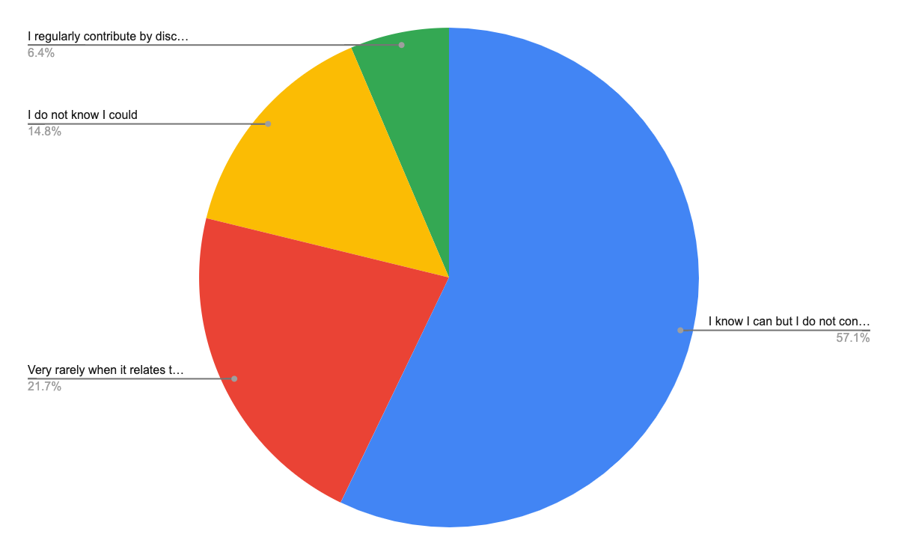

# Airflow User Survey 2022

This year’s survey has come and gone, and with it we’ve got a new batch of data for everyone! We collected 210 responses over two weeks. We continue to see growth in both contributions and downloads over the last two years, and expect that trend will continue through 2022.

The raw response data is available here for anyone interested in doing additional analysis: [airflow_survey_2022.csv]()

## TL;DR

### Overview of the user

- Like previous years, more than half of the Airflow users are Data Engineers (54%). Solutions Architects (13%), Developers (12%), DevOps (6%) and Data Scientists (4%) are also active Airflow users! There was a slight increase in the representation of Solutions Architect roles compared to results from [2020](https://airflow.apache.org/blog/airflow-survey-2020/#overview-of-the-user) and [2019](https://airflow.apache.org/blog/airflow-survey/) .
- Airflow is used and popular in bigger companies, 64% of Airflow users work for companies with 200+ employees which is an 11 percent increase compared to [2020](https://airflow.apache.org/blog/airflow-survey-2020/#overview-of-the-user).
- 62% of the survey participants have more than 6 Airflow users in their company.
- More Airflow users (65.9%) are willing to recommend Apache Airflow compared to the survey results in [2020](https://airflow.apache.org/blog/airflow-survey-2020/#overview-of-the-user) and [2019](https://airflow.apache.org/blog/airflow-survey/). There is a general positive trend in a willingness to recommend Airflow, 93% of surveyed Airflow users are willing to recommend Airflow ( 85.7% in [2019](https://airflow.apache.org/blog/airflow-survey/) and 92% in [2020](https://airflow.apache.org/blog/airflow-survey-2020/#overview-of-the-user) ), only 1% of users are not likely to recommend (3.6% in [2019](https://airflow.apache.org/blog/airflow-survey/) and 3.5% in [2020](https://airflow.apache.org/blog/airflow-survey-2020/#overview-of-the-user)).
- Airflow documentation is a critical source of information, with more than 90% (15% increase compared to results from [2020](https://airflow.apache.org/blog/airflow-survey-2020/#overview-of-the-user)) of survey participants using the documentation. Airflow documentation is also one of the top areas to improve! What’s interesting, also Stack Overflow usage is critical, with about 60% users declaring to use it as a source of information (24% increase compared to results from [2020](https://airflow.apache.org/blog/airflow-survey-2020/#overview-of-the-user)).

### Deployments

- 85% of the Airflow users have between 1 to 7 active Airflow instances. 62.5% of the Airflow users have between 11 to 250 DAGs in their largest Airflow instance. 75% of the surveyed Airflow users have between 1 to 100 tasks per DAG.
- Close to 85% of users use one of the Airflow 2 versions, 9.2% users still use 1.10.15, while the remaining 6.3% are still using olderAirflow 1 versions. The good news is that the majority of users on Airflow 1 are planning migration to Airflow 2 quite soon, with resources and capacity being the main blockers.
- In comparison to results from [2020](https://airflow.apache.org/blog/airflow-survey-2020/#overview-of-the-user), more users were interested in monitoring in general and specifically in using tools such as external monitoring services (40.7%, up from 29.6%) and information from metabase (35.7%, up from 25.1%).
- Celery (52.7%) and Kubernetes (39.4%) are the most common executors used.

### Usage

- 81.3% of Airflow users who responded to the survey don’t have any customisation of Airflow.
- Xcom (69.8%) is the most popular method to pass inputs and outputs between tasks, however Saving and Retrieving Inputs and Outputs from Storage still plays an important role (49%).
- Lineage itself is a quite new topic for Airflow users, most of them don’t use lineage solutions but might be interested if supported by Airflow (47.5%), are not familiar with data lineage (29%) or that data lineage is not their concern (13%).
- The Airflow web UI is used heavily for Monitoring Runs (95.9%), Accessing Task Logs (89.8%), Manually triggering DAGs (85.2%), Clearing Tasks (82.7%) and Marking Tasks as successful (60.7%). The top 3 views used are: List of DAGs, Task Logs and DAG Runs, which is very similar to results from [2020](https://airflow.apache.org/blog/airflow-survey-2020/#overview-of-the-user) and [2019](https://airflow.apache.org/blog/airflow-survey/).

### Community and contribution

- Most Airflow users (57.1%) are aware they could contribute but do not, and an additional 21.7% contribute very rarely. 14.8% of users were not aware they could contribute. There is much more to be done to engage our community to be more active contributors and raise the current 6.4% of users who actively contribute, especially considering that one important blocker for contribution is lack of knowledge on how to start (37.7%).

### The future of Airflow

- The top area for improvement is still the Airflow web UI (49.5%), closely followed by more telemetry for logging, monitoring and alerting purposes (48%). However all those efforts should go in line with improved documentation (36.6.%) and resources about using the Airflow, especially when we take into account the need of onboarding new users (36.6%).
- DAG Versioning(66.2%) is a winner for new features in Airflow, and it’s not a surprise as this feature may positively impact daily work of Airflow users. It is followed by three other ideas: Dependency management and Data-driven scheduling (42.6%), More dynamic task structure (42.1%) and Multi-Tenancy (37.9%).

## Overview of the user

### What best describes your current occupation? (single choice)

<table>
  <tr>
   <td>
   </td>
   <td>

No.

   </td>
   <td>

%

   </td>
  </tr>
  <tr>
   <td>Data Engineer
   </td>
   <td>

114

   </td>
   <td>

54%

   </td>
  </tr>
  <tr>
   <td>Solutions Architect
   </td>
   <td>

27

   </td>
   <td>

13%

   </td>
  </tr>
  <tr>
   <td>Developer
   </td>
   <td>

25

   </td>
   <td>

12%

   </td>
  </tr>
  <tr>
   <td>DevOps
   </td>
   <td>

12

   </td>
   <td>

6%

   </td>
  </tr>
  <tr>
   <td>Data Scientist
   </td>
   <td>

8

   </td>
   <td>

4%

   </td>
  </tr>
  <tr>
   <td>Support Engineer
   </td>
   <td>

5

   </td>
   <td>

2%

   </td>
  </tr>
  <tr>
   <td>Data Analyst
   </td>
   <td>

3

   </td>
   <td>

1%

   </td>
  </tr>
  <tr>
   <td>Business Analyst
   </td>
   <td>

2

   </td>
   <td>

1%

   </td>
  </tr>
  <tr>
   <td>Other
   </td>
   <td>

14

   </td>
   <td>

7%

   </td>
  </tr>
</table>

According to the survey, more than half of Airflow users are Data Engineers (54%). Roles of the remaining Airflow users might be broken down into Solutions Architects (13%), Developers (12%), DevOps (6%) and Data Scientists (4%). The 2022 results are similar to [those from 2019](https://airflow.apache.org/blog/airflow-survey/) and [2020](https://airflow.apache.org/blog/airflow-survey-2020/#overview-of-the-user) with a slight increase in the representation of Solutions Architect roles.

### How often do you interact with Airflow? (single choice)

<table>
  <tr>
   <td>
   </td>
   <td>

No. 

   </td>
   <td>

%

   </td>
  </tr>
  <tr>
   <td>Every day
   </td>
   <td>

154

   </td>
   <td>

73%

   </td>
  </tr>
  <tr>
   <td>At least once per week
   </td>
   <td>

36

   </td>
   <td>

17%

   </td>
  </tr>
  <tr>
   <td>At least once per month
   </td>
   <td>

11

   </td>
   <td>

5%

   </td>
  </tr>
  <tr>
   <td>Less than once per month
   </td>
   <td>

9

   </td>
   <td>

4%

   </td>
  </tr>
</table>

Users who took the survey are actively using Airflow as part of their current role. 73% of Airflow users who responded use it on a daily basis, 17% weekly.

### How many people work at your company? (single choice)

<table>
  <tr>
   <td>
   </td>
   <td>

No.

   </td>
   <td>

%

   </td>
  </tr>
  <tr>
   <td>201-5000
   </td>
   <td>

85

   </td>
   <td>

41%

   </td>
  </tr>
  <tr>
   <td>5000+
   </td>
   <td>

49

   </td>
   <td>

23%

   </td>
  </tr>
  <tr>
   <td>51-200
   </td>
   <td>

46

   </td>
   <td>

22%

   </td>
  </tr>
  <tr>
   <td>11-50
   </td>
   <td>

20

   </td>
   <td>

10%

   </td>
  </tr>
  <tr>
   <td>1-10
   </td>
   <td>

9

   </td>
   <td>

4%

   </td>
  </tr>
</table>

Airflow is a framework that is used and popular in bigger companies, 64% of Airflow users who responded (compared to 52.7% in [2020](https://airflow.apache.org/blog/airflow-survey-2020/#overview-of-the-user)) work for companies bigger than 200 employees (41% in companies size 201-5000 and 23% in companies size 5000+).

### How many people at your company use Airflow? (single choice)

<table>
  <tr>
   <td>
   </td>
   <td>

No.

   </td>
   <td>

%

   </td>
  </tr>
  <tr>
   <td>6-20
   </td>
   <td>

80

   </td>
   <td>

38%

   </td>
  </tr>
  <tr>
   <td>1-5
   </td>
   <td>

61

   </td>
   <td>

29%

   </td>
  </tr>
  <tr>
   <td>51-200
   </td>
   <td>

49

   </td>
   <td>

24%

   </td>
  </tr>
  <tr>
   <td>200+
   </td>
   <td>

18

   </td>
   <td>

9%

   </td>
  </tr>
</table>

Airflow is generally used by small to medium-sized teams. 62% of the survey participants have more than 6 Airflow users in their company (38% have between 6 and 200 users, 24% between 51-200 users).

### How likely are you to recommend Apache Airflow? (single choice)

<table>
  <tr>
   <td>
   </td>
   <td>

% 2019

   </td>
   <td>

% 2020

   </td>
   <td>

% 2022

   </td>
  </tr>
  <tr>
   <td>Very Likely
   </td>
   <td>

45.4%

   </td>
   <td>

61.6%

   </td>
   <td>

65.9%

   </td>
  </tr>
  <tr>
   <td>Likely
   </td>
   <td>

40.3%

   </td>
   <td>

30.4%

   </td>
   <td>

26.9%

   </td>
  </tr>
  <tr>
   <td>Neutral
   </td>
   <td>

10.7%

   </td>
   <td>

5.4%

   </td>
   <td>

6.3%

   </td>
  </tr>
  <tr>
   <td>Unlikely
   </td>
   <td>

2.6%

   </td>
   <td>

1.5%

   </td>
   <td>

0.5%

   </td>
  </tr>
  <tr>
   <td>Very Unlikely
   </td>
   <td>

1%

   </td>
   <td>

1%

   </td>
   <td>

0.5%

   </td>
  </tr>
</table>

According to the survey, more Airflow users (65.9%) are willing to recommend Apache Airflow compared to the survey results in [2020](https://airflow.apache.org/blog/airflow-survey-2020/#overview-of-the-user) and [2019](https://airflow.apache.org/blog/airflow-survey/). There is a general positive trend in a willingness to recommend Airflow, 93% of surveyed Airflow users are willing to recommend Airflow (92% in [2020](https://airflow.apache.org/blog/airflow-survey-2020/#overview-of-the-user) and 85.7% in [2019](https://airflow.apache.org/blog/airflow-survey/)), only 1% of users are not likely to recommend (3.6% in [2019](https://airflow.apache.org/blog/airflow-survey/) and 3.5% in [2020](https://airflow.apache.org/blog/airflow-survey-2020/#overview-of-the-user) ).

### What is your source of information about Airflow? (multiple choice)

<table>
  <tr>
   <td>
   </td>
   <td>

No.

   </td>
   <td>

%

   </td>
  </tr>
  <tr>
   <td>Documentation
   </td>
   <td>

189

   </td>
   <td>

90.4%

   </td>
  </tr>
  <tr>
   <td>Airflow website (Blog, etc.)
   </td>
   <td>

142

   </td>
   <td>

67.9%

   </td>
  </tr>
  <tr>
   <td>Stack Overflow
   </td>
   <td>

126

   </td>
   <td>

60.3%

   </td>
  </tr>
  <tr>
   <td>Github Issues
   </td>
   <td>

104

   </td>
   <td>

49.8%

   </td>
  </tr>
  <tr>
   <td>Slack
   </td>
   <td>

96

   </td>
   <td>

45.9%

   </td>
  </tr>
  <tr>
   <td>Airflow Summit Videos
   </td>
   <td>

88

   </td>
   <td>

42.1%

   </td>
  </tr>
  <tr>
   <td>GitHub Discussions
   </td>
   <td>

76

   </td>
   <td>

36.4%

   </td>
  </tr>
  <tr>
   <td>Airflow Community Webinars
   </td>
   <td>

41

   </td>
   <td>

19.6%

   </td>
  </tr>
  <tr>
   <td>Astronomer Registry
   </td>
   <td>

51

   </td>
   <td>

24.4%

   </td>
  </tr>
  <tr>
   <td>Airflow Mailing List
   </td>
   <td>

34

   </td>
   <td>

16.3%

   </td>
  </tr>
</table>

Airflow documentation is a critical source of information, with more than 90% of survey participants using the documentation. It is of increasing importance compared to results from [2020](https://airflow.apache.org/blog/airflow-survey-2020/#overview-of-the-user) where documentation was at about 75% level. Moreover, more than 60% of users are getting information from the Airflow website (67.9% ) and Stack Overflow (60.3%) which is also a big increase compared to 36% level in [2020](https://airflow.apache.org/blog/airflow-survey-2020/#overview-of-the-user). What’s interesting is that Slack usage decreased from 63.05% in [2020](https://airflow.apache.org/blog/airflow-survey-2020/#overview-of-the-user) to 45.9% in 2022.

## Deployments

### How many active DAGs do you have in your largest Airflow instance? (single choice)

<table>
  <tr>
   <td>
   </td>
   <td>

No.

   </td>
   <td>

%

   </td>
  </tr>
  <tr>
   <td>51-250
   </td>
   <td>

66

   </td>
   <td>

31.7%

   </td>
  </tr>
  <tr>
   <td>11-50
   </td>
   <td>

64

   </td>
   <td>

30.8%

   </td>
  </tr>
  <tr>
   <td>5-10
   </td>
   <td>

25

   </td>
   <td>

12.0%

   </td>
  </tr>
  <tr>
   <td>251-500
   </td>
   <td>

20

   </td>
   <td>

9.6%

   </td>
  </tr>
  <tr>
   <td>&lt;5
   </td>
   <td>

14

   </td>
   <td>

6.7%

   </td>
  </tr>
  <tr>
   <td>1000+
   </td>
   <td>

10

   </td>
   <td>

4.8%

   </td>
  </tr>
  <tr>
   <td>501-1000
   </td>
   <td>

9

   </td>
   <td>

4.3%

   </td>
  </tr>
</table>

62.5% of the Airflow users surveyed have between 11 to 250 DAGs in their largest Airflow instance.

### How many active Airflow instances do you have? (single choice)

<table>
  <tr>
   <td>
   </td>
   <td>

No.

   </td>
   <td>

%

   </td>
  </tr>
  <tr>
   <td>1
   </td>
   <td>

52

   </td>
   <td>

25.2%

   </td>
  </tr>
  <tr>
   <td>2
   </td>
   <td>

46

   </td>
   <td>

22.3%

   </td>
  </tr>
  <tr>
   <td>4-7
   </td>
   <td>

40

   </td>
   <td>

19.4%

   </td>
  </tr>
  <tr>
   <td>3
   </td>
   <td>

37

   </td>
   <td>

18.0%

   </td>
  </tr>
  <tr>
   <td>20+
   </td>
   <td>

19

   </td>
   <td>

9.2%

   </td>
  </tr>
  <tr>
   <td>8-10
   </td>
   <td>

7

   </td>
   <td>

3.4%

   </td>
  </tr>
  <tr>
   <td>11-20
   </td>
   <td>

5

   </td>
   <td>

2.4%

   </td>
  </tr>
</table>

85% of the Airflow users surveyed have between 1 and 7 active Airflow instances, and nearly 50% have only 1 or 2.

### What is the maximum number of tasks that you have used in a single DAG?(single choice)

<table>
  <tr>
   <td>
   </td>
   <td>

No.

   </td>
   <td>

%

   </td>
  </tr>
  <tr>
   <td>11-25
   </td>
   <td>

51

   </td>
   <td>

24.5%

   </td>
  </tr>
  <tr>
   <td>26-50
   </td>
   <td>

41

   </td>
   <td>

19.7%

   </td>
  </tr>
  <tr>
   <td>51-100
   </td>
   <td>

35

   </td>
   <td>

16.8%

   </td>
  </tr>
  <tr>
   <td>&lt;10
   </td>
   <td>

29

   </td>
   <td>

13.9%

   </td>
  </tr>
  <tr>
   <td>101-250
   </td>
   <td>

23

   </td>
   <td>

11.1%

   </td>
  </tr>
  <tr>
   <td>501-1000
   </td>
   <td>

9

   </td>
   <td>

4.3%

   </td>
  </tr>
  <tr>
   <td>1000-2500
   </td>
   <td>

8

   </td>
   <td>

3.8%

   </td>
  </tr>
  <tr>
   <td>251-500
   </td>
   <td>

8

   </td>
   <td>

3.8%

   </td>
  </tr>
  <tr>
   <td>2500-5000
   </td>
   <td>

4

   </td>
   <td>

1.9%

   </td>
  </tr>
</table>

75% of the surveyed Airflow users have between 1 and 100 tasks per DAG.

### How many schedulers do you have in your largest Airflow instance? (single choice)

<table>
  <tr>
   <td>
   </td>
   <td>

No.

   </td>
   <td>

%

   </td>
  </tr>
  <tr>
   <td>1
   </td>
   <td>

113

   </td>
   <td>

55.1%

   </td>
  </tr>
  <tr>
   <td>2
   </td>
   <td>

61

   </td>
   <td>

29.8%

   </td>
  </tr>
  <tr>
   <td>3
   </td>
   <td>

18

   </td>
   <td>

8.8%

   </td>
  </tr>
  <tr>
   <td>4+
   </td>
   <td>

13

   </td>
   <td>

6.3%

   </td>
  </tr>
</table>

More than half of Airflow users who responded to the survey have 1 scheduler in their largest Airflow instance, however it’s important to notice that the second half of Airflow users decided to have 2 schedulers and more.

### What executor type do you use? (multiple choice)

<table>
  <tr>
   <td>
   </td>
   <td>

% 2022

   </td>
  </tr>
  <tr>
   <td>

Celery

   </td>
   <td>

52.7 %

   </td>
  </tr>
  <tr>
   <td>

Kubernetes

   </td>
   <td>

39.4%

   </td>
  </tr>
  <tr>
   <td>

Local

   </td>
   <td>

24.1%

   </td>
  </tr>
  <tr>
   <td>

Sequential

   </td>
   <td>

10.3%

   </td>
  </tr>
  <tr>
   <td>

CeleryKubernetes 

   </td>
   <td>

6.9%

   </td>
  </tr>
</table>

Celery (52.7%) and Kubernetes (39.4%) are the most common executors used. CeleryKubernetes (6.9%) executor also started to be noticed and used by Airflow users.

### If you use the Celery executor, how many workers do you have in your largest Airflow instance? (single choice)

<table>
  <tr>
   <td>
   </td>
   <td>

No.

   </td>
   <td>

%

   </td>
  </tr>
  <tr>
   <td>2-5
   </td>
   <td>

64

   </td>
   <td>

44.8%

   </td>
  </tr>
  <tr>
   <td>10+
   </td>
   <td>

28

   </td>
   <td>

19.6%

   </td>
  </tr>
  <tr>
   <td>1
   </td>
   <td>

26

   </td>
   <td>

18.2%

   </td>
  </tr>
  <tr>
   <td>6-10
   </td>
   <td>

25

   </td>
   <td>

17.5%

   </td>
  </tr>
</table>

Amongst Celery executor users who responded to the survey, close to half the number (44.8%) have between 2 to 5 workers in their largest Airflow instance. It’s notable that nearly a fifth (19.6%) have more than 10 workers.

### Which version of Airflow do you currently use? (single choice)

<table>
  <tr>
   <td>
   </td>
   <td>

No.

   </td>
   <td>

%

   </td>
  </tr>
  <tr>
   <td>1.10.14 or older
   </td>
   <td>

13

   </td>
   <td>

6.3%

   </td>
  </tr>
  <tr>
   <td>1.10.15
   </td>
   <td>

19

   </td>
   <td>

9.2%

   </td>
  </tr>
  <tr>
   <td>2.0.x
   </td>
   <td>

23

   </td>
   <td>

11.1%

   </td>
  </tr>
  <tr>
   <td>2.1.x
   </td>
   <td>

24

   </td>
   <td>

11.6%

   </td>
  </tr>
  <tr>
   <td>2.2.x
   </td>
   <td>

79

   </td>
   <td>

38.2%

   </td>
  </tr>
  <tr>
   <td>2.3.x
   </td>
   <td>

49

   </td>
   <td>

23.7%

   </td>
  </tr>
</table>

It's good to see that close to 85% of users who responded to the survey use one of the Airflow 2 versions, 9.2% users still use 1.10.15, while the remaining 6.3% are still using older Airflow 1.10 versions.

The good news is that the majority of users on Airflow 1 are planning migration to Airflow 2 quite soon, as for now they have capacity constraints to undertake such a significant effort in their opinion. However, it can also be noticed in the survey’s comments that some users are generally skeptical towards migration to Airflow 2, they have negative opinions about the new scheduler or compatibility with the helm chart.

As to plans about migration to the newest version of Airflow 2, users who responded to the survey are committed and waiting especially for the features related to dynamic DAGs. However, some users also reported that they are waiting to solve some dependencies they have or they prefer to wait a little bit more for the community to test the new version before they decide to move on.

### What metrics do you use to monitor Airflow? (multiple choice)

<table>
  <tr>
   <td>
   </td>
   <td>

No.

   </td>
   <td>

%

   </td>
  </tr>
  <tr>
   <td>External monitoring service
   </td>
   <td>

81

   </td>
   <td>

40.7%

   </td>
  </tr>
  <tr>
   <td>Information from metadatabase
   </td>
   <td>

71

   </td>
   <td>

35.7%

   </td>
  </tr>
  <tr>
   <td>Statsd
   </td>
   <td>

54

   </td>
   <td>

27.1%

   </td>
  </tr>
  <tr>
   <td>I do not use monitoring
   </td>
   <td>

47

   </td>
   <td>

23.6%

   </td>
  </tr>
  <tr>
   <td>Other
   </td>
   <td>

14

   </td>
   <td>

7%

   </td>
  </tr>
</table>

In comparison to results from [2020](https://airflow.apache.org/blog/airflow-survey-2020/#overview-of-the-user), more users are monitoring airflow in some way. External monitoring services (40.7%) and information from metabase (35.7%) started to play a more important role in Airflow monitoring.

How do you deploy Airflow? (multiple choice)

<table>
  <tr>
   <td>
   </td>
   <td>

No.

   </td>
   <td>

%

   </td>
  </tr>
  <tr>
   <td>On virtual machines (for example using AWS EC2)
   </td>
   <td>

63

   </td>
   <td>

30.6 %

   </td>
  </tr>
  <tr>
   <td>Using a managed service like Astronomer, Google Composer or AWS MWAA
   </td>
   <td>

54

   </td>
   <td>

26.2 %

   </td>
  </tr>
  <tr>
   <td>On Kubernetes (using Apache Airflow’s helm chart)
   </td>
   <td>

46

   </td>
   <td>

22.3%

   </td>
  </tr>
  <tr>
   <td>On premises
   </td>
   <td>

43

   </td>
   <td>

20.9%

   </td>
  </tr>
  <tr>
   <td>On Kubernetes (using custom deployments)
   </td>
   <td>

39

   </td>
   <td>

18.9%

   </td>
  </tr>
  <tr>
   <td>On Kubernetes (using another helm chart)
   </td>
   <td>

21

   </td>
   <td>

10.2%

   </td>
  </tr>
  <tr>
   <td>Other
   </td>
   <td>

13

   </td>
   <td>

6.5%

   </td>
  </tr>
</table>

More than half of Airflow users who responded (51.4%) deploy Airflow on Kubernetes. This is about 20 percent more than in [2020](https://airflow.apache.org/blog/airflow-survey-2020/#overview-of-the-user). The remaining top deployment methods are on virtual machines (30.6%) and via managed services (26.2%).

### How do you distribute your DAGs from your developer environment to the cloud? (single choice)

<table>
  <tr>
   <td>
   </td>
   <td>

No.

   </td>
   <td>

%

   </td>
  </tr>
  <tr>
   <td>Using a synchronizing process (Git sync, GCS fuse, etc)
   </td>
   <td>

100

   </td>
   <td>

49%

   </td>
  </tr>
  <tr>
   <td>Bake them into the docker image
   </td>
   <td>

51

   </td>
   <td>

25%

   </td>
  </tr>
  <tr>
   <td>Shared files system
   </td>
   <td>

30

   </td>
   <td>

14.7%

   </td>
  </tr>
  <tr>
   <td>Other
   </td>
   <td>

16

   </td>
   <td>

7.9%

   </td>
  </tr>
  <tr>
   <td>I don’t know
   </td>
   <td>

7

   </td>
   <td>

3.4%

   </td>
  </tr>
</table>

According to the survey responses, the most popular way of distributing DAGs is a synchronizing process, about half of Airflow users (49%) use this process to distribute DAGs from developer environments to the cloud.

## Usage

### Do you have any customisation of Airflow? (single choice)

<table>
  <tr>
   <td>
   </td>
   <td>

No.

   </td>
   <td>

%

   </td>
  </tr>
  <tr>
   <td>No, we use vanilla airflow
   </td>
   <td>

165

   </td>
   <td>

81.3%

   </td>
  </tr>
  <tr>
   <td>Yes, we have a separate fork
   </td>
   <td>

13

   </td>
   <td>

6.4%

   </td>
  </tr>
  <tr>
   <td>Yes, we use a 3rd-party fork
   </td>
   <td>

12

   </td>
   <td>

5.9%

   </td>
  </tr>
  <tr>
   <td>Yes, we’ve backpropagated bug fixes to an older version
   </td>
   <td>

13

   </td>
   <td>

6.4%

   </td>
  </tr>
</table>

More Airflow users (81.3%) don’t have any customisation of Airflow (compared to 75.9% in [2020](https://airflow.apache.org/blog/airflow-survey-2020/#overview-of-the-user)). Those Airflow users who have customisations (18.7%) decided to introduce them mainly to separate development and production workflows, to backport bug fixes, due to security fixes or to run a backfill command on Kubernetes pod.

### Which Metadata Database do you use? (single choice)

<table>
  <tr>
   <td>
   </td>
   <td>

No.

   </td>
   <td>

%I 

   </td>
  </tr>
  <tr>
   <td>PostgreSQL 13
   </td>
   <td>

86

   </td>
   <td>

43.9%

   </td>
  </tr>
  <tr>
   <td>PostgreSQL 12
   </td>
   <td>

74

   </td>
   <td>

37.8%

   </td>
  </tr>
  <tr>
   <td>MySQL 8
   </td>
   <td>

22

   </td>
   <td>

11.2%

   </td>
  </tr>
  <tr>
   <td>MySQL 5
   </td>
   <td>

9

   </td>
   <td>

4.6%

   </td>
  </tr>
  <tr>
   <td>MariaDB
   </td>
   <td>

4

   </td>
   <td>

2.0%

   </td>
  </tr>
  <tr>
   <td>MsSQL
   </td>
   <td>

1

   </td>
   <td>

0.5%

   </td>
  </tr>
</table>

According to the survey responses, the most popular metadata databases are PostgreSQL 13 (43.9%) and PostgreSQL 12 (37.8%). This represents a sharp increase from 2020, up from 68.9% to 81.7% total on PostgreSQL, with a corresponding decrease in MySQL, down from 23% to 15%. This is an interesting result taking into account community discussion about not adding support for more database backend or even deciding on single database support.

### What's the primary method by which you integrate with providers and external services in your Airflow DAGs? (single choice)

<table>
  <tr>
   <td>
   </td>
   <td>

No.

   </td>
   <td>

%

   </td>
  </tr>
  <tr>
   <td>Using existing dedicated operators / hooks
   </td>
   <td>

70

   </td>
   <td>

34.5%

   </td>
  </tr>
  <tr>
   <td>Using Bash/Python operators
   </td>
   <td>

58

   </td>
   <td>

28.6%

   </td>
  </tr>
  <tr>
   <td>Using custom operators / hooks
   </td>
   <td>

50

   </td>
   <td>

24.6%

   </td>
  </tr>
  <tr>
   <td>Using KubernetesPodOperator
   </td>
   <td>

25

   </td>
   <td>

12.3%

   </td>
  </tr>
</table>

According to the survey responses, the following ways of using Airflow to connect to external services are the most popular: Using existing dedicated operators / hooks (34.5%), Using Bash/Python operators (28.6%), Using custom operators / hooks (24.6%). Using KubernetesPodOperator (12.3%) is less popular regarding the survey responses. The integration with providers and external services methods ranking is similar to the one from [2020](https://airflow.apache.org/blog/airflow-survey-2020/#overview-of-the-user).

What providers do you use in your Airflow DAGs? (multiple choice)

<table>
  <tr>
   <td>
   </td>
   <td>

No.

   </td>
   <td>

%

   </td>
  </tr>
  <tr>
   <td>

Amazon Web Services

   </td>
   <td>

112

   </td>
   <td>

55.4%

   </td>
  </tr>
  <tr>
   <td>

Google Cloud Platform / Google APIs

   </td>
   <td>

79

   </td>
   <td>

39.1%

   </td>
  </tr>
  <tr>
   <td>

Internal company systems

   </td>
   <td>

75

   </td>
   <td>

37.1%

   </td>
  </tr>
  <tr>
   <td>

Hadoop / Spark / Flink / Other Apache software

   </td>
   <td>

57

   </td>
   <td>

28.2%

   </td>
  </tr>
  <tr>
   <td>

Microsoft Azure

   </td>
   <td>

17

   </td>
   <td>

8.4%

   </td>
  </tr>
  <tr>
   <td>

Other

   </td>
   <td>

21

   </td>
   <td>

10.5%

   </td>
  </tr>
  <tr>
   <td>

I do not use external services in my Airflow DAGs

   </td>
   <td>

14

   </td>
   <td>

6.9%

   </td>
  </tr>
</table>

It’s not surprising that Amazon Web Services (55.4% vs 59.6% in [2020](https://airflow.apache.org/blog/airflow-survey-2020/)), on the next three positions Google Cloud Platform (39.1% vs 47.7% in [2020](https://airflow.apache.org/blog/airflow-survey-2020/) ), Internal company systems (37.1% vs 55.6% in [2020](https://airflow.apache.org/blog/airflow-survey-2020/)), and other Apache products (28.2% vs 35.47% in [2020](https://airflow.apache.org/blog/airflow-survey-2020/)) are leading Airflow providers.

<table>
  <tr>
   <td><strong>No.</strong>
   </td>
   <td><strong>%</strong>
   </td>
   <td>
   </td>
  </tr>
  <tr>
   <td>Amazon Web Services
   </td>
   <td>121
   </td>
   <td>59.61
   </td>
  </tr>
  <tr>
   <td>Internal company systems
   </td>
   <td>113
   </td>
   <td>55.67
   </td>
  </tr>
  <tr>
   <td>Google Cloud Platform / Google APIs
   </td>
   <td>97
   </td>
   <td>47.78
   </td>
  </tr>
  <tr>
   <td>Hadoop / Spark / Flink / Other Apache software
   </td>
   <td>72
   </td>
   <td>35.47
   </td>
  </tr>
  <tr>
   <td>Microsoft Azure
   </td>
   <td>21
   </td>
   <td>10.34
   </td>
  </tr>
  <tr>
   <td>Other
   </td>
   <td>19
   </td>
   <td>9.36
   </td>
  </tr>
  <tr>
   <td>I do not use external services in my Airflow DAGs
   </td>
   <td>5
   </td>
   <td>2.46
   </td>
  </tr>
</table>

### How frequently do you upgrade Airflow environments? (single choice)

<table>
  <tr>
   <td>
   </td>
   <td>

No.

   </td>
   <td>

%

   </td>
  </tr>
  <tr>
   <td>every 12 months
   </td>
   <td>

46

   </td>
   <td>

22.9%

   </td>
  </tr>
  <tr>
   <td>every 6 months
   </td>
   <td>

49

   </td>
   <td>

24.4%

   </td>
  </tr>
  <tr>
   <td>once a quarter
   </td>
   <td>

47

   </td>
   <td>

23.4%

   </td>
  </tr>
  <tr>
   <td>Whenever there is a newer version
   </td>
   <td>

59

   </td>
   <td>

29.4%

   </td>
  </tr>
</table>

Different frequencies of Airflow environments upgrades are almost equally popular amongst Airflow users who responded to the survey.

### Do you upgrade providers separately from the core? (single choice)

<table>
  <tr>
   <td>
   </td>
   <td>

No.

   </td>
   <td>

%

   </td>
  </tr>
  <tr>
   <td>When I need it
   </td>
   <td>

83

   </td>
   <td>

42.8%

   </td>
  </tr>
  <tr>
   <td>Never - always use the providers that come with Airflow
   </td>
   <td>

68

   </td>
   <td>

35.1%

   </td>
  </tr>
  <tr>
   <td>I did not know I can upgrade providers separately
   </td>
   <td>

32

   </td>
   <td>

16.5%

   </td>
  </tr>
  <tr>
   <td>I upgrade providers when they are released
   </td>
   <td>

11

   </td>
   <td>

5.7%

   </td>
  </tr>
</table>

According to the survey responses, Airflow users most often upgrade providers when they need it (42.8%) or prefer to stay with providers that come with Airflow (35.1%). It’s surprising that 16.5% of Airflow users who responded to the survey were not aware that they can upgrade their providers separately from the core Airflow.

### How do you pass inputs and outputs between tasks? (multiple choice)

<table>
  <tr>
   <td>
   </td>
   <td>

No.

   </td>
   <td>

%

   </td>
  </tr>
  <tr>
   <td>Xcom
   </td>
   <td>

141

   </td>
   <td>

69.8%

   </td>
  </tr>
  <tr>
   <td>Saving and retrieving from Storage 
   </td>
   <td>

99

   </td>
   <td>

49%

   </td>
  </tr>
  <tr>
   <td>TaskFlow
   </td>
   <td>

37

   </td>
   <td>

18.3%

   </td>
  </tr>
  <tr>
   <td>Other
   </td>
   <td>

5

   </td>
   <td>

2.5%

   </td>
  </tr>
  <tr>
   <td>We don’t
   </td>
   <td>

29

   </td>
   <td>

14.4%

   </td>
  </tr>
</table>

According to the survey responses, Xcom (69.8%) is the most popular method to pass inputs and outputs between tasks, however Saving and Retrieving Inputs and Outputs from Storage still plays an important role (49%). It’s interesting that close to 15% of Airflow users who responded to the survey declare to not pass any outputs or inputs between tasks.

### Do you use a data lineage backend? (multiple choice)

<table>
  <tr>
   <td>
   </td>
   <td>

No.

   </td>
   <td>

%

   </td>
  </tr>
  <tr>
   <td>No, but I will use such feature if fully supported in Airflow
   </td>
   <td>

95

   </td>
   <td>

47.5%

   </td>
  </tr>
  <tr>
   <td>I’m not familiar with data lineage
   </td>
   <td>

58

   </td>
   <td>

29%

   </td>
  </tr>
  <tr>
   <td>No, data lineage isn’t a concern for my usage
   </td>
   <td>

26

   </td>
   <td>

13%

   </td>
  </tr>
  <tr>
   <td>Yes, I send lineage to an Open Source lineage repository
   </td>
   <td>

15

   </td>
   <td>

7.5%

   </td>
  </tr>
  <tr>
   <td>Yes, I send lineage to an Enterprise lineage repository
   </td>
   <td>

7

   </td>
   <td>

3.5%

   </td>
  </tr>
  <tr>
   <td>Yes, I send lineage to a custom internal lineage repository
   </td>
   <td>

9

   </td>
   <td>

4.5%

   </td>
  </tr>
</table>

When asked what lineage backend Airflow users use, the answers indicated that, while lineage itself is a quite new topic, there is interest in the feature as a whole. Most Airflow users responded that they don’t use lineage solutions currently but might be interested in the future if supported by Airflow (47.5%), are not familiar with data lineage (29%) or that data lineage is not their concern (13%).

### Which interfaces of Airflow do you use as part of your current role? (multiple choice)

<table>
  <tr>
   <td>
   </td>
   <td>

No.

   </td>
   <td>

%

   </td>
  </tr>
  <tr>
   <td>Original Airflow Graphical User Interface
   </td>
   <td>

189

   </td>
   <td>

94%

   </td>
  </tr>
  <tr>
   <td>CLI
   </td>
   <td>

98

   </td>
   <td>

48.8%

   </td>
  </tr>
  <tr>
   <td>API
   </td>
   <td>

80

   </td>
   <td>

39.8%

   </td>
  </tr>
  <tr>
   <td>Custom (own created) Airflow Graphical User Interface
   </td>
   <td>

12

   </td>
   <td>

6%

   </td>
  </tr>
  <tr>
   <td>GCP Composer 
   </td>
   <td>

1

   </td>
   <td>

0.5%

   </td>
  </tr>
</table>

It’s clear that usage of Airflow web UI is important as 94% of users who responded to the survey declare to use it as a part of their current role. Usage of CLI (48.8%) and API (39.8%) goes in pairs but are not so common compared to Airflow web UI usage.

### (If GUI Marked) What do you use the GUI for? (multiple choice)

<table>
  <tr>
   <td>
   </td>
   <td>

No.

   </td>
   <td>

%

   </td>
  </tr>
  <tr>
   <td>Monitoring Runs
   </td>
   <td>

188

   </td>
   <td>

95.9%

   </td>
  </tr>
  <tr>
   <td>Accessing Task Logs
   </td>
   <td>

176

   </td>
   <td>

89.8%

   </td>
  </tr>
  <tr>
   <td>Manually triggering DAGs
   </td>
   <td>

167

   </td>
   <td>

85.2%

   </td>
  </tr>
  <tr>
   <td>Clearing Tasks
   </td>
   <td>

162

   </td>
   <td>

82.7%

   </td>
  </tr>
  <tr>
   <td>Marking Tasks as successful
   </td>
   <td>

119

   </td>
   <td>

60.7%

   </td>
  </tr>
  <tr>
   <td>Other
   </td>
   <td>

6

   </td>
   <td>

3%

   </td>
  </tr>
</table>

Airflow web UI is used heavily for monitoring: Monitoring Runs (95.9%) and troubleshooting: Accessing Task Logs (89.8%), Manually triggering DAGs (85.2%), Clearing Tasks (82.7%) and Marking Tasks as successful (60.7%).

### (if CLI Marked) What do you use the CLI For? (multiple choice)

<table>
  <tr>
   <td>
   </td>
   <td>

No.

   </td>
   <td>

%

   </td>
  </tr>
  <tr>
   <td>Backfilling
   </td>
   <td>

63

   </td>
   <td>

56.8%

   </td>
  </tr>
  <tr>
   <td>Manually triggering DAGs
   </td>
   <td>

52

   </td>
   <td>

46.8%

   </td>
  </tr>
  <tr>
   <td>Clearing Tasks
   </td>
   <td>

26

   </td>
   <td>

23.4%

   </td>
  </tr>
  <tr>
   <td>Monitoring Runs
   </td>
   <td>

25

   </td>
   <td>

22.5%

   </td>
  </tr>
  <tr>
   <td>Accessing Task Logs
   </td>
   <td>

21

   </td>
   <td>

18.9%

   </td>
  </tr>
  <tr>
   <td>Marking Tasks as successful
   </td>
   <td>

11

   </td>
   <td>

9.9%

   </td>
  </tr>
  <tr>
   <td>Other
   </td>
   <td>

17

   </td>
   <td>

15.3%

   </td>
  </tr>
</table>

Compared to Airflow web UI, Airflow CLI is used mainly for Backfilling (56.8%) and Manually triggering DAGs (46.8%).

### In Airflow, which UI views are important for you? (multiple choice)

<table>
  <tr>
   <td>
   </td>
   <td>

No.

   </td>
   <td>

%

   </td>
  </tr>
  <tr>
   <td>List of DAGs
   </td>
   <td>

178

   </td>
   <td>

89.4%

   </td>
  </tr>
  <tr>
   <td>Task Logs
   </td>
   <td>

162

   </td>
   <td>

81.4%

   </td>
  </tr>
  <tr>
   <td>DAG Runs
   </td>
   <td>

160

   </td>
   <td>

80.4%

   </td>
  </tr>
  <tr>
   <td>Graph view
   </td>
   <td>

147

   </td>
   <td>

73.9%

   </td>
  </tr>
  <tr>
   <td>Grid/Tree View
   </td>
   <td>

138

   </td>
   <td>

69.3%

   </td>
  </tr>
  <tr>
   <td>Run Details
   </td>
   <td>

117

   </td>
   <td>

58.8%

   </td>
  </tr>
  <tr>
   <td>DAG details
   </td>
   <td>

111

   </td>
   <td>

55.8%

   </td>
  </tr>
  <tr>
   <td>Task Instances
   </td>
   <td>

102

   </td>
   <td>

51.3%

   </td>
  </tr>
  <tr>
   <td>Task Duration
   </td>
   <td>

91

   </td>
   <td>

45.7%

   </td>
  </tr>
  <tr>
   <td>Code
   </td>
   <td>

90

   </td>
   <td>

45.2%

   </td>
  </tr>
  <tr>
   <td>Task Tries
   </td>
   <td>

60

   </td>
   <td>

30.2%

   </td>
  </tr>
  <tr>
   <td>Gantt
   </td>
   <td>

48

   </td>
   <td>

21.4%

   </td>
  </tr>
  <tr>
   <td>Landing Times
   </td>
   <td>

27

   </td>
   <td>

13.6%

   </td>
  </tr>
  <tr>
   <td>Other
   </td>
   <td>

4

   </td>
   <td>

2%

   </td>
  </tr>
</table>

UI views importance ranking shows that the majority Airflow users use Web UI mostly for monitoring and/or troubleshooting purposes, where the top 3 views are List of DAGs (89.4%), Task Logs (81.4%) and DAG Runs (80.4%). The results are very similar to those from [2020](https://airflow.apache.org/blog/airflow-survey-2020/#overview-of-the-user) and [2019](https://airflow.apache.org/blog/airflow-survey/).

## Community and contribution

### Are you participating in the Airflow community discussions? (single choice)

<table>
  <tr>
   <td>
   </td>
   <td>

No.

   </td>
   <td>

%

   </td>
  </tr>
  <tr>
   <td>I see them from time to time
   </td>
   <td>

99

   </td>
   <td>

48.3%

   </td>
  </tr>
  <tr>
   <td>I regularly follow what's being discussed but don't participate
   </td>
   <td>

53

   </td>
   <td>

25.9%

   </td>
  </tr>
  <tr>
   <td>I didn't know I could
   </td>
   <td>

41

   </td>
   <td>

20.0%

   </td>
  </tr>
  <tr>
   <td>I actively participate in the discussions
   </td>
   <td>

12

   </td>
   <td>

5.9%

   </td>
  </tr>
</table>

Most of the Airflow users (48.3%) who responded to the survey participate in the Airflow community discussions only from time to time, 25.9% of users follow discussions but don’t participate and 20% of users were not aware they could actively participate. It clearly means there is much more to be done to engage our community to more active involvement and raise the current 5.9% of users who actively participate in the discussions.

### Do you contribute to Airflow?\*\* \*\*(single choice)

<table>
  <tr>
   <td>
   </td>
   <td>

No.

   </td>
   <td>

%

   </td>
  </tr>
  <tr>
   <td>I know I can but I do not contribute
   </td>
   <td>

116

   </td>
   <td>

57.1%

   </td>
  </tr>
  <tr>
   <td>Very rarely when it relates to what I need
   </td>
   <td>

44

   </td>
   <td>

21.7%

   </td>
  </tr>
  <tr>
   <td>I do not know I could
   </td>
   <td>

30

   </td>
   <td>

14.8%

   </td>
  </tr>
  <tr>
   <td>I regularly contribute by discussing, reviewing and submitting PR
   </td>
   <td>

13

   </td>
   <td>

6.4%

   </td>
  </tr>
</table>

Results related to the Airflow contribution are very similar to those about participating in the Airflow community discussions. Most of the Airflow users (57.1%) who responded to the survey are aware but do not contribute or contribute very rarely (21.7%). 14.8% of users were not aware they could contribute. Once again, it’s a clear indicator that there is much more to be done to engage our community to be more active contributors and raise the current 6.4% of users who actively contribute.

### If you do not contribute - why?

<table>
  <tr>
   <td>
   </td>
   <td>

No.

   </td>
   <td>

%

   </td>
  </tr>
  <tr>
   <td>I have no time to contribute even if would like to
   </td>
   <td>

65

   </td>
   <td>

38.9%

   </td>
  </tr>
  <tr>
   <td>I don’t know how to start
   </td>
   <td>

63

   </td>
   <td>

37.7%

   </td>
  </tr>
  <tr>
   <td>I don’t have a need to contribute
   </td>
   <td>

19

   </td>
   <td>

11.4%

   </td>
  </tr>
  <tr>
   <td>I didn’t know I could
   </td>
   <td>

12

   </td>
   <td>

7.2%

   </td>
  </tr>
  <tr>
   <td>My employer has policy that makes it difficult to contribute
   </td>
   <td>

8

   </td>
   <td>

4.8%

   </td>
  </tr>
</table>

According to the survey results, the most important blocker for the Airflow contribution is limited time (38.9%), but surprisingly interesting and important blocker is also lack of knowledge on how to start (37.7%), followed by lack of knowledge that it’s possible to contribute (7.2%).

## The future of Airflow

### In your opinion, what could be improved in Airflow? (multiple choice)

<table>
  <tr>
   <td>
   </td>
   <td>

No.

   </td>
   <td>

%

   </td>
  </tr>
  <tr>
   <td>Web UI
   </td>
   <td>

100

   </td>
   <td>

49.5%

   </td>
  </tr>
  <tr>
   <td>Logging, monitoring and alerting
   </td>
   <td>

97

   </td>
   <td>

48.0%

   </td>
  </tr>
  <tr>
   <td>Examples, how-to, onboarding documentation
   </td>
   <td>

74

   </td>
   <td>

36.6%

   </td>
  </tr>
  <tr>
   <td>Technical documentation
   </td>
   <td>

74

   </td>
   <td>

36.6%

   </td>
  </tr>
  <tr>
   <td>Scheduler performance
   </td>
   <td>

56

   </td>
   <td>

27.7%

   </td>
  </tr>
  <tr>
   <td>Reliability
   </td>
   <td>

52

   </td>
   <td>

25.7%

   </td>
  </tr>
  <tr>
   <td>DAG authoring
   </td>
   <td>

48

   </td>
   <td>

23.8%

   </td>
  </tr>
  <tr>
   <td>REST API
   </td>
   <td>

43

   </td>
   <td>

21.3%

   </td>
  </tr>
  <tr>
   <td>Authentication and authorization
   </td>
   <td>

41

   </td>
   <td>

20.3%

   </td>
  </tr>
  <tr>
   <td>External integration e.g. AWS, GCP, Apache products
   </td>
   <td>

41

   </td>
   <td>

20.3%

   </td>
  </tr>
  <tr>
   <td>Better support for various deployments (Docker-compose/Nomad/Others)
   </td>
   <td>

39

   </td>
   <td>

19.3%

   </td>
  </tr>
  <tr>
   <td>Everything works fine for me
   </td>
   <td>

19

   </td>
   <td>

9.4%

   </td>
  </tr>
  <tr>
   <td>I don’t know
   </td>
   <td>

4

   </td>
   <td>

2.0%

   </td>
  </tr>
</table>

The results are quite self-explanatory. According to the survey results, the top area for improvement is still the Airflow web UI (49.5%), closely followed by more telemetry for logging, monitoring and alerting purposes (48%). However all those efforts should go in line with improved documentation (36.6.%) and resources about using the Airflow, especially when we take into account the need of onboarding new users (36.6%).

### Which features would you like to see in Airflow?

<table>
  <tr>
   <td>
   </td>
   <td>

No.

   </td>
   <td>

%

   </td>
  </tr>
  <tr>
   <td>DAG Versioning
   </td>
   <td>

129

   </td>
   <td>

66.2%

   </td>
  </tr>
  <tr>
   <td>Dependency management and Data-driven scheduling
   </td>
   <td>

83

   </td>
   <td>

42.6%

   </td>
  </tr>
  <tr>
   <td>More dynamic task structure
   </td>
   <td>

82

   </td>
   <td>

42.1%

   </td>
  </tr>
  <tr>
   <td>Multi-Tenancy
   </td>
   <td>

74

   </td>
   <td>

37.9%

   </td>
  </tr>
  <tr>
   <td>Signal-based scheduling
   </td>
   <td>

67

   </td>
   <td>

34.4%

   </td>
  </tr>
  <tr>
   <td>Better Security (Isolation)
   </td>
   <td>

65

   </td>
   <td>

33.3%

   </td>
  </tr>
  <tr>
   <td>Submitting new DAGs externally via API
   </td>
   <td>

53

   </td>
   <td>

27.2%

   </td>
  </tr>
  <tr>
   <td>Composable Operators
   </td>
   <td>

46

   </td>
   <td>

23.6%

   </td>
  </tr>
  <tr>
   <td>Support for native cloud executors (AWS/GCP/Azure etc.)
   </td>
   <td>

44

   </td>
   <td>

22.6%

   </td>
  </tr>
  <tr>
   <td>Better support for Machine Learning
   </td>
   <td>

38

   </td>
   <td>

19.5%

   </td>
  </tr>
  <tr>
   <td>Remote CLI
   </td>
   <td>

36

   </td>
   <td>

18.5%

   </td>
  </tr>
  <tr>
   <td>Support for hybrid executors
   </td>
   <td>

22

   </td>
   <td>

11.3%

   </td>
  </tr>
</table>

According to the survey results, DAG Versioning is a winner for new features in Airflow, and it’s not a surprise as this feature may positively impact daily work of Airflow users. It is followed by three other ideas: Dependency management and Data-driven scheduling (42.6%), More dynamic task structure (42.1%) and Multi-Tenancy (37.9%). Another interesting point from that question is that only 11.3% think that support for hybrid executors is needed in Airflow.
