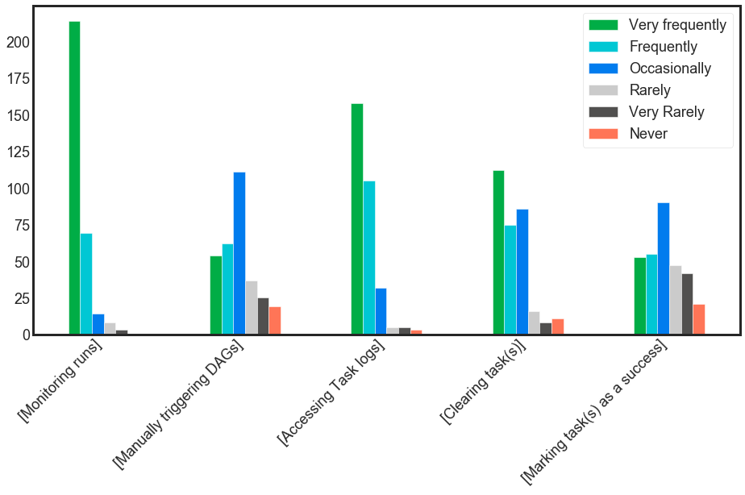
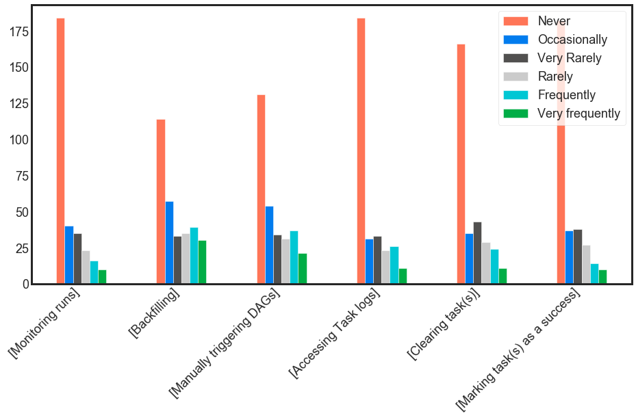
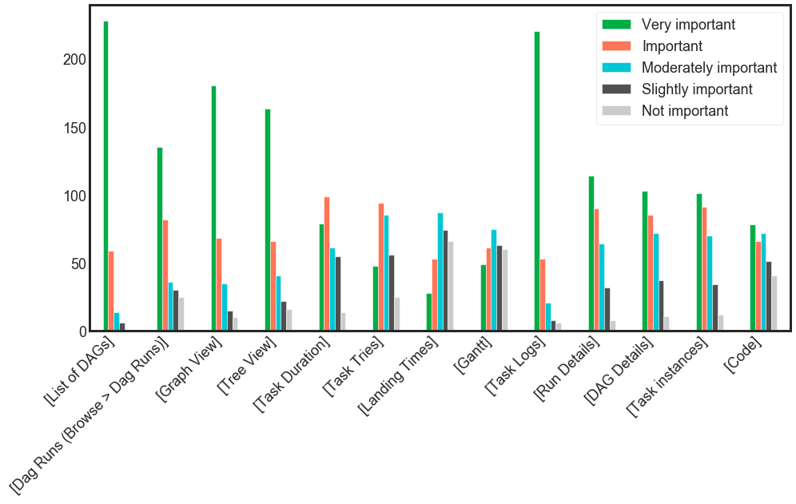

# Apache Airflow Survey 2019

Apache Airflow is [growing faster than ever](https://www.astronomer.io/blog/why-airflow/).
Thus, receiving and adjusting to our users’ feedback is a must. We created
[survey](https://forms.gle/XAzR1pQBZiftvPQM7) and we got **308** responses.
Let’s see who Airflow users are, how they play with it, and what they miss.

# Overview of the user

**What best describes your current occupation?**

|                         |No.|  %   |
|-------------------------|---|------|
|Data Engineer            |194|62.99%|
|Developer                | 34|11.04%|
|Architect                | 23|7.47% |
|Data Scientist           | 19|6.17% |
|Data Analyst             | 13|4.22% |
|DevOps                   | 13|4.22% |
|IT Administrator         |  2|0.65% |
|Machine Learning Engineer|  2|0.65% |
|Manager                  |  2|0.65% |
|Operations               |  2|0.65% |
|Chief Data Officer       |  1|0.32% |
|Engineering Manager      |  1|0.32% |
|Intern                   |  1|0.32% |
|Product owner            |  1|0.32% |
|Quant                    |  1|0.32% |

**In your day to day job, what do you use Airflow for?**

|                                                      |No.|  %   |
|------------------------------------------------------|---|------|
|Data processing (ETL)                                 |298|96.75%|
|Artificial Intelligence and Machine Learning Pipelines| 90|29.22%|
|Automating DevOps operations                          | 64|20.78%|

According to the survey, most of the Airflow users are the “data” people. Moreover,
28.57% uses Airflow to both ETL and ML pipelines meaning that those two fields
are somehow connected. Only five respondents use Airflow for DevOps operations only,
That means that other 59 people who use Airflow for DevOps stuff use it also for
ETL / ML  purposes.

**How many active DAGs do you have in your largest Airflow instance?**

|       |No.|  %   |
|-------|---|------|
|0-20   |115|37.34%|
|21-40  | 65|21.10%|
|41-60  | 44|14.29%|
|61-100 | 28|9.09% |
|101-200| 28|9.09% |
|201-300|  7|2.27% |
|301-999|  8|2.60% |
|1000+  | 13|4.22% |

The majority of users do not exceed 100 active DAGs per Airflow instance. However,
as we can see there are users who exceed thousands of DAGs with a maximum number 5000.

**What is the maximum number of tasks that you have used in one DAG?**

|       |No.|  %   |
|-------|---|------|
|0-10   | 61|19.81%|
|11-20  | 60|19.48%|
|21-30  | 31|10.06%|
|31-40  | 21|6.82% |
|41-50  | 26|8.44% |
|51-100 | 36|11.69%|
|101-200| 28|9.09% |
|201-500| 21|6.82% |
|501+   | 24|11.54%|

The given maximum number of tasks in a single DAG was 10 000 (!). The number of tasks
depends on the purposes of a DAG, so it’s rather hard to say if users have “simple”
or “complicated” workflows.

**When onboarding new members to Airflow, what is the biggest problem?**

|                                                               |No.|  %   |
|---------------------------------------------------------------|---|------|
|No guide on best practises on developing DAGs                  |160|51.95%|
|Small number of tutorials on different aspects of using Airflow| 57|18.51%|
|Documentation is not clear enough                              | 42|13.64%|
|Small number of blogs regarding Airflow                        |  6|1.95% |
|Other                                                          | 43|13.96%|

This is an important result. Using Airflow is all about writing and scheduling DAGs.
No guide or any other complete resource on best practices for developing Dags is a big
problem. Diving deep in the “other” answers, we can find that:

- Airflow’s “magic” (scheduler, executors, schedule times) is hard to understand
- DAG testing is not easy to do and to explain
- Airflow UI needs some love.

**How likely are you to recommend Apache Airflow?**

|             |No.|  %   |
|-------------|---|------|
|Very Likely  |140|45.45%|
|Likely       |124|40.26%|
|Neutral      | 33|10.71%|
|Unlikely     |  8|2.60% |
|Very unlikely|  3|0.97% |

This means that more than 85% of people who use Airflow like it. It seems Airflow does
its job nicely. However, we have to remember that this survey is likely biased - it’s
more likely that you respond to the survey if you like the tool you use. Should we
focus then on those 11 people who did not like Airflow? It’s a good question.

## Airflow usage

**Which interface(s) of Airflow do you use as part of your current role?**

|                                                     |No.|  %   |
|-----------------------------------------------------|---|------|
|Original Airflow Graphical User Interface            |297|96.43%|
|CLI                                                  |126|40.91%|
|Original Airflow Graphical User Interface, CLI       |117|37.99%|
|API                                                  | 60|19.48%|
|Original Airflow Graphical User Interface, CLI, API  | 32|10.39%|
|Custom (own created) Airflow Graphical User Interface| 25|8.12% |

It’s visible that usage of CLI goes in pair with using Airflow web UI. Our
survey included some UX related questions to allow us to understand how users
use Airflow webserver.

**What do you use the Graphical User Interface for?**

**What do you use CLI for?**

**In Airflow, which UI view(s) are important for you?**

Here we see that the majority uses Web UI mostly for monitoring purposes:

- Monitoring DAGs
- Accessing logs

An interesting result is that many people seem not to use backfilling as
there’s no other way than to do it by CLI.

**What executor type do you use?**

|          |No.|  %   |
|----------|---|------|
|Celery    |138|44.81%|
|Local     | 85|27.60%|
|Kubernetes| 52|16.88%|
|Sequential| 22|7.14% |
|Other     | 11|3.57  |

The other option mostly consisted of information that someone uses a few types or is
migrating from one executor to another. What can be observed is an increase in usage
of Local and Kubernetes executors when compared to results from an earlier [survey done
by Ash](https://ash.berlintaylor.com/writings/2019/02/airflow-user-survey-2019/).

**Do you use Kubernetes-based deployments for Airflow?**

|                                                                     |No.|  %   |
|---------------------------------------------------------------------|---|------|
|No - we do not plan to use Kubernetes near term                      | 88|28.57%|
|Yes - setup on our own via Helm Chart or similar                     | 65|21.10%|
|Not yet - but we use Kubernetes in our organization and we could move| 61|19.81%|
|Yes - via managed service in the cloud (Composer / Astronomer etc.)  | 45|14.61%|
|Not yet - but we plan to deploy Kubernetes in our organization soon  | 42|13.64%|
|Other                                                                |  7|2.27% |

The most interesting thing is that there’s nearly 30% of users who do not use Kubernetes,
and they are not going to move. This means we should keep other deployment options in
mind when working on Airflow 2.0. On the other hand, almost 70% of the users already
use Kubernetes, or it’s a viable option for them.

**Do you combine multiple DAGs?**

|                                 |No.|  %   |
|---------------------------------|---|------|
|No, I don't combine multiple DAGs|127|41.23%|
|Yes, through SubDAG              | 73|23.70%|
|Yes, by triggering another DAG   | 72|23.38%|
|Other                            | 36|11.69%|

In the other category, 9 people explicitly mentioned using `ExternalTaskSensor`,
and I think it could be treated as running subDAGs by triggering other DAGs.

**Do you use Airflow Plugins? If yes, what do you use it for?**

|                                      |No.|  %   |
|--------------------------------------|---|------|
|Adding new operators/sensors and hooks|187|60.71%|
|I don't use Airflow plugins           |109|35.39%|
|Adding AppBuilder views & menu items  | 31|10.06%|
|Adding new executor                   | 18|5.84% |
|Adding OperatorExtraLinks             |  7|2.27% |

The high percentage - 60%  for “Adding new operators/sensors and hooks” is quite a
surprising result for some of us - especially that you do not actually need to use the
plugin mechanism to add any of those. Those are standard python objects, and you can
simply drop your hooks/operators/sensors code to `PYTHONPATH` environment variable and
they will work. It seems that this may be a result of a lack of best practices guide.

Plugins are more useful for adding views and menu items - yet only 10%.
OperatorExtraLinks are even more useful (though relatively new) feature, so it’s not
entirely surprising they are hardly used.

It was also kind of surprising that someone at all uses plugins to use their own
executors. We considered removing that option recently - but now we have to rethink
our approach.

**What metrics do you use to monitor Airflow?**

There were a lot of different responses. Some use Prometheus and other services,
others do not use any monitoring. One of the interesting responses linked to this
solution for [airflow_operators_metrics](https://github.com/mastak/airflow_operators_metrics).

## External services

**What external services do you use in your Airflow DAGs?**

|                                                 |No.|  %   |
|-------------------------------------------------|---|------|
|Amazon Web Services                              |160|51.95%|
|Internal company systems                         |150|48.7% |
|Hadoop / Spark / Flink / Other Apache software   |119|38.64%|
|Google Cloud Platform / Google APIs              |112|36.36%|
|Microsoft Azure                                  | 28|9.09% |
|I do not use external services in my Airflow DAGs| 18|5.84% |

It’s not surprising that Amazon Web Services is leading the way as they are considered the most mature
cloud provider. Internal system and other Apache products on the next two positions are
quite understandable if we take into account that the majority uses Airflow for ETL processes.

**What external services do you use in your Airflow DAGs? (Mixed providers)**

|                                                        |No.|  %   |
|--------------------------------------------------------|---|------|
|Google Cloud Platform / Google APIs, Amazon Web Services| 44|14.29%|
|Amazon Web Services, Microsoft Azure                    |  5|1.62% |
|Google Cloud Platform / Google APIs, Microsoft Azure    |  4|1.3%  |

This result is not surprising because companies usually prefer to stick with one cloud
provider.

**How do you integrate with external services?**

|                                           |No.|  %   |
|-------------------------------------------|---|------|
|Using Bash / Python operator               |220|71.43%|
|Using existing, dedicated operators / hooks|217|70.45%|
|Using own, custom operators / hooks        |216|70.13%|

We had some anecdotal evidence that people use more Python/Bash operators than the
dedicated ones - but it looks like all ways of using Airflow to connect to external
services are equally popular.

## What can be improved

**In your opinion, what could be improved in Airflow?**

|                                                  |No.|  %   |
|--------------------------------------------------|---|------|
|Scheduler performance                             |189|61.36%|
|Web UI                                            |180|58.44%|
|Logging, monitoring and alerting                  |145|47.08%|
|Examples, how-to, onboarding documentation        |143|46.43%|
|Technical documentation                           |137|44.48%|
|Reliability                                       |112|36.36%|
|REST API                                          | 96|31.17%|
|Authentication and authorization                  | 89|28.9% |
|External integration e.g. AWS, GCP, Apache product| 49|15.91%|
|CLI                                               | 41|13.31%|
|I don’t know                                      |  5|1.62% |

The results are rather quite self-explaining. Improved performance of Airflow, better
UI, and more telemetry are desirable. But this should go in pair with improved
documentation and resources about using the Airflow, especially when we
take into account the problem of onboarding new users.

Another interesting point from that question is that only 16% think that operators
should be extended and improved. This suggests that we should focus on improving
Airflow core instead of adding more and more integrations.

**What would be the most interesting feature for you?**

|                                                           |No.|  %   |
|-----------------------------------------------------------|---|------|
|Production-ready Airflow docker image                      |175|56.82%|
|Declarative way of writing DAGs / automated DAGs generation|155|50.32%|
|Horizontal Autoscaling                                     |122|39.61%|
|Asynchronous Operators                                     | 97|31.49%|
|Stateless web server                                       | 81|26.3% |
|Knative Executor                                           | 48|15.58%|
|I already have all I need                                  | 13|4.22% |

Production Docker image wins, and it’s not a surprise. We all know that deploying
Airflow is not a plug and play process, and that’s why the official image is being
worked on by Jarek Potiuk. An unexpected result is that half of the users would like to
have a declarative way of creating DAGs. That seems to be something that is “against Airflow”
as we always emphasize the possibility of writing workflows in pure python. Stories
about DAG generators are not new and confirm that there’s a need for a way to
declare DAGs.

## Data

If you think I missed something and you want to look for insights on your own the data is available
for you here:

 - Original data: https://storage.googleapis.com/airflow-survey/survey.csv
 - Processed: https://storage.googleapis.com/airflow-survey/airflow_survey_processed.csv

The processed data includes multi-choice options one-hot encoded. If you find any interesting
insight, please update the article ([make PR](https://github.com/apache/airflow-site/blob/master/CONTRIBUTE.md)
to Airflow site).
