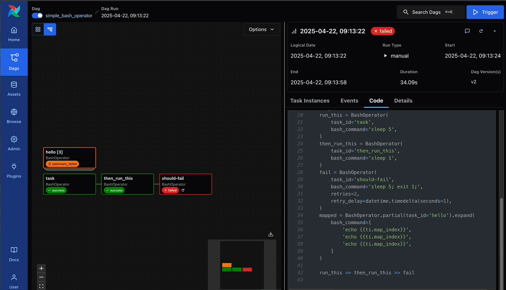
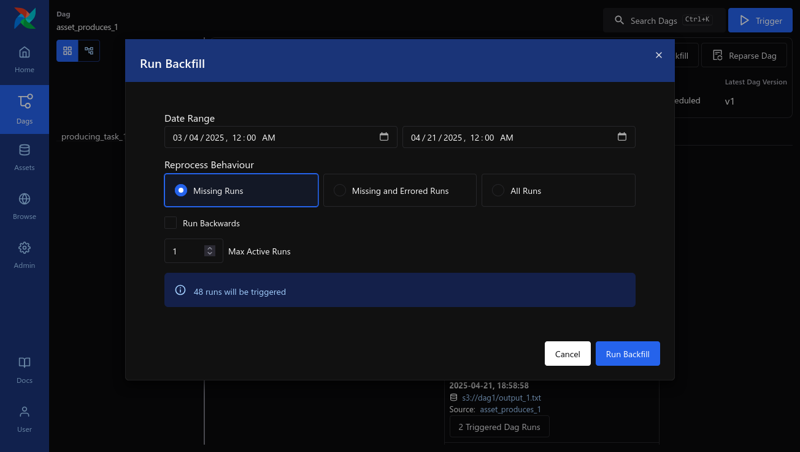
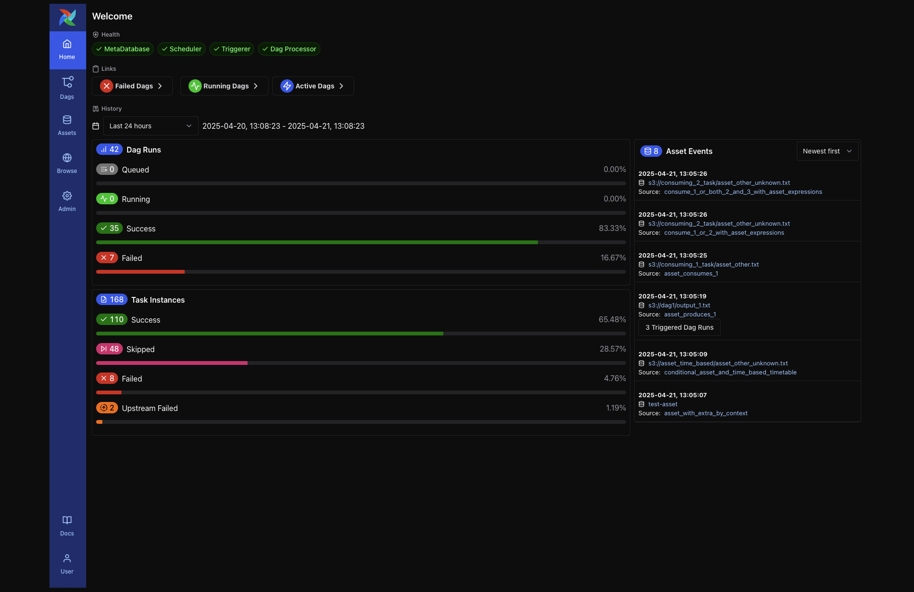

We announced our intent to focus on Apache Airflow 3.0® as the next big milestone for the Airflow project at the Airflow Summit in September 2024. We are delighted to announce that Airflow 3.0 is now released!

## A Major Release, Four Years in the Making

Airflow 3.0 is the biggest release in Airflow’s history—2.0 was released in 2020, and the last 4 years have seen incremental updates and releases every quarter with version 2.10 released in Q4 2024. With over 30 million monthly downloads (up over 30x since 2020) and 80,000 organizations (up from 25,000 in 2020) now using Airflow, we’ve seen an incredible growth in popularity since 2.0.

Over the last four years, Airflow has grown to power business critical data workflows within organizations of all sizes. We have seen an exponential increase in the use cases for Airflow from its beginnings with ETL, ELT, and Reverse ETL, with over 30% of Airflow users using it for MLOps, and 10% using it for GenAI workflows. Airflow 3 is a response to this use case expansion and is the standard for data application development across the enterprise.

Here are some highlights:

- Airflow 3 is significantly easier to use for data practitioners and incorporates their key requests for critical changes to Airflow. Early user reactions to features such as the new React based UI, DAG Versioning, and improved Backfill support have been incredibly positive. I was ecstatic to see the reaction from data engineers when I demonstrated this at a recent Airflow meetup.

- The seamless UI transition of navigating between Asset-oriented workflows and Task-oriented workflows is beautiful. Once again, Airflow lets the developer choose how you want to develop and navigate without imposing any restrictions.

- Introduction of Event Driven Scheduling enables Airflow to seamlessly integrate with messaging providers and react to events happening and data assets being updated outside of Airflow.

- The big architecture change with the introduction of the Task Execution Interface and the Task SDKs, enable a stronger security model, including secure, scalable execution across multi-cloud, hybrid-cloud, and local data center deployments.

This is the result of 300+ developers within the Airflow community working together tirelessly for many months and I could not be more proud to be part of this wonderful team. Here are some more details of the release.

## Highly requested UX features

### DAG Versioning

DAG Versioning has been the most requested feature within Airflow based on the annual Airflow survey. As implemented in Airflow 3, a DAG will run through to completion based on the version at start, even if a new version has been uploaded while this DAG was being run. All DAG runs in the UI are now associated with the version of the DAG as run including the Task structure, the code, the logs, and more.
This is described in two AIPs: Improve DAG history ([AIP-65](https://cwiki.apache.org/confluence/display/AIRFLOW/AIP-65%3A+Improve+DAG+history+in+UI)) , and DAG Bundles and Parsing ([AIP-66](https://cwiki.apache.org/confluence/pages/viewpage.action?pageId=294816356)).

### Backfills improvements

Another long-standing user request has been better support for backfills. Often discussed in the context of machine learning, backfills also apply to traditional ETL and ELT use cases.  In Airflow 3, backfills are run within the scheduler for improved control, scalability, and diagnostics. Backfills can now be started from the UI or API, and monitored within the UI.

This was defined as part of “Scheduler-managed backfills” ([AIP-78](https://cwiki.apache.org/confluence/display/AIRFLOW/AIP-78+Scheduler-managed+backfill)), and an example screenshot is shown below:

## Run anywhere, at any time, in any Language

### Run anywhere, in any language

A foundational goal of Airflow 3 is allowing execution in any environment, in any language. A key component of this is the Task Execution Interface ([AIP-72](https://cwiki.apache.org/confluence/display/AIRFLOW/AIP-72+Task+Execution+Interface+aka+Task+SDK)), which enables the evolution of Airflow into a client-server architecture, which represents one of the most significant architectural shifts in Airflow’s history. This supports Celery, Kubernetes, and Local Executors, but also enables new capabilities. A component of this change is the API server which represents input for the Task Execution Interface. This foundational feature enables multi-cloud deployments and multi-language support in the form of the Task Execution API. The Airflow 3 release includes the Python TaskSDK which enables backward compatibility for existing DAGs. TaskSDKs for additional languages, starting with Golang will be released over the next few months.

To enable data pipelines to be run on edge devices, outside of the core data centers and clouds, the Edge Executor ([AIP-69](https://cwiki.apache.org/confluence/pages/viewpage.action?pageId=301795932)) is available as a provider package with Airflow 3. This is an incremental feature built on top of the Task Execution Interface. Initial incarnations have been released in experimental mode based on Airflow 2x and this executor has now evolved to leverage the Airflow 3 API Server.

### Event-driven scheduling and Data Assets

Airflow 3 represents a foundational jump in enabling Airflow to react to events happening outside of Airflow, including data assets being created or updated by external data systems. This was based on the evolution of Datasets into Data Assets and was broken out into several AIPs as detailed below, which are all part of the release.

The fundamental evolution of Datasets into Data Assets has been done as part of “Introducing Data Assets” ([AIP-74](https://cwiki.apache.org/confluence/display/AIRFLOW/AIP-74+Introducing+Data+Assets)). This introduces the concept of Watchers which is leveraged by other capabilities detailed below. A significant enhancement around Data Assets is the New Asset-Centric Syntax ([AIP-75](https://cwiki.apache.org/confluence/display/AIRFLOW/AIP-75+New+Asset-Centric+Syntax)) for defining Assets easily with DAGs using the Python decorator syntax, which is part of this release.

External event driven scheduling ([AIP-82](https://cwiki.apache.org/confluence/display/AIRFLOW/AIP-82+External+event+driven+scheduling+in+Airflow)) is based on the foundational Data Assets work described above, specifically Watchers. The initial scope as defined in the AIP is complete and now incorporates a “Common Message Bus” interface. This release also includes an implementation of the above for AWS SQS as an “out of the box” integration, which demonstrates DAGs being triggered upon the arrival of a message in AWS SQS.

### Inference execution and hyper-parameter tuning

Many ML and AI Engineers are already using Airflow for ML/AI Ops, especially for model training. However, there were challenges for Inference Execution. Enhancing Airflow for Inference Execution by adding support for non-data-interval-Dags (sorry, that’s a mouthful) is an important change. This work is covered as part of “Remove Execution date unique constraint from DAG run” ([AIP-83](https://cwiki.apache.org/confluence/display/AIRFLOW/AIP-83+Remove+Execution+Date+Unique+Constraint+from+DAG+Run))

## Security and usability improvements

### UI Modernization

The Airflow UI has been completely rewritten as part of Airflow 3 and incorporates a significantly improved user experience which seamlessly blends Asset-oriented workflows with Task-oriented workflows. This is a dramatic improvement which enables developers to author DAGs as they choose, without being opinionated about “a right way”.

Check out [the screenshots in the docs](http://airflow.apache.org/docs/apache-airflow/stable/ui.html) for more.

Recreating it to be based on React and the FastAPI has been a massive project and was broken out into several AIPs as detailed below.

The foundation for the new UI is the REST API and a set of internal APIs for UI Operations ([AIP-84](https://cwiki.apache.org/confluence/display/AIRFLOW/AIP-84+UI+REST+API)) both of which are now based on FastAPI. These APIs are served as part of the API Server described above as part of the Task Execution framework.

The Airflow 3.0 UI has been significantly improved and includes a streamlined user experience workflow encompassing both the Grid and Graph views. The interaction between DAGs and Assets are also more streamlined. User experience is always a work in progress and we very much appreciate your feedback. This is covered in great detail as part of the Modern Web Application proposal ([AIP-38](https://cwiki.apache.org/confluence/display/AIRFLOW/AIP-38+Modern+Web+Application)).

As part of this project, Flask AppBuilder has now been moved into a separate provider package and is no longer a part of the Core Airflow package. This enables an easier security and maintenance update process, while retaining backwards compatibility. This is documented as part of the “Remove Flask App Builder as a Core Dependency” proposal ([AIP-79](https://cwiki.apache.org/confluence/display/AIRFLOW/AIP-79%3A+Remove+Flask+AppBuilder+as+Core+dependency)).

### Security

A key benefit of the Task Execution Interface and the API server is Task Isolation. This has often been requested by Airflow enterprise deployments for a better security posture when an Airflow deployment is shared by multiple teams. Further security and authorization patterns can be developed on top of this foundation as more detailed requirements are uncovered.

Improving the CLI and reducing the maintenance burden by having the CLI use the Airflow APIs, rather than direct access is an important evolution for Airflow. We have now split the core Airflow CLI into two parts, the first for local development and backwards compatibility and the second for remote access using the API. The second will be a new provider package called “airflowctl” which can be optionally installed along with Core Airflow. This is documented in more detail as part of the “Enhanced security in CLI via Integration of API” proposal ([AIP-81](https://cwiki.apache.org/confluence/display/AIRFLOW/AIP-81+Enhanced+Security+in+CLI+via+Integration+of+API)).

## An amazing community

This release could not have happened without the inspiration and technical leadership of key contributors who led the AIPs listed above. We thank them all here: Ash Berlin-Taylor, Brent Bovenzi, Bugra Ozturk, Constance Martineau, Daniel Standish, Jed Cunningham, Jens Scheffler, Kaxil Naik, Pierre Jeambrun, Vincent Beck, and Vikram Koka. We also wanted to thank Jarek Potiuk for the critical development infrastructure and packaging work and to Elad Kalif for shepherding all the key provider changes needed. We would like to recognize Wei Lee and Ankit Chaurasia for their work on the upgrade utilities to enable users to easily upgrade to Airflow 3.

Finally, a huge shoutout to Jed Cunningham and Kaxil Naik for the critical part of release management!

Over three hundred developers around the world have contributed to making this release a reality. We thank them all for their contributions. They are listed here in alphabetical order:

- Aakcht
- Aaron Chen
- Abhishek
- Adam Turner
- Adan
- Aditya Yadav
- Adrian Lazar
- Adrian Perea
- Ajit J Gupta
- Albert Okiri
- Alex Waygood
- Alexander Millin
- AlteredOracle
- Amar Prakash Pandey
- Amir Mor
- Amogh Desai
- Amol Saini
- Anakin Skywalker Pactores
- Andor Markus
- Andre Miranda
- Andres Lowrie
- Andrew Arochukwu
- Andrew Stein
- Andrii Abramov
- Andrii Korotkov
- Andrii Yerko
- Ankit Chaurasia
- Anthony Lin
- Antony Southworth
- Aritra Basu
- Arjun Pathak
- Arnel Jan Sarmiento
- Arnout Engelen
- Artem Suslov
- Arthur Braveheart
- Artour
- Artur Skarżyński
- Arunav Gupta
- Aryan Khurana
- Ash Berlin-Taylor
- AshKatzEm
- AutomationDev85
- Avihais12344
- Azhar Izzannada E
- Baitur Ulukbekov
- Balthazar Rouberol
- Bartosz Jankiewicz
- Bas
- Ben Chen
- Benoit Perigaud
- Biswamitra Biswas
- Bjorn Olsen
- Bluefox9x5
- Bohdan Udovenko
- Bonnie Why
- Boris Morel
- Bowrna
- Brent Bovenzi
- Bugra Ozturk
- Błażej Tecław
- Castle Cheng
- Chris Luedtke
- Christian Yarros
- Christos Bisias
- Collin McNulty
- Computer Network Investigation
- Constance Martineau
- D. Ferruzzi
- DShi
- Daniel Gellert
- Daniel Imberman
- Daniel Standish
- Daniel van der Ende
- Danish Amjad
- Danny Liu
- David Blain
- Derek
- Detlev V.
- Dewen Kong
- Dheeraj Turaga
- Diogo Rodrigues
- Dmitry Astankov
- Dmitry Pustoshilov
- Dominic Leung
- Dong-yeong0
- Doug Guthrie
- Dylan Melotik
- Elad Kalif
- Eldar Kasmamytov
- Ephraim Anierobi
- Eric
- Everton Seiei Arakaki
- Farhan
- Fedor Kobak
- Felix Uellendall
- Fred Thomsen
- Fully.is(풀리)
- GPK
- Gagan Bhullar
- Geonwoo Kim
- GlenboLake
- Gopal Dirisala
- Gregory Borodin
- Guan-Ming (Wesley) Chiu
- Guangyang Li
- Guillaume Lostis
- Hari Selvarajan
- HassanAlahmed
- Hojin Jun
- Howard Yoo
- Huanjie Guo
- Hung
- Hussein Awala
- Hyunsoo Kang
- Ian Buss
- Idris Adebisi
- Igor Kholopov
- IlaiGigi
- Indrale Dnyaneshwar
- JISHAN GARGACHARYA
- Jaejun
- Jake Ferriero
- Jake Roach
- Jakub Dardzinski
- James Chaldecott
- James Regan
- Jarek Potiuk
- Jasmin Patel
- Jason
- Jed Cunningham
- Jeff Harrison
- Jens Scheffler
- Jianzhun Du
- Jimmy McBroom
- Joao Amaral
- João Pedro M Miguel
- Joel Labes
- Joey Cumines
- Joffrey Bienvenu
- John Bampton
- John C. Merfeld
- Johnny1cyber
- José Joaquín Virtudes Castro
- Joseph Ang
- JoshuaXOng
- Josix
- Julian Maicher
- Kacper Kulczak
- Kacper Muda
- Kalyan R
- Kamil Breguła
- Karen Braganza
- Karthik Dulam
- Karthik Ravi
- Karthikeyan Singaravelan
- Kaxil Naik
- Kevin Allen
- Kim
- Kris
- Kunal Bhattacharya
- LIU ZHE YOU
- Lennox Stevenson
- Linh
- Lorin Dawson
- Lou ✨
- Lucy Hu
- Lukas Mikelionis
- Luyang Liu
- Lyndon Fan
- M. Olcay Tercanlı
- Maciej Obuchowski
- Madison Swain-Bowden
- Maksim
- Marcelo Trylesinski
- Marcos Marx
- Maria
- Mark Andreev
- Mark H
- Matt Burke
- Matt Dupree
- Maxim Martynov
- Mayuresh Kedari
- Mehul Goyal
- Mike
- Mike Beckhusen
- Mikhail Dengin
- MishchenkoYuriy
- Muhammad Hanif Mohamad Musa
- Myles Hollowed
- Narendra-Neerukonda
- Natsu
- Nikita
- Niko Oliveira
- Nishant Gupta
- Nitesh Kumar Dubey Samsung
- Nitochkin
- Oleg Ovcharuk
- Oleksandr Slynko
- Omkar P
- Owen Leung
- Pandycool
- Pankaj Koti
- Park Jiwon
- Pavan Sharma
- Peng-Jui Wang
- Peter Debelak
- Phani Kumar
- Pierre Jeambrun
- Po-Yu Hsieh
- Prajwal7842
- Pratiksha
- Purna Chander
- Rafa
- Rahul Madan
- Rahul Vats
- Ramit Kataria
- Rishabh Srivastava
- Rushabh Garambha
- Ryan Eakman
- Ryan Hatter
- Rytis Ulys
- SAI GANESH S
- Sam Lendle
- SamLiaoP
- Saumil Patel
- SaurabhhB
- Sean Gabriel Bayron
- Sean Rose
- Sebastian Daum
- SeonghwanLee
- Shahar Epstein
- Shahbaz Aamir
- Shoaib UR Rehman
- Shubham Raj
- Simon Sawicki
- Siva Kumar Edupuganti
- Sneha Prabhu
- Sooter Saalu
- Srabasti Banerjee
- Stefan Keidel
- Steven Loria
- Steven Shidi Zhou
- Stijn De Haes
- Success Moses
- TakawaAkirayo
- Tamara Janina Fingerlin
- Tamas Palinkas
- Tatiana Al-Chueyr
- Topher Anderson
- Tzu-ping Chung
- Usiel Riedl
- Utkarsh Sharma
- Valentyn
- Venkat VJ
- Vikram Koka
- Vikram Medabalimi
- Vikramaditya Gaonkar
- Vincent
- Vincent Kling
- VladaZakharova
- Waldemar Hummer
- Wang Ran (汪然)
- Wei Lee
- Wojciech Szlachta
- Wonseok Yang
- Yeonguk
- Yohei Kishimoto
- Youngha, Park
- Yuan Li
- Zach Liu
- Zhen-Lun (Kevin) Hong
- althati
- ambikagarg
- atrbgithub
- awdavidson
- codecae
- dan-js
- darkag
- davidfgcorreia
- dominikhei
- ellisms
- enisnazif
- fritz-astronomer
- gaurav7261
- geraj1010
- got686-yandex
- harjeevan maan
- harry.shi
- hikaruhk
- hprassad
- ipsatrivedi
- jaejun
- jj.lee
- jonhspyro
- kanagaraj
- kandharvishnu
- leoguzman
- lucasmo
- luoyuliuyin
- mahdi alizadeh
- majorosdonat
- max
- mayankymailusfedu
- michaeljs-c
- morooshka
- ninad-opsverse
- olegkachur-e
- paolomoriello
- perry2of5
- pgvishnuram
- phi-friday
- rahulgoyal2987
- raphaelauv
- rgriffier
- rom sharon
- saucoide
- sbock-slack
- sc-anssi
- seyoon-lim
- simonprydden
- skandala23
- sonu4578
- suyesh-amatya
- svellaiyan
- tnk-ysk
- uzhastik
- vatsrahul1001
- vfeldsher
- xavipuerto
- xitep
- yangyulely
- yunchi
- 鐘翊修
- 김영준

## What’s Next

We’d love your feedback. Try out the release, open issues, file PRs, or just join the conversation on the Airflow dev list, Slack, and GitHub.
Let’s build the future of data orchestration—together.
