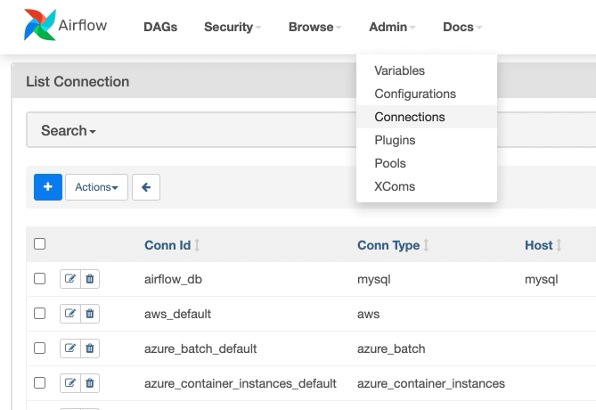

I am proud to announce that Apache Airflow 2.0.0 has been released.

The full changelog is about 3,000 lines long (already excluding everything backported to 1.10), so for now I'll simply share some of the major features in 2.0.0 compared to 1.10.14:

## A new way of writing dags: the TaskFlow API (AIP-31)

(Known in 2.0.0alphas as Functional DAGs.)

DAGs are now much much nicer to author especially when using PythonOperator. Dependencies are handled more clearly and XCom is nicer to use

Read more here:

[TaskFlow API Tutorial](http://airflow.apache.org/docs/apache-airflow/stable/tutorial_taskflow_api.html) \
[TaskFlow API Documentation](https://airflow.apache.org/docs/apache-airflow/stable/concepts.html#decorated-flows)

A quick teaser of what DAGs can now look like:

```python
from airflow.decorators import dag, task
from airflow.utils.dates import days_ago

@dag(default_args={'owner': 'airflow'}, schedule_interval=None, start_date=days_ago(2))
def tutorial_taskflow_api_etl():
   @task
   def extract():
       return {"1001": 301.27, "1002": 433.21, "1003": 502.22}

   @task
   def transform(order_data_dict: dict) -> dict:
       total_order_value = 0

       for value in order_data_dict.values():
           total_order_value += value

       return {"total_order_value": total_order_value}

   @task()
   def load(total_order_value: float):

       print("Total order value is: %.2f" % total_order_value)

   order_data = extract()
   order_summary = transform(order_data)
   load(order_summary["total_order_value"])

tutorial_etl_dag = tutorial_taskflow_api_etl()
```

## Fully specified REST API (AIP-32)

We now have a fully supported, no-longer-experimental API with a comprehensive OpenAPI specification

Read more here:

[REST API Documentation](http://airflow.apache.org/docs/apache-airflow/stable/stable-rest-api-ref.html).

## Massive Scheduler performance improvements

As part of AIP-15 (Scheduler HA+performance) and other work Kamil did, we significantly improved the performance of the Airflow Scheduler. It now starts tasks much, MUCH quicker.

Over at Astronomer.io we've [benchmarked the scheduler—it's fast](https://www.astronomer.io/blog/airflow-2-scheduler) (we had to triple check the numbers as we don't quite believe them at first!)

## Scheduler is now HA compatible (AIP-15)

It's now possible and supported to run more than a single scheduler instance. This is super useful for both resiliency (in case a scheduler goes down) and scheduling performance.

To fully use this feature you need Postgres 9.6+ or MySQL 8+ (MySQL 5, and MariaDB won't work with more than one scheduler I'm afraid).

There's no config or other set up required to run more than one scheduler—just start up a scheduler somewhere else (ensuring it has access to the DAG files) and it will cooperate with your existing schedulers through the database.

For more information, read the [Scheduler HA documentation](http://airflow.apache.org/docs/apache-airflow/stable/scheduler.html#running-more-than-one-scheduler).

## Task Groups (AIP-34)

SubDAGs were commonly used for grouping tasks in the UI, but they had many drawbacks in their execution behaviour (primarily that they only executed a single task in parallel!) To improve this experience, we’ve introduced "Task Groups": a method for organizing tasks which provides the same grouping behaviour as a subdag without any of the execution-time drawbacks.

SubDAGs will still work for now, but we think that any previous use of SubDAGs can now be replaced with task groups. If you find an example where this isn't the case, please let us know by opening an issue on GitHub

For more information, check out the [Task Group documentation](http://airflow.apache.org/docs/apache-airflow/stable/concepts.html#taskgroup).

## Refreshed UI

We've given the Airflow UI [a visual refresh](https://github.com/apache/airflow/pull/11195) and updated some of the styling.



We have also added an option to auto-refresh task states in Graph View so you no longer need to continuously press the refresh button :).

Check out [the screenshots in the docs](http://airflow.apache.org/docs/apache-airflow/stable/ui.html) for more.

## Smart Sensors for reduced load from sensors (AIP-17)

If you make heavy use of sensors in your Airflow cluster, you might find that sensor execution takes up a significant proportion of your cluster even with "reschedule" mode. To improve this, we've added a new mode called "Smart Sensors".

This feature is in "early-access": it's been well-tested by Airbnb and is "stable"/usable, but we reserve the right to make backwards incompatible changes to it in a future release (if we have to. We'll try very hard not to!)

Read more about it in the [Smart Sensors documentation](https://airflow.apache.org/docs/apache-airflow/stable/smart-sensor.html).

## Simplified KubernetesExecutor

For Airflow 2.0, we have re-architected the KubernetesExecutor in a fashion that is simultaneously faster, easier to understand, and more flexible for Airflow users. Users will now be able to access the full Kubernetes API to create a .yaml `pod_template_file` instead of specifying parameters in their airflow.cfg.

We have also replaced the `executor_config` dictionary with the `pod_override` parameter, which takes a Kubernetes V1Pod object for a1:1 setting override. These changes have removed over three thousand lines of code from the KubernetesExecutor, which makes it run faster and creates fewer potential errors.

Read more here:

[Docs on pod_template_file](https://airflow.apache.org/docs/apache-airflow/stable/executor/kubernetes.html?highlight=pod_override#pod-template-file) \
[Docs on pod_override](https://airflow.apache.org/docs/apache-airflow/stable/executor/kubernetes.html?highlight=pod_override#pod-override)

## Airflow core and providers: Splitting Airflow into 60+ packages:

Airflow 2.0 is not a monolithic "one to rule them all" package. We’ve split Airflow into core and 61 (for now) provider packages. Each provider package is for either a particular external service (Google, Amazon, Microsoft, Snowflake), a database (Postgres, MySQL), or a protocol (HTTP/FTP). Now you can create a custom Airflow installation from "building" blocks and choose only what you need, plus add whatever other requirements you might have. Some of the common providers are installed automatically (ftp, http, imap, sqlite) as they are commonly used. Other providers are automatically installed when you choose appropriate extras when installing Airflow.

The provider architecture should make it much easier to get a fully customized, yet consistent runtime with the right set of Python dependencies.

But that’s not all: you can write your own custom providers and add things like custom connection types, customizations of the Connection Forms, and extra links to your operators in a manageable way. You can build your own provider and install it as a Python package and have your customizations visible right in the Airflow UI.

Our very own Jarek Potiuk has written about [providers in much more detail](https://higrys.medium.com/airflow-2-0-providers-1bd21ba3bd93) on Jarek's blog.

Docs on the [providers concept and writing custom providers](http://airflow.apache.org/docs/apache-airflow-providers/) \
Docs on the [all providers packages available](http://airflow.apache.org/docs/apache-airflow-providers/packages-ref.html)

## Security

As part of Airflow 2.0 effort, there has been a conscious focus on Security and reducing areas of exposure. This is represented across different functional areas in different forms. For example, in the new REST API, all operations now require authorization. Similarly, in the configuration settings, the Fernet key is now required to be specified.

## Configuration

Configuration in the form of the airflow.cfg file has been rationalized further in distinct sections, specifically around "core". Additionally, a significant amount of configuration options have been deprecated or moved to individual component-specific configuration files, such as the pod-template-file for Kubernetes execution-related configuration.

## Thanks to all of you

We've tried to make as few breaking changes as possible and to provide deprecation path in the code, especially in the case of anything called in the DAG. That said, please read through UPDATING.md to check what might affect you. For example: We have re-organized the layout of operators (they now all live under airflow.providers.*) but the old names should continue to work - you'll just notice a lot of DeprecationWarnings that need to be fixed up.

Thank you so much to all the contributors who got us to this point, in no particular order: Kaxil Naik, Daniel Imberman, Jarek Potiuk, Tomek Urbaszek, Kamil Breguła, Gerard Casas Saez, Xiaodong DENG, Kevin Yang, James Timmins, Yingbo Wang, Qian Yu, Ryan Hamilton and the 100s of others who keep making Airflow better for everyone.
