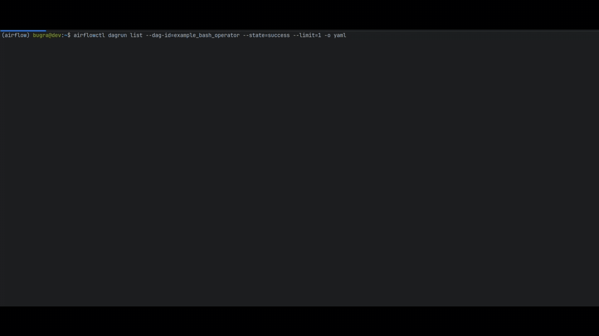
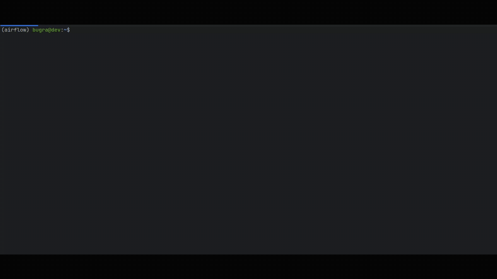

We are thrilled to announce the first major release of **`airflowctl` 1.0.0**, the new **secure, API-driven command-line interface (CLI)** for Apache Airflow — built under [**AIP-81**](https://cwiki.apache.org/confluence/display/AIRFLOW/AIP-81+Enhanced+Security+in+CLI+via+Integration+of+API).

This release marks the beginning of Airflow’s next evolution: replacing the legacy direct-database CLI with a **modern, authenticated, and auditable interface** that communicates exclusively through the Airflow REST API.

**Details**:

📦 **PyPI:** [https://pypi.org/project/apache-airflow-ctl/1.0.0/](https://pypi.org/project/apache-airflow-ctl/1.0.0/)  \
📚 **airflowctl Docs:** [https://airflow.apache.org/docs/apache-airflow-ctl/stable/](https://airflow.apache.org/docs/apache-airflow-ctl/stable/)  \
🛠️ **Release Notes:** [https://airflow.apache.org/docs/apache-airflow-ctl/stable/release_notes.html](https://airflow.apache.org/docs/apache-airflow-ctl/stable/release_notes.html)  \
🪶 **Source Code:** [https://github.com/apache/airflow/tree/main/airflow-ctl](https://github.com/apache/airflow/tree/main/airflow-ctl)


## 🔒 Why airflowctl?

Until now, Airflow’s classic CLI connected directly to the **metadata database**, bypassing RBAC, authentication, and API logs.
While convenient, this approach limited **security, auditing, and remote management** capabilities — especially for enterprise environments.

**`airflowctl`** changes that by routing every command through the **Airflow REST API**, bringing:

* **Authentication & RBAC enforcement**
* **Centralized logging & audit trail**
* **Secure credential storage via Keyring**
* **Remote command execution with zero DB access**
* **Consistency with Airflow UI and API behaviors**


## 🚀 AIP-81: CLI Reimagined Through the API

**AIP-81** (“Enhanced Security in CLI via Integration of API”) defined a clear goal:
> “The CLI must be a first-class, secure client of the Airflow REST API — not a privileged database actor.”

`airflowctl` is the direct realization of that vision.

### Core design principles:
- **All remote commands use the REST API**
- **RBAC and auth handled consistently via API layer**
- **Pluggable auth mechanisms** (basic auth, OAuth, token, etc.)
- **Secure credential persistence** through **system keyring**
- **Extensible** to new API endpoints as Airflow evolves


## ⚙️ Getting Started

```bash
pip install apache-airflow-ctl
```

Once installed, you can connect your CLI to an Airflow instance:

```bash
airflowctl auth login --url http://localhost:8080 --username admin --password admin
```

## 🧩 Command Highlights

Here’s a quick look at some of the most popular commands, now fully API-backed in airflowctl 1.0.0:

### 🧩 Assets


### ⚙️ Config


### 🔑 Connections


### 🎯 DAG Runs

Trigger and inspect DAG runs securely through the API:




### 🪣 Variables




All these commands — and many more — operate via Airflow’s public REST API, ensuring secure, logged, and RBAC-controlled execution.

## 🔐 Key Security Features

### 🔑 Keyring Integration

No more plaintext tokens or passwords.
airflowctl uses your OS-level keyring (e.g., macOS Keychain, Windows Credential Manager, or Linux Secret Service) to store and retrieve authentication tokens securely.

### 🧱 Role-Based Access Control

Every command is evaluated by Airflow’s RBAC system through the API — ensuring consistent authorization with the web UI and API clients.

### 🕵️‍♀️ Auditing and Traceability

All CLI commands generate API logs and can be observed through standard audit mechanisms — closing a long-standing gap between the CLI and Airflow’s security model.

## 📈 Roadmap Highlights

airflowctl 1.0.0 is just the beginning. The foundation is in place for a fully unified, secure CLI experience.

### 🧩 Coming Soon

* Completeness of API coverage
* Live log streaming
* Worker management
* Remote debugging
* Incremental deprecation of legacy CLI commands
* Over time, the legacy airflow CLI will be incrementally deprecated as commands achieve API parity.

## 🧭 Migration

Migration requires mapping commands, updating authentication, and re-testing automation to ensure compatibility with the new API-backed architecture.
Because airflowctl mirrors the core CLI syntax, most workflows require minimal changes — primarily adjusting authentication and configuration.

Side by side comparison:

| Before                                                   | After                                                      |
|----------------------------------------------------------|------------------------------------------------------------|
|          |                    |
|  |  |


## 🙏 Community & Acknowledgments

This release is the result of extensive collaboration across the Apache Airflow community.
Special thanks to all contributors who worked on AIP-81, the Airflow REST API, and the airflowctl implementation.
[comment]: <> (TODO: Add list of contributors here after exporting them from git history)

The secure CLI foundation lays the groundwork for Airflow’s next generation. A unified, API-first platform for orchestration and operations.

✨ In Summary

airflowctl 1.0.0 makes Airflow’s command line:

| Before                | After                        |
|-----------------------|------------------------------|
| Direct DB access      | API-backed security          |
| No RBAC or audit      | Centralized auth \& logging  |
| Inconsistent behavior | Unified CLI + API experience |
| Manual secrets        | Keyring-secured credentials  |

### 🔐 Security first. API always. CLI reimagined.

