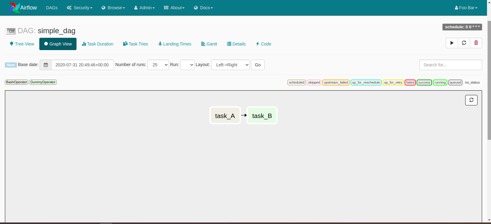
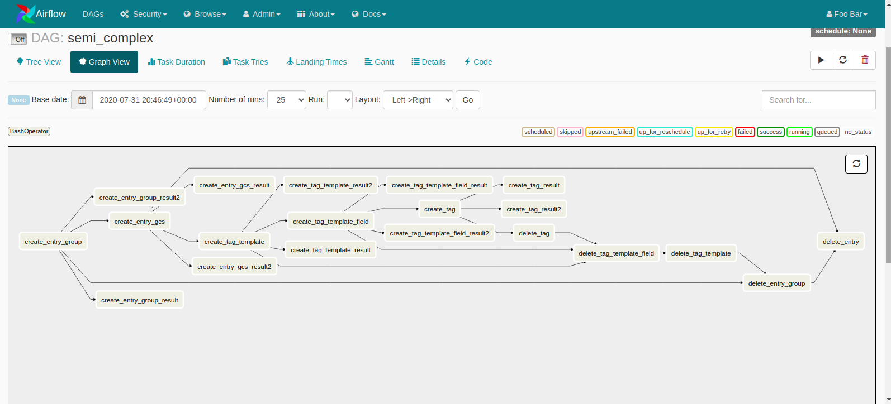
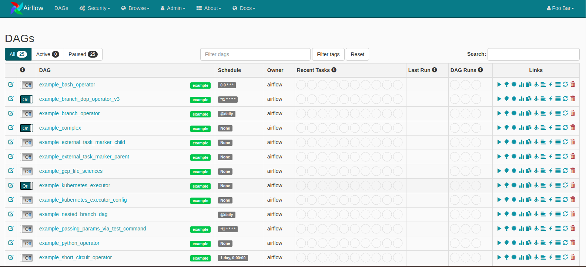

Apache Airflow is a platform to programmatically author, schedule, and monitor workflows.
A workflow is a sequence of tasks that processes a set of data. You can think of workflow as the
path that describes how tasks go from being undone to done. Scheduling, on the other hand, is the
process of planning, controlling, and optimizing when a particular task should be done.

### Authoring Workflow in Apache Airflow.
Airflow makes it easy to author workflows using python scripts. A [Directed Acyclic Graph](https://en.wikipedia.org/wiki/Directed_acyclic_graph)
(DAG) represents a workflow in Airflow. It is a collection of tasks in a way that shows each task's
relationships and dependencies. You can have as many DAGs as you want, and Airflow will execute
them according to the task's relationships and dependencies. If task B depends on the successful
execution of another task A, it means Airflow will run task A and only run task B after task A.
This dependency is very easy to express in Airflow. For example, the above scenario is expressed as
```python
task_A >> task_B
```
Also equivalent to
```python
task_A.set_downstream(task_B)
```


That helps Airflow to know that it needs to execute task A before task B. Tasks can have far more complex
relationships to each other than expressed above and Airflow figures out how and when to execute the tasks following
their relationships and dependencies.


Before we discuss the architecture of Airflow that makes scheduling, executing, and monitoring of
workflow an easy thing, let us discuss the [Breeze environment](https://github.com/apache/airflow/blob/master/BREEZE.rst).

### Breeze Environment
The breeze environment is the development environment for Airflow where you can run tests, build images,
build documentations and so many other things. There are excellent
[documentation and video](https://github.com/apache/airflow/blob/master/BREEZE.rst) on Breeze environment.
Please check them out. You enter the Breeze environment by running the ``./breeze`` script. You can run all
the commands mentioned here in the Breeze environment.

### Scheduler
The scheduler is the component that monitors DAGs and triggers those tasks whose dependencies have
been met. It watches over the DAG folder, checking the tasks in each DAG and triggers them once they
are ready. It accomplishes this by spawning a process that runs periodically(every minute or so)
reading the metadata database to check the status of each task and decides what needs to be done.
The metadata database is where the status of all tasks are recorded. The status can be one of running,
 success, failed, etc.

A task is said to be ready when its dependencies have been met. The dependencies include all the data
necessary for the task to be executed. It should be noted that the scheduler won't trigger your tasks until
the period it covers has ended. If a task's ``schedule_interval`` is ``@daily``, the scheduler triggers the task
at the end of the day and not at the beginning. This is to ensure that the necessary data needed for the tasks
are ready. It is also possible to trigger tasks manually on the UI.

In the [Breeze environment](https://github.com/apache/airflow/blob/master/BREEZE.rst), the scheduler is started by running the command ``airflow scheduler``. It uses
the configured production environment. The configuration can be specified in ``airflow.cfg``

### Executor
Executors are responsible for running tasks. They work with the scheduler to get information about
what resources are needed to run a task as the task is queued.

By default, Airflow uses the [SequentialExecutor](https://airflow.apache.org/docs/stable/executor/sequential.html#sequential-executor).
 However, this executor is limited and it is the only executor that can be used with SQLite.

There are many other [executors](https://airflow.apache.org/docs/stable/executor/index.html),
 the difference is on the resources they have and how they choose to use the resources. The available executors
 are:

  - Sequential Executor
  - Debug Executor
  - Local Executor
  - Dask Executor
  - Celery Executor
  - Kubernetes Executor
  - Scaling Out with Mesos (community contributed)

CeleryExecutor is a better executor compared to the SequentialExecutor. The CeleryExecutor uses several
workers to execute a job in a distributed way. If a worker node is ever down, the CeleryExecutor assign its
task to another worker node. This ensures high availability.

The CeleryExecutor works closely with the scheduler which adds a message to the queue and the Celery broker
which delivers the message to a Celery worker to execute.
You can find more information about the CeleryExecutor and how to configure it at the
[documentation](https://airflow.apache.org/docs/stable/executor/celery.html#celery-executor)


### Webserver
The webserver is the web interface (UI) for Airflow. The UI is feature-rich. It makes it easy to
monitor and troubleshoot DAGs and Tasks.



There are many actions you can perform on the UI. You can trigger a task, monitor the execution
including the duration of the task. The UI makes it possible to view the task's dependencies in a
tree view and graph view. You can view task logs in the UI.

The web UI is started with the command `airflow webserver` in the breeze environment.

### Backend
By default, Airflow uses the SQLite backend for storing the configuration information, DAG states,
and much other useful information. This should not be used in production as SQLite can cause a data
loss.

You can use PostgreSQL or MySQL as a backend for airflow. It is easy to change to PostgreSQL or MySQL.

The command `./breeze --backend mysql` selects MySQL as the backend when starting the breeze environment.

### Operators
Operators determine what gets done by a task. Airflow has a lot of builtin Operators. Each operator
does a specific task. There's a BashOperator that executes a bash command, the PythonOperator which
calls a python function, AwsBatchOperator which executes a job on AWS Batch and [many more](https://airflow.apache.org/docs/stable/concepts.html#operators).

#### Sensors
Sensors can be described as special operators that are used to monitor a long-running task.
Just like Operators, there are many predefined sensors in Airflow. These includes

  - AthenaSensor: Asks for the state of the Query until it reaches a failure state or success state.
  - AzureCosmosDocumentSensor: Checks for the existence of a document which matches the given query in CosmosDB
  - GoogleCloudStorageObjectSensor:  Checks for the existence of a file in Google Cloud Storage

A list of most of the available sensors can be found in this [module](https://airflow.apache.org/docs/stable/_api/airflow/contrib/sensors/index.html?highlight=sensors#module-airflow.contrib.sensors)

### Contributing to Airflow
Airflow is an open source project, everyone is welcome to contribute. It is easy to get started thanks
to the excellent [documentation on how to get started](https://github.com/apache/airflow/blob/master/CONTRIBUTING.rst).

I joined the community about 12 weeks ago through the [Outreachy Program](https://www.outreachy.org/) and have
completed about [40 PRs](https://github.com/apache/airflow/pulls/ephraimbuddy).

It has been an amazing experience! Thanks to my mentors [Jarek](https://github.com/potiuk) and
[Kaxil](https://github.com/kaxil), and the community members especially [Kamil](https://github.com/mik-laj)
and [Tomek](https://github.com/turbaszek) for all their support. I'm grateful!

Thank you so much, [Leah E. Cole](https://github.com/leahecole), for your wonderful reviews.
