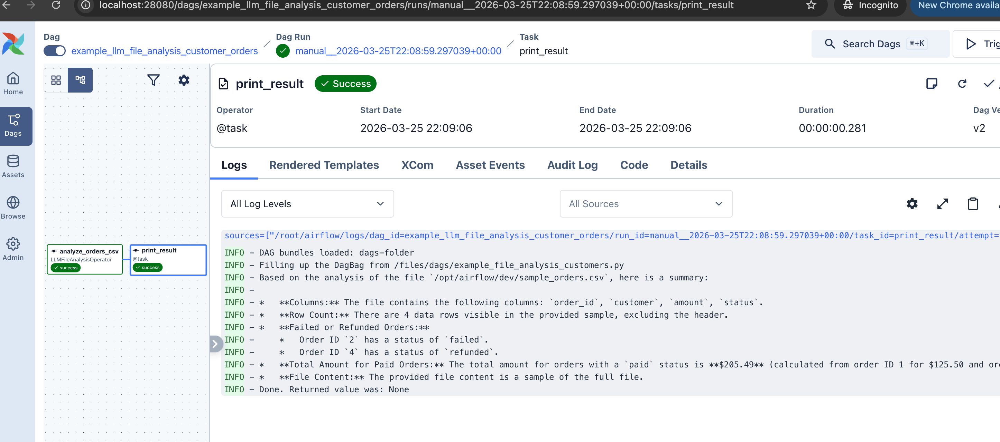
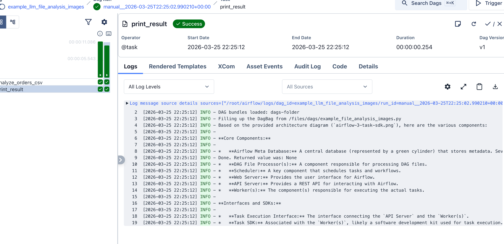
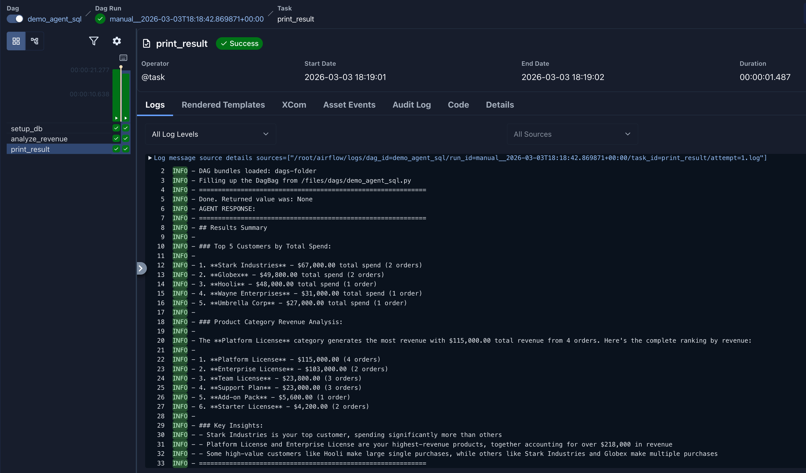
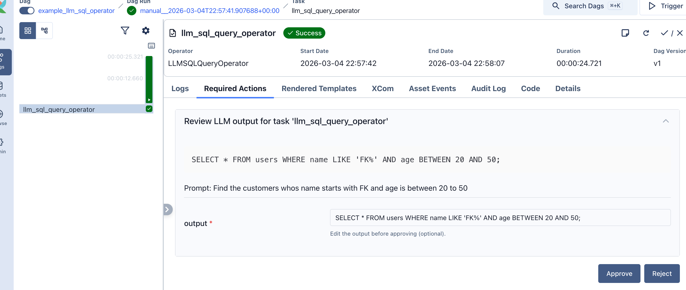
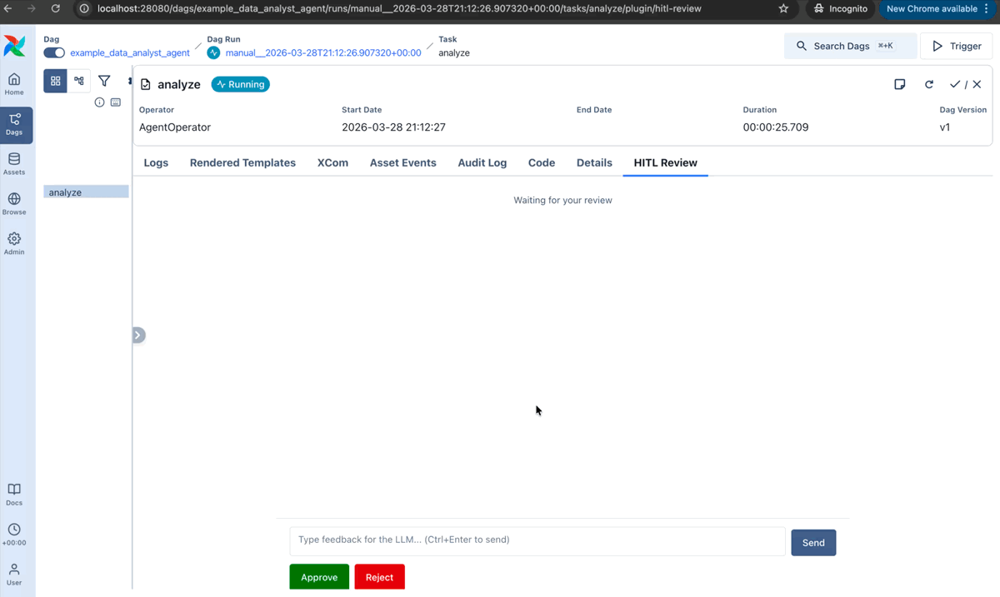
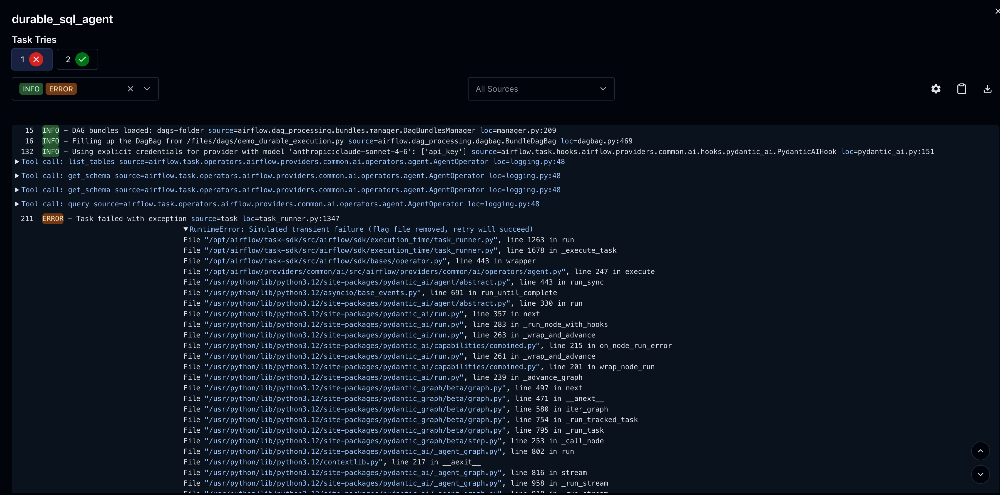
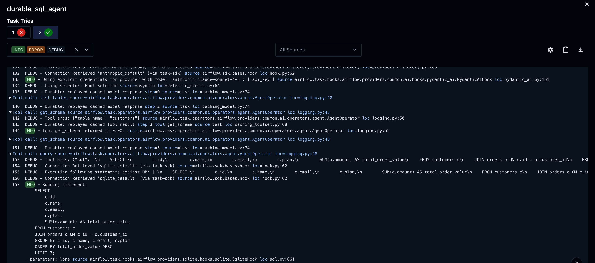
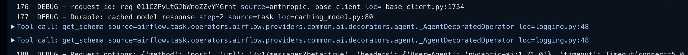
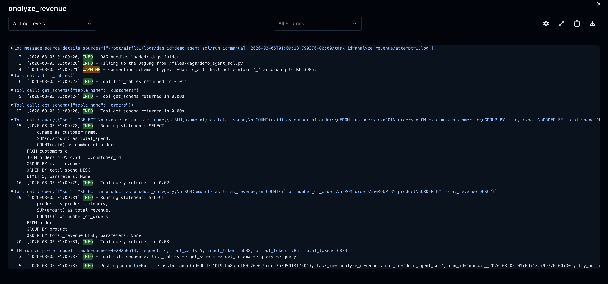

At [Airflow Summit 2025](https://airflowsummit.org/sessions/2025/airflow-as-an-ai-agents-toolkit-unlocking-1000-integrations-with-mcp/), we previewed what native AI integration in Apache Airflow could look like. Today we're shipping it.

**[`apache-airflow-providers-common-ai`](https://pypi.org/project/apache-airflow-providers-common-ai/) 0.1.0** adds LLM and agent capabilities directly to Airflow. Not a wrapper around another framework, but a provider package that plugs into the orchestrator you already run. It's built on [Pydantic AI](https://ai.pydantic.dev/) and supports 20+ model providers (OpenAI, Anthropic, Google, Azure, Bedrock, Ollama, and more) through a single install.

```bash
pip install 'apache-airflow-providers-common-ai'
```

Requires Apache Airflow 3.0+.

> **Note:** This is a 0.x release. We're actively looking for feedback and iterating fast, so breaking changes are possible between minor versions. Try it, tell us what works and what doesn't. Your input directly shapes the API.

## By the Numbers

| | |
|---|---|
| **6** | Operators |
| **6** | TaskFlow decorators |
| **5** | Toolsets |
| **4** | Connection types |
| **20+** | Supported model providers via Pydantic AI |


## The Decorator Suite

Every operator has a matching TaskFlow decorator.

### `@task.llm`: Single LLM Call

Send a prompt, get text or structured output back.

```python
from pydantic import BaseModel
from airflow.providers.common.compat.sdk import dag, task


@dag
def my_pipeline():
    class Entities(BaseModel):
        names: list[str]
        locations: list[str]

    @task.llm(
        llm_conn_id="my_openai_conn",
        system_prompt="Extract named entities.",
        output_type=Entities,
    )
    def extract(text: str):
        return f"Extract entities from: {text}"

    extract("Alice visited Paris and met Bob in London.")


my_pipeline()
```

The LLM returns a typed `Entities` object, not a string you have to parse. Downstream tasks get structured data through `XCom`.

### `@task.agent`: Multi-Step Agent with Tools

When the LLM needs to query databases, call APIs, or read files across multiple steps, use `@task.agent`. The agent picks which tools to call and loops until it has an answer.

```python
from airflow.providers.common.ai.toolsets.sql import SQLToolset
from airflow.providers.common.compat.sdk import dag, task


@dag
def sql_analyst():
    @task.agent(
        llm_conn_id="my_openai_conn",
        system_prompt="You are a SQL analyst. Use tools to answer questions with data.",
        toolsets=[
            SQLToolset(
                db_conn_id="postgres_default",
                allowed_tables=["customers", "orders"],
                max_rows=20,
            )
        ],
    )
    def analyze(question: str):
        return f"Answer this question about our data: {question}"

    analyze("What are the top 5 customers by order count?")


sql_analyst()
```

Under the hood, the agent calls `list_tables`, `get_schema`, and `query` on its own until it has the answer.

### `@task.llm_branch`: LLM-Powered Branching

The LLM decides which downstream task(s) to run. No string parsing. The LLM returns a constrained enum built from the task's downstream IDs.

```python
@task.llm_branch(
    llm_conn_id="my_openai_conn",
    system_prompt="Classify the support ticket priority.",
)
def route_ticket(ticket_text: str):
    return f"Classify this ticket: {ticket_text}"
```

### `@task.llm_sql`: Text-to-SQL with Safety Rails

Generates SQL from natural language. The operator introspects your database schema and validates the output via AST parsing ([sqlglot](https://github.com/tobymao/sqlglot)) before execution.

```python
from airflow.providers.common.compat.sdk import dag, task


@dag
def sql_generator():
    @task.llm_sql(
        llm_conn_id="my_openai_conn",
        db_conn_id="postgres_default",
        table_names=["orders", "customers"],
        dialect="postgres",
    )
    def build_query(ds=None):
        return f"Find customers who placed no orders after {ds}"

    build_query()


sql_generator()
```

### `@task.llm_file_analysis`: Analyze Files with LLMs

Point it at files in object storage (S3, GCS, local) and let the LLM analyze them. Supports CSV, Parquet, Avro, JSON, and images (multimodal).



It also handles multimodal input. Set `multi_modal=True` and the operator sends images and PDFs as binary attachments to the LLM:



### `@task.llm_schema_compare`: Cross-Database Schema Drift

Compares schemas across databases and returns structured `SchemaMismatch` results with severity levels. Handles the type mapping headaches across systems (`varchar(n)` vs `string`, `timestamp` vs `timestamptz`).


## 350+ Hooks as AI Tools

Airflow already has 350+ provider hooks with typed methods, docstrings, and managed credentials. `S3Hook`, `GCSHook`, `SlackHook`, `SnowflakeHook`, `DbApiHook`. They all authenticate through Airflow's secret backend, and they all already work.

Rather than setting up separate MCP servers with their own auth for each integration, `HookToolset` lets agents call hook methods directly using the connections you've already configured.

`HookToolset` turns any of them into AI agent tools:

```python
from airflow.providers.amazon.aws.hooks.s3 import S3Hook
from airflow.providers.common.ai.toolsets.hook import HookToolset

# S3Hook methods become agent tools: the agent can list, read, and check S3 objects
HookToolset(
    S3Hook(aws_conn_id="aws_default"),
    allowed_methods=["list_keys", "read_key", "check_for_key"],
    tool_name_prefix="s3_",
)
```

The introspection engine builds JSON Schema from method signatures and enriches tool descriptions from docstrings (Sphinx and Google style). You explicitly declare which methods to expose. No auto-discovery, no unintended access. The agent sees `s3_list_keys`, `s3_read_key`, `s3_check_for_key` as typed tools with parameter descriptions pulled straight from the hook.

This works with _any_ hook. Want your agent to send Slack messages? `HookToolset(SlackHook(...), allowed_methods=["send_message"])`. Query Snowflake? Use `SQLToolset` with a Snowflake connection. Hit an internal API? `HookToolset(HttpHook(...), allowed_methods=["run"])`.

You can also compose multiple toolsets in a single agent. Give it `SQLToolset` for database access _and_ `HookToolset` for API calls, and the agent picks the right tool for each step.

Four toolsets ship with the provider:

| Toolset | What it does |
|---|---|
| **`SQLToolset`** | `list_tables`, `get_schema`, `query`, `check_query` for any `DbApiHook` database |
| **`HookToolset`** | Wraps any Airflow hook's methods as agent tools |
| **`MCPToolset`** | Connects to external [MCP](https://modelcontextprotocol.io/) servers via Airflow Connections |
| **`DataFusionToolset`** | SQL over files in object storage (S3, GCS, Azure Blob) via Apache DataFusion |

All toolsets resolve connections lazily through `BaseHook.get_connection()`. No hardcoded keys.

Here's what an agent SQL analysis looks like in the Airflow task logs. The agent explored the schema, wrote queries, and produced a structured summary:




## Not Locked Into Decorators

You don't have to use `@task.agent` or the operator classes. Pydantic AI works directly from a plain `@task`, `PythonOperator`, or any custom operator:

```python
from pydantic_ai import Agent
from airflow.providers.common.ai.hooks.pydantic_ai import PydanticAIHook
from airflow.providers.common.ai.toolsets.sql import SQLToolset
from airflow.providers.common.compat.sdk import dag, task


@dag
def raw_pydantic_ai():
    @task
    def multi_agent():
        hook = PydanticAIHook(llm_conn_id="my_openai_conn")
        model = hook.get_conn()

        agent = Agent(
            model,
            system_prompt="You are a SQL analyst.",
            toolsets=[SQLToolset(db_conn_id="postgres_default")],
        )
        result = agent.run_sync("What are the top products by revenue?")
        return result.output

    multi_agent()


raw_pydantic_ai()
```

This gives you full control: run multiple agent calls in one task, swap models at runtime, combine outputs from different agents before returning.

`@task.agent` adds guardrails on top (durable execution, HITL review, automatic tool logging). Raw Pydantic AI skips those. Both paths use the same toolsets.


## Human-in-the-Loop

Not every LLM output should go straight to production. The provider has two levels of human oversight.

**Approval gates**: the task defers after generating output and waits for a human to approve before downstream tasks run:

```python
LLMOperator(
    task_id="summarize_report",
    prompt="Summarize the quarterly financial report for stakeholders.",
    llm_conn_id="my_openai_conn",
    require_approval=True,
    approval_timeout=timedelta(hours=24),
    allow_modifications=True,  # reviewer can edit the output
)
```

**Iterative review**: a human reviews agent output, approves, rejects, or requests changes, and the agent revises in a loop:

```python
AgentOperator(
    task_id="analyst",
    prompt="Summarize the Q4 sales report.",
    llm_conn_id="my_openai_conn",
    enable_hitl_review=True,
    max_hitl_iterations=5,
    hitl_timeout=timedelta(minutes=30),
)
```

A built-in plugin adds the review UI to the Airflow web interface.






## Durable Execution

LLM agent calls are expensive. When a 10-step agent task fails on step 8, a retry shouldn't re-run all 10 steps and double your API bill. A single parameter fixes this:

```python
AgentOperator(
    task_id="analyst",
    prompt="Analyze quarterly trends across all regions.",
    llm_conn_id="my_openai_conn",
    toolsets=[SQLToolset(db_conn_id="postgres_default")],
    durable=True,
)
```

With `durable=True`, each model response and tool result is cached to `ObjectStorage` as the agent runs. On retry, cached steps replay instantly: no repeated LLM calls, no repeated tool execution. The cache is deleted after successful completion.

Say the agent ran `list_tables`, `get_schema`, `get_schema`, `query`, then hit a transient failure:



On retry, those 4 tool calls and 4 model responses replay from cache in milliseconds. The agent picks up exactly where it left off:



The summary line tells you exactly what happened:



Works with any `ObjectStorage` backend (local filesystem for dev, S3/GCS for production) and any toolset.


## Any Model, One Interface

Configure your LLM connection once. Switch providers by changing the connection, not the DAG code.

Four connection types:

| Connection Type | Provider | Model Format |
|---|---|---|
| `pydanticai` | OpenAI, Anthropic, Groq, Mistral, Ollama, vLLM, and others | `openai:gpt-5`, `anthropic:claude-sonnet-4-20250514` |
| `pydanticai-azure` | Azure OpenAI | `azure:gpt-4o` |
| `pydanticai-bedrock` | AWS Bedrock | `bedrock:us.anthropic.claude-opus-4-5` |
| `pydanticai-vertex` | Google Vertex AI | `google-vertex:gemini-2.0-flash` |

Each type has dedicated UI fields in Airflow's connection form (API keys, endpoints, region, project, service account info), all stored in Airflow's secret backend.

Under the hood, the agent runtime is [Pydantic AI](https://ai.pydantic.dev/), which handles structured output, tool calling, and conversation management with proper typing.


## Full Observability

Every LLM task logs token usage and tool calls to Airflow's metadata DB. The full conversation history is stored too, so you can audit what the agent did after the fact.

`AgentOperator` enables tool logging by default. Each tool call appears at INFO level with execution time, arguments at DEBUG level.




## What's Next

These are directions we're exploring, not commitments. What actually ships depends on what the community needs. Tell us what matters to you.

- **Google ADK backend**: `AgentOperator` with Google's Agent Development Kit as an alternative to Pydantic AI, with session management, ADK callbacks, and multi-agent workflows
- **Asset integration**: automatic schema context from Airflow Assets, lineage tracking for LLM-generated queries
- **Cost controls (AIBudget)**: token limits and cost caps per task, DAG, or team
- **Multi-agent orchestration**: patterns for composing agents across tasks
- **Model evaluation**: integration with pydantic-evals for testing LLM behavior


## Get Involved

- [Install the provider](https://pypi.org/project/apache-airflow-providers-common-ai/) and try it out
- [Browse the provider on the Airflow Registry](https://airflow.apache.org/registry/providers/common-ai/) for the full module listing
- [Read the docs](https://airflow.apache.org/docs/apache-airflow-providers-common-ai/) for operator guides, toolset reference, and connection setup
- **Give us feedback**: open an [issue](https://github.com/apache/airflow/issues), start a thread on [Airflow Slack](https://s.apache.org/airflow-slack), or post to the [dev mailing list](https://airflow.apache.org/community/). What hooks should we add built-in toolsets for? What's missing?
- The code lives in [`providers/common/ai/`](https://github.com/apache/airflow/tree/main/providers/common/ai) in the main Airflow repo
