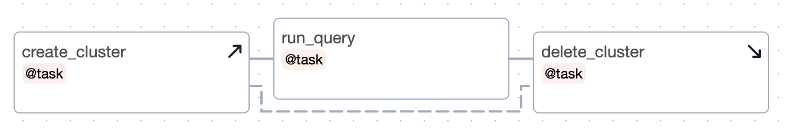
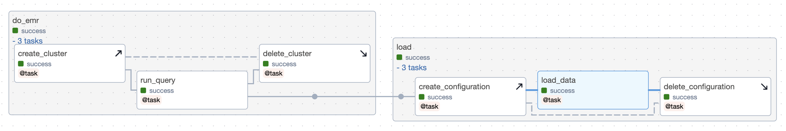

In data pipelines, commonly we need to create infrastructure resources, like a cluster or GPU nodes in an existing cluster, before doing the actual “work” and delete them after the work is done. Airflow 2.7 adds “setup” and “teardown” tasks to better support this type of pipeline. This blog post aims to highlight the key features so you know what’s possible. For full documentation on how to use setup and teardown tasks, see the [setup and teardown docs](https://airflow.apache.org/docs/apache-airflow/2.7.0/howto/setup-and-teardown.html).

## Why setup and teardown?

Before we dig into examples, let me state at high level what setup and teardown bring to the table.

### More expressive dependencies

Before setup and teardown, upstream and downstream relationships could only mean one thing: “this comes before that”. With setup and teardown, in effect we can say “this requires that”. And what it means in practice is, if you clear your task, and it requires a setup, that setup will be cleared too. And if that setup has a teardown, that will run again as well.

### Separating the work from the infra

Sometimes the part of the dag you care about is not, say, the cleanup task. For example, suppose you have a dag that loads some data and then deletes temp files. As long as the data loads, you want your dag to be marked successful. By default, this is how teardown tasks work; that is, they are ignored when determining dag run state.

## Simple case

A simple example is one setup / teardown pair, and one normal or “work” task.



Setups and teardowns are indicated by the up and down arrows, respectively. From that we can see that .`create_cluster` is a setup task and `delete_cluster` is a teardown. The link between a setup and a teardown is always dotted to highlight the special relationship.

Some things to observe:

* If `create_cluster` fails, neither `run_query` nor `delete_cluster` will run.
* If `create_cluster` succeeds and `run_query` fails, then `delete_cluster` will still run.
* If `create_cluster` is skipped, `run_query` and `delete_cluster` will be skipped
* By default, if `run_query` succeeds, and `delete_cluster` fails, then the dag run will still be marked successful. (This behavior can be overridden).

## Authoring with task groups

When we set something downstream of a task group, any teardowns in the task group are ignored. This reflects the assumption that in general, we probably don’t want to stop dag execution just because a teardown fails. So, let’s wrap the above dag in a task group and see what happens:



And here’s how we linked those groups in the code:

```python
with TaskGroup("do_emr") as do_emr:
    create_cluster_task = create_cluster()
    run_query(create_cluster_task) >> delete_cluster(create_cluster_task)

with TaskGroup("load") as load:
    create_config_task = create_configuration()
    load_data(create_config_task) >> delete_configuration(create_config_task)

do_emr >> load
```

In this code, each group has a teardown, and we just arrow the first group to the second. As advertised, `delete_cluster`, a teardown task, is ignored. This has two important consequences: one, even if it fails, the `load` group will still run; and two, `delete_cluster` and `create_configuration` can run in parallel (generally speaking, we’d imagine you don’t want to wait for teardown operations to complete before continuing onto other tasks in the dag). Of course you can override this behavior by adding an arrow between `delete_cluster` and `create_configuration`. Further, the success of this dag will depend only on whether the `load_data` task completes successfully.

## Conclusion

There’s a lot of detail we’re omitting here about exactly how to write dags with setup and teardown tasks, and for that please head over to the [setup and teardown docs](https://airflow.apache.org/docs/apache-airflow/2.7.0/howto/setup-and-teardown.html). But hopefully this post gives you enough of an idea of what is possible with setup and teardown tasks that you can begin to see where they can improve your data pipelines in Airflow.

Curious to know what else is new in Airflow 2.7? Head over to the main [Airflow 2.7 blog post]() to find out!

## Acknowledgements

Setup and Teardown was the product of AIP-52. Thanks to everyone who contributed to it, including those that read and voted on the AIP. Special thanks to Ash Berlin-Taylor, Brent Bovenzi, Daniel Standish, Ephraim Anierobi, Jed Cunningham, Rahul Vats, and Vikram Koka.
