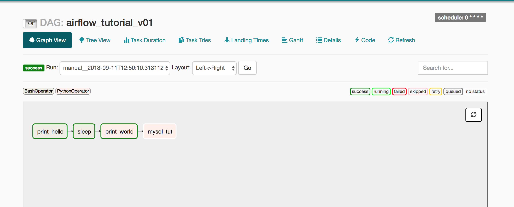

# Introduction

Most "AI" startups need flexible data and ML pipelines customised to their own needs. When building a pipeline, it’s necessary to be able to schedule tasks, ensure dependencies for the task have already completed and backfill historic data if needed. While it’s possible to run these tasks manually, this can turn into quite a hectic job and impractical to manage while your startup needs to scale up.

In the pipeline workflow, there can be various tasks that have different sets of dependencies and even need different resources to run. For instance, training your NLP model might need a GPU-powered EC2 instance whereas running the ETL pipeline requires very little computation power and has varying sets of dependencies. It would not be efficient and cost-effective to have one environment to serve the various needs of different parts of the pipeline. Teams should also be able to manage and trigger their pipelines from a single interface, whether that be an API or a UI. Last but not the least, storing and passing client specific credentials from one task to another needs to be secured, as there is a huge amount of sensitive data at stake.

While there are plenty of tools being developed to manage data science pipelines, Airflow is becoming the industry standard for authoring data and ML pipeline workflows. Airflow is a workflow management system, and we will discuss how we at [SentiSum](https://www.sentisum.com) have used and customised Airflow to make it fit our needs and save us tremendous time, effort and cost.

# Airflow

As mentioned earlier, Airflow is an open-sourced workflow management system developed by Airbnb. Airflow is one realisation of the DevOps philosophy of "Configuration as Code". It allows engineers to build dependency DAGs (realised as a Python DAG object), each node being a task that can run only after the dependencies have been triggered or completed. It also checks the boxes of having both a REST API and a UI for admins to trigger, schedule or monitor the tasks.

Airflow is highly dynamic where engineers configure pipelines in the form of Python code which allows dynamic pipeline generation, with the support of Jinja templating engine to replace script parameters with runtime variables or an output from any of the previous tasks. It is also extensible and scalable with a modular architecture and a message queue to orchestrate any number of workers.

# DAGs

I have mentioned "DAG" a couple of times before, let us discuss more about DAGs in detail. Directed Acyclic Graph is a directed graph without any directed cycles. This data structure can be very powerful in defining a pipeline, where each task is a node and one task is dependent on its parent task(s). The directed edges of the graphs signifies the order in which the tasks will be executed, and the acyclic nature of the graph makes sure there are no infinite loops.



This is a very simple DAG (viewed on the Airflow UI), with no branching. As you can see, the pipeline will be triggered with the `print_hello` task, and then move on to the `sleep` task and so on.

A DAG object can be created by instantiating the [`airflow.models.dag.DAG`](https://airflow.apache.org/docs/apache-airflow/stable/_api/airflow/models/dag/index.html#airflow.models.dag.DAG) class with a few arguments.

```python
from airflow.models.dag import DAG
from datetime import datetime

default_args = {
    "owner": "John Doe",
    "depends_on_past": True,
    "start_date": datetime(2020, 4, 29),
    "email": ["john.doe@mail.xyz"],
    "email_on_failure": True,
    "email_on_retry": True,
    "retries": 2,
    "retry_delay": timedelta(minutes=1),
}

dag = DAG(
    "airflow_tutorial_v01",
    default_args=default_args
    catchup=False # set True if you want to backfill historic data
    schedule_interval="0 * * * *",
    start_date=datetime.today(),
)
```

In a batch model this DAG can be scheduled at an interval to process different batches of data, just like you schedule a Cronjob.

## Operators

We had created the `DAG` object but didn't define the tasks yet. That's where operators come in. A DAG consists of operator(s) which define the tasks. Basically, the operators are the nodes of the directed acyclic graph. In the diagram `print_hello`, `sleep`, `print_world` and `mysql_tut` were the operators of the DAG `airflow_tutorial_v01`.

Airflow has quite a few operators for defining different types of tasks. Some of them are as follows (find the full list of official operators [here](https://airflow.apache.org/docs/apache-airflow/stable/_api/airflow/operators/index.html)).

- `BashOperator` - runs a bash command
- `PythonOperator` - calls a Python function
- `EmailOperator` - sends an email
- `SimpleHTTPOperator` - makes an HTTP request
- `Sensor` - waits for a certain time or some signal
- `KubernetesPodOperator` - executes task in a Kubernetes pod (we will discuss this in detail)

Similar to a DAG, an operator can be created by instantiating any of the operator classes.

```python
from airflow.operators.bash_operator import BashOperator

print_hello = BashOperator(
    task_id="print_hello",
    bash_command="echo $welcome_text",
    env={"welcome_text": "hello"},
    dag=dag,
)

# define other operators here

print_hello > sleep > print_world > mysql_tut
```

The `>` operator can be used to define the order of the pipeline.

These various types of operators gives the real power to Airflow, allowing engineers to have full power over run-time environments. `KubernetesPodOperator` takes this to a whole new level by letting engineers create a Kubernetes pod and run a container on it by giving them full power over their resources and secrets, basically turning Airflow into an "any job you want" workflow orchestrator. The sky's the limit!

This also means that we need tasks to be abstracted away from the pipeline itself thus allowing different engineers (or teams) to work on different tasks.

# `KubernetesPodOperator`

Now that we have a basic idea of what `KubernetesPodOperator` is, let's see what extra it has to make it stand out.

- **Increased flexibility for deployments** - Airflow's plugin API supports addition of new operators but whenever a developer wanted to create a new operator, they would have to develop the operator first. In this case they can just define, build, upload and manage their image to any repository (can be a private one as well) and make the operator pull and run that. Also, now we can specify different clusters to create a particular pod in enabling us to assign different clusters with different resources for different tasks (no more resource blocking by less resource-intensive tasks).
- **Flexibility of configurations and dependencies** - Configuring a run-time environment to support all sets of dependencies for all tasks is a mess, that can be mitigated by only configuring run-time environments for a single task in the image description. This also means that various teams can work on different tasks without having to worry about knowing Airflow, this bringing in the much needed abstraction between the tasks and the pipeline itself.
- **Usage of Kubernetes Secrets for added security** - Yes! Client secrets can now be safely passed on to the container when they are running.

This operator can also be created in a similar manner by instantiating the [`airflow.contrib.operators.kubernetes_pod_operator.KubernetesPodOperator`](https://airflow.apache.org/docs/apache-airflow/stable/_api/airflow/contrib/operators/kubernetes_pod_operator/index.html#airflow.contrib.operators.kubernetes_pod_operator.KubernetesPodOperator) with the necessary arguments.

```python
from airflow.contrib.operators.kubernetes_pod_operator import KubernetesPodOperator

say_hello = KubernetesPodOperator(
    task_id="say_hello",
    image="registry.hub.docker.com/library/whalesay",
    arguments=["cowsay", "hello"],
    name="say_hello",
    namespace="default",
    in_cluster=False,
        # setting image_null_policy to "Always" makes sure the container is
        # pulled from the repositoy before every run, thus fetching the updated image
    image_pull_policy="Always",
        # setting node_selectors with key-value pairs will make sure that the pod
        # is allocated to the particular cluster according to the cluster labels
        # mentioned in the key-value pairs
        node_selector={
            "beta.kubernetes.io/instance-type": "t3.large",
        },
    is_delete_operator_pod=True, # set False if you want the pods to be persisted
    get_logs=True,
    dag=dag,
)
```

# Pitfalls

`KubernetesPodOperator` was actually built by Bloomberg, as a part of their continued commitment to developing the Kubernetes ecosystem, and is fairly new. It was released in mid 2018 and is still maturing.

Debugging becomes difficult once a task fails because the pod is immediately deleted, so for additional logs you might need to watch for pod event updates using the Kubernetes CLI or `kubectl`.  You can also set the `is_delete_operator_pod` to `False` but that would need manual deletion of the pods later.

Especially when the allocated cluster resource runs out, pods fail abruptly without any appropriate log. This has happened to us a couple of times and we've had a hard time debugging this when we noticed this for the first time.

# Final notes

Airflow has tremendously decreased the manual labour that we had to put in order to run our pipelines workflows and maintain them and the Kubernetes operator has only been a cherry on the top! Over a small period of time, we have been able to radically change the way we used to approach these pipelines, make them much less prone to human error and maintain them idependently. This has not only made us more efficient and confident as a team but also helped us improve our [Zendesk sentiment analysis](https://www.sentisum.com/customer-analytics-software/zendesk-sentiment-analysis) and focus on other aspects of our product.

It was not possible to share the entire setup for Kubernetes in a single blog, but there are other great articles and guides on the internet to help you with that; I will be linking some in the next section.

If you're using AWS, or any other Cloud Service Provides such as GCP or DigitalOcean, you can launch a fully managed Kubernetes and create separate clusters (with different resources) for different task necessities. Then you can simply use the `node_selector` argument to select specific clusters for the respective tasks.

# References

- https://airflow.apache.org/docs/apache-airflow/stable/kubernetes.html
- https://kubernetes.io/blog/2018/06/28/airflow-on-kubernetes-part-1-a-different-kind-of-operator
